# Lesson #02 - Broken Authentication

## Lesson 2: Broken Authentication

## 1) Goal and Vulnerability Summary

This lesson demonstrates a Broken Authentication vulnerability in the DVSA (Damn Vulnerable Serverless Application). The issue is related to how JSON Web Tokens (JWTs) are processed within the backend logic, specifically in the Lambda function responsible for handling order requests.

#### Expected Function Behavior

The backend is intended to securely handle authenticated requests using JSON Web Tokens (JWTs). Under normal conditions, the system should accept a JWT from the Authorization header and verify that it was issued by a trusted identity provider such as Amazon Cognito. It should then validate the token's signature to ensure that it has not been altered, extract the authenticated user's identity from a trusted source within the token, and finally return only the data that belongs to that specific user.

#### Actual Behavior (The Vulnerability)

In the vulnerable implementation, the backend fails to properly validate the JWT signature. Instead of verifying that the token is authentic and untampered, the system simply decodes the payload and trusts its contents.

As a result:

- Any token can be accepted, even if it has been modified

- The system trusts user-controlled values such as username and sub

- There is no guarantee that the token was issued by a trusted authority

#### Security Impact

Because of this flaw, an attacker can:

- Modify the JWT payload to impersonate another user

- Access data that does not belong to them

- Bypass authentication controls without needing valid credentials

This means that user identity can be forged, and sensitive data can be exposed simply by altering the token contents.

## 2) Why This Works / Root Cause

#### How JWT Authentication Is Expected to Work

A JSON Web Token (JWT) is composed of three main parts: the header, the payload, and the signature. These sections are separated by dots and together form the complete token. The header specifies the algorithm used for signing, the payload contains user-related claims such as identity and expiration time, and the signature ensures the token has not been altered.

In a secure system, when a request is received, the backend should verify the signature using a public key provided by the identity provider (Amazon Cognito). Only after confirming that the token is valid and untampered should the system trust the information inside the payload.

### The Root Cause: Signature Verification Was Never Performed

In the vulnerable implementation (order-manager.js), the backend does not verify the JWT signature. Instead, it directly decodes the payload and extracts user information:

```text
var auth_data = jose.util.base64url.decode(token_sections[1]);
var token = JSON.parse(auth_data);
var user = token.username; // trusted without validation
```

This logic results in the following behavior:

- The token is split into parts

- Only the payload is decoded

- The username is extracted and trusted

- The signature is completely ignored

Because no verification function is used, the system never confirms whether the token is valid or tampered.

### Why the Signature Can Be Reused

Since the backend does not validate the signature, attackers can reuse it even after modifying the payload.

Original token:

header | payload(username=UserB) | signature(valid)

Forged token:

header | payload(username=UserC) | signature(from UserB)

#### Why This Vulnerability Class is Dangerous

This issue introduces multiple security risks:

- No authentication assurance: The system does not confirm token validity with Cognito

- Horizontal privilege escalation: Attackers can impersonate other users

- No revocation mechanism: Compromised tokens remain usable until expiration

- Misleading logs: Logs may show the forged identity instead of the real attacker

These risks make the vulnerability especially severe in a serverless environment where trust is heavily dependent on token validation.

## 3. Environment and Setup

| Component | Details |
| --- | --- |
| Lambda function | DVSA-ORDER-MANAGER |
| Runtime | Node.js |
| Vulnerable file | order-manager.js |
| API Endpoint | https://bya1uph7a9.execute-api.us-east-1.amazonaws.com/dvsa/order |
| DVSA URL | http://dvsa-website-moaayd-9283712-265808836847-us-east-1.s3-website-us-east-1.amazonaws.com/index.html |
| AWS Region | us-east-1 (N. Virginia) |
| Tools Used | Browser DevTools, curl, python3, Mac Terminal |
| User B (Attacker) | Authenticated DVSA user account used to manipulate JWT |
| User C (Victim) | Another DVSA user whose data was accessed through token modification |

## 4. Reproduction Steps

- Open the DVSA application in the browser and log in as User B (attacker).

- Open the browser Developer Tools (F12), navigate to the Network tab, and access the "Orders" page to capture the API request.

- Select the request sent to the /order endpoint and extract the Authorization header, which contains the JWT token for User B.

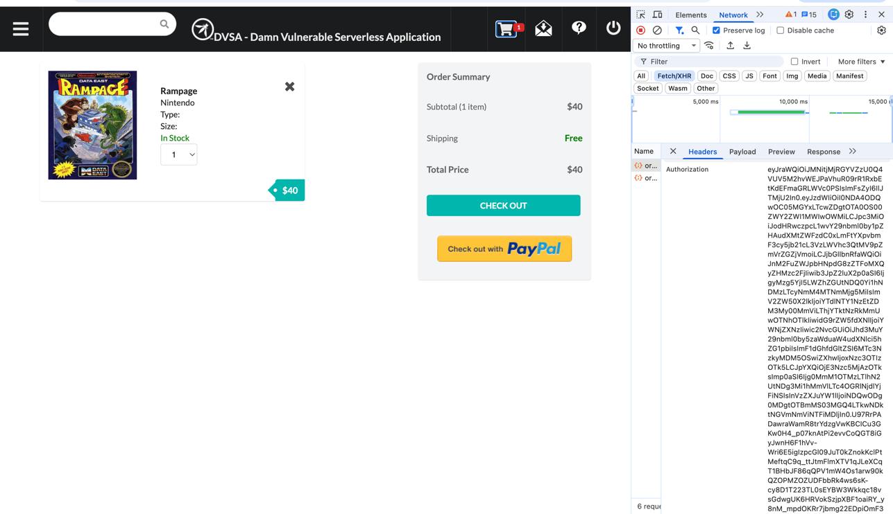

- Log out from the application, then log in as User C (victim). Repeat the same steps to capture a second JWT token.

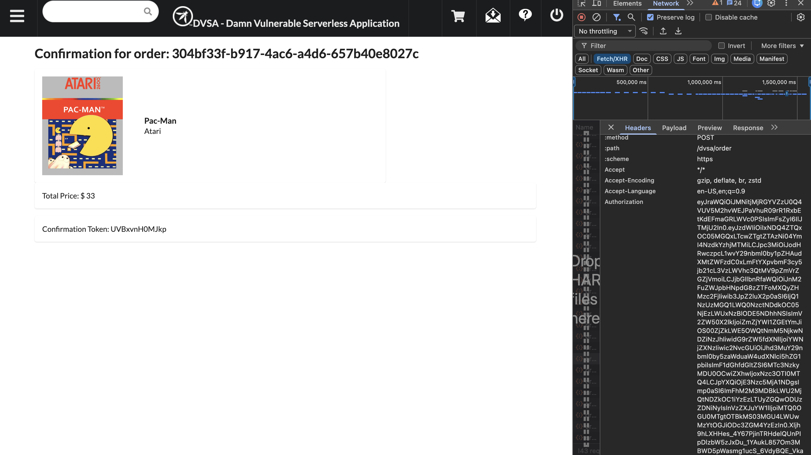

- Decode the payload of both tokens and extract the identity fields (username and sub) from User C's token.

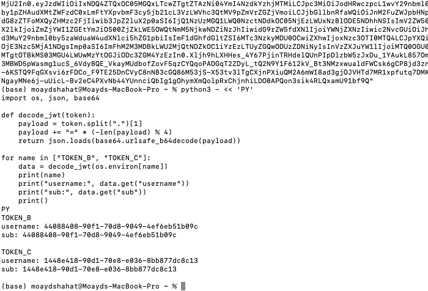

- Send a request to the /order API endpoint using the original token of User B to confirm the normal behavior, where only User B's orders are returned

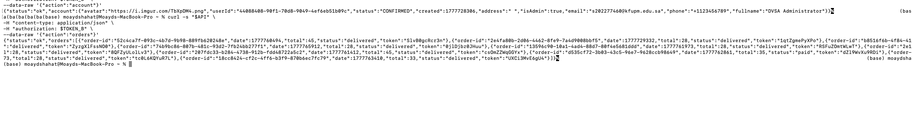

- Modify the payload of User B's JWT by replacing the username and sub values with those extracted from User C. The modified payload is then re-encoded and combined with the original header and signature to create a forged token.

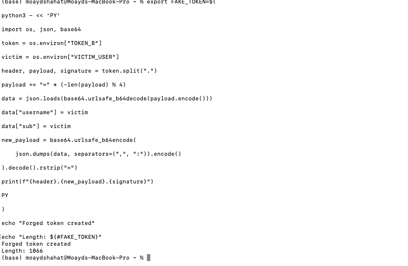

- Send a second request to the same /order endpoint using the forged token in the Authorization header.

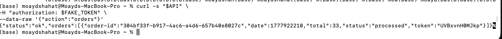

- Observe that the response now returns User C's order data instead of User B's, confirming successful impersonation and unauthorized access.

- An additional request was made to retrieve full order details using a valid victim order ID and the forged token. The backend returned an error due to improper input handling, which further indicates weak validation logic

## 5. Evidence and Proof

### Evidence 1: Token Capture

The JWT token was successfully captured from the browser using Developer Tools. The token was extracted from the Authorization header of a request to the /order API endpoint.

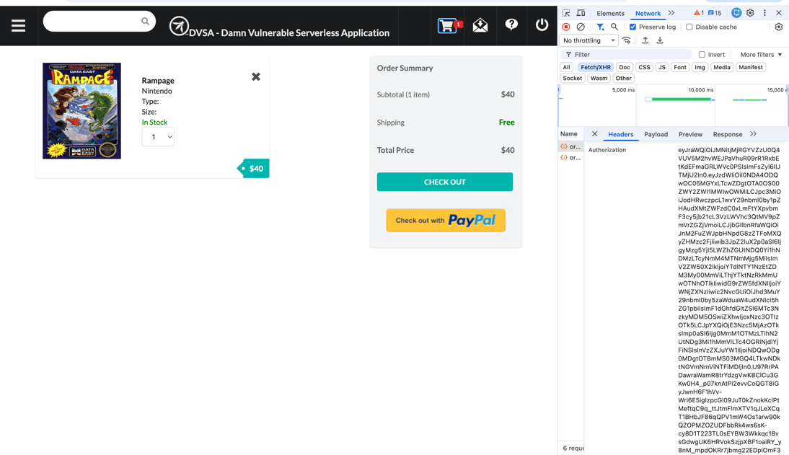

### Evidence 2: Normal Behavior (Baseline)

A request was sent using the original token of User B. The response returned only User B's own orders, confirming that the system behaves correctly under normal conditions.

After running this code:

```text
curl -s "$API" \
-H "Content-Type: application/json" \
-H "authorization: $TOKEN_B" \
--data-raw '{"action":"orders"}'
```

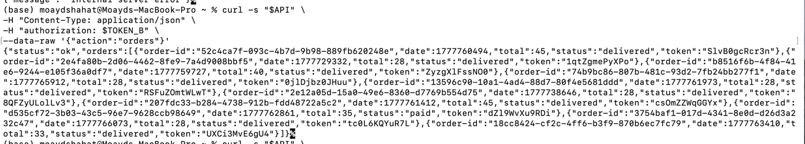

### Evidence 3: Token Decoding

Both JWT tokens (User B and User C) were decoded to extract identity fields (username and sub). These values were used to construct the forged token.


### Evidence 4: Forged Token Creation

A forged JWT token was generated by modifying the payload of User B's token and inserting User C's identity values. The token was successfully rebuilt while keeping the original signature.


### Evidence 5: Exploit Execution (Attack Success)

A request was sent using the forged token. The response returned order data belonging to User C (victim), instead of User B (attacker), confirming successful impersonation.


## 6)Fix Strategy / Probable Mitigation

#### Fix Location

The vulnerability originates from the JWT handling logic inside the DVSA-ORDER-MANAGER Lambda function, particularly in the order-manager.js file. The issue occurs because the application processes token data without verifying its authenticity.

To address this, proper validation must be added before any identity information is trusted

#### Required Improvements

The current implementation needs to be modified to enforce secure token validation. The following changes should be introduced:

| Area | Vulnerable Behavior | Secure Behavior After Fix |
| --- | --- | --- |
| Token handling | Payload is decoded directly without validation | Full token verification is performed before processing |
| User identity | username is trusted from decoded payload | Identity is extracted only after verification succeeds |
| Missing token cases | Not properly handled | System returns an error for missing tokens |
| Tampered tokens | Accepted without checks | Rejected if signature validation fails |
| Claims validation | No validation of token claims | Validate issuer (iss) and expiration (exp) |

#### How the Fix Solves the Problem

The vulnerability exists because the system assumes that any token payload is trustworthy. By adding proper signature verification, the backend ensures that only tokens signed by the legitimate identity provider (Amazon Cognito) are accepted.

With this fix in place:

- Any modified or forged token will fail verification

- Unauthorized users cannot impersonate others

- Only valid identity data is processed

This effectively eliminates the possibility of manipulating JWT contents to gain unauthorized access.

### Security Improvements After Fix

| Before | After |
| --- | --- |
| No signature validation | Signature is verified |
| Payload trusted blindly | Payload trusted only after validation |
| Identity can be altered | Identity integrity is enforced |
| Unauthorized access possible | Unauthorized access prevented |

## 7. Code / Config Changes

#### Before Fix: Vulnerable JWT Handling

Before the fix, the DVSA-ORDER-MANAGER Lambda function in order-manager.js only decoded the JWT payload and trusted the username value directly. The code did not verify the token signature, so a modified token could still be accepted.

```text
var auth_header = headers.Authorization || headers.authorization;
var token_sections = auth_header.split('.');
var auth_data = jose.util.base64url.decode(token_sections[1]);
var token = JSON.parse(auth_data);
var user = token.username;
```

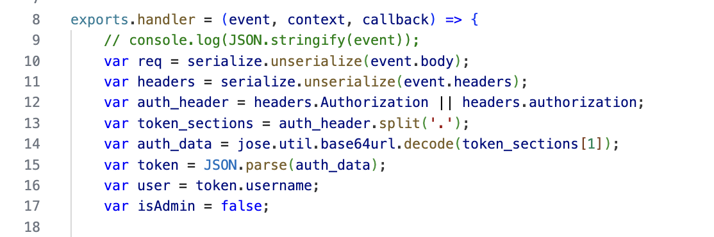

#### After Fix: JWT Verification Added

After the fix, the Lambda function checks that the Authorization header exists, verifies the JWT before trusting its claims, and rejects invalid or modified tokens. The user identity is extracted only after successful verification.

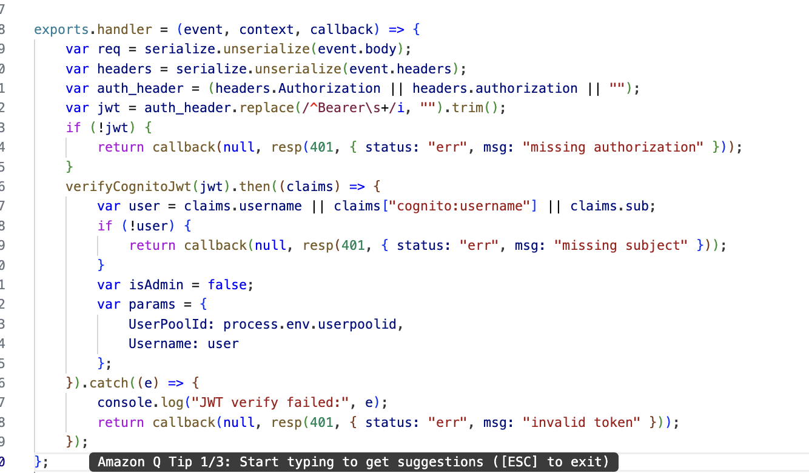

## 8. Verification After Fix

After applying the JWT verification fix in DVSA-ORDER-MANAGER, the same forged-token attack was tested again to confirm that the vulnerability was no longer exploitable.

#### Test Performed

The forged token was sent again to the /order API endpoint:

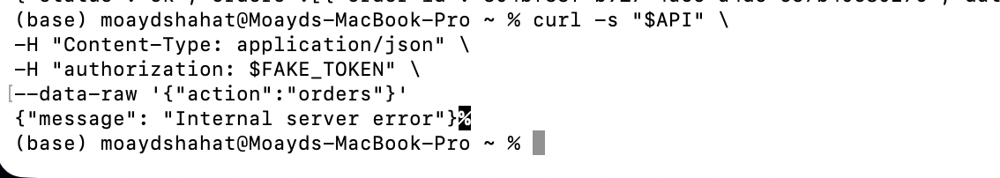

#### Explanation

Unlike the previous behavior, where the forged token successfully returned another user's data, the system now rejects the request. The error response indicates that the modified token is no longer accepted by the backend.

This confirms that the JWT validation logic is now enforced, and tampered tokens fail during processing instead of being trusted.

## 9)Structured Analysis Summary

#### Table A

| Vulnerability | Intended Rule(s) | Artifacts Used to Infer Rule | Normal Behavior Evidence | Exploit Behavior Evidence |
| --- | --- | --- | --- | --- |
| Broken Authentication | Only a properly validated and cryptographically verified JWT should be used to determine the user's identity. Users must only be able to access their own data and not the data of others. | Browser interaction flow, /order API requests, JWT structure, decoded token payloads, and API responses | When using a valid token (TOKEN_B), the API correctly returned only the orders that belong to User B. | After altering the JWT payload and using a forged token, the API returned User C's order data instead of User B's, demonstrating unauthorized access. |

#### Table B

| Vulnerability | Why This Is a Deviation | Deviation Class | Fix Applied (Where) | Post-Fix Verification |
| --- | --- | --- | --- | --- |
| Broken Authentication | The backend relied on identity information from the JWT payload without validating the token's signature. This allowed attacker-controlled values to be trusted for authorization, breaking the intended security model. | Security design flaw / misuse of authentication logic | JWT signature verification was added in DVSA-ORDER-MANAGER/order-manager.js, ensuring both the token's authenticity and its claims are validated before identifying the user. | After applying the fix, forged tokens were rejected and no longer returned another user's data. Legitimate tokens continued to function correctly for authorized users. |

## 10) Takeaway / Lessons Learned

This lesson demonstrates the critical importance of properly validating authentication mechanisms, particularly JSON Web Tokens (JWTs), in backend systems. Although JWTs are designed to securely represent user identity, the vulnerability showed that failing to verify the token's signature allows attackers to manipulate its payload and impersonate other users. By modifying fields such as username and sub, an attacker was able to access data belonging to another account, highlighting a serious breach of confidentiality and access control. The fix, which introduced proper signature verification and validation of token claims, successfully prevented the use of forged tokens and restored secure authentication behavior. This emphasizes that backend systems must never trust user-controlled data without verification and must enforce strict validation to ensure that only legitimate, untampered tokens are accepted.
