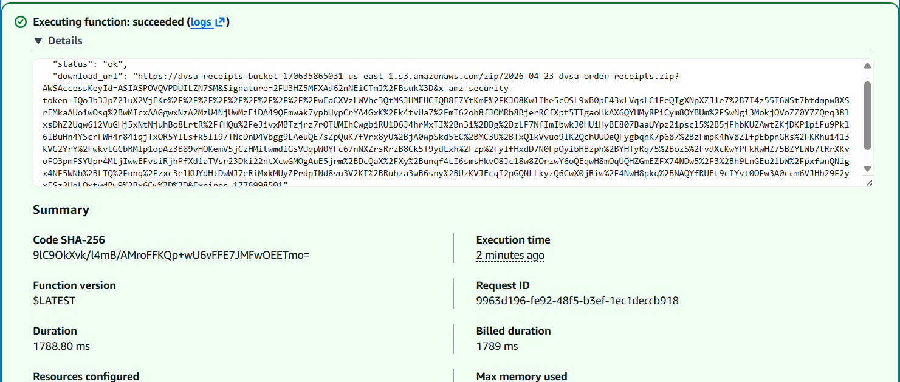
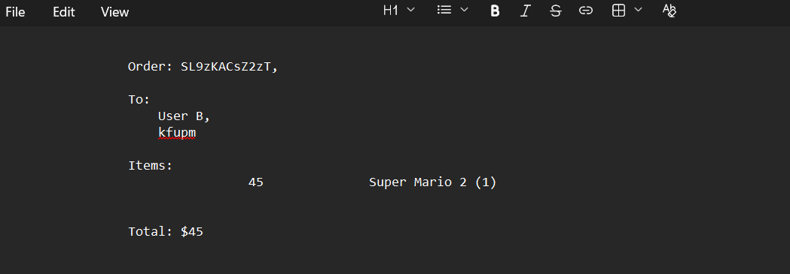
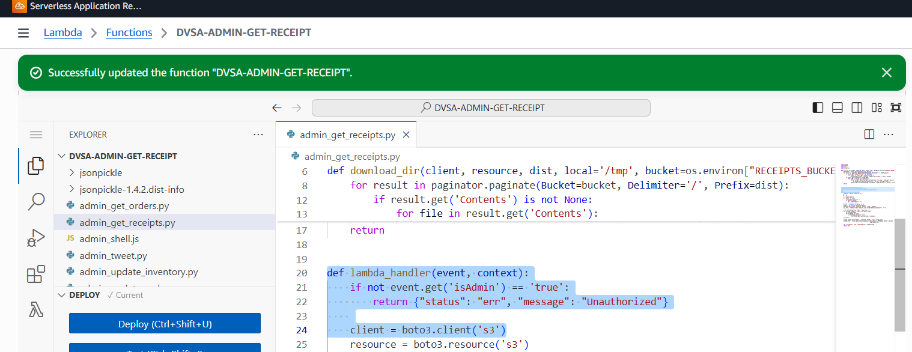
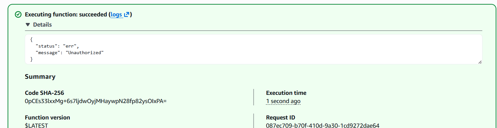
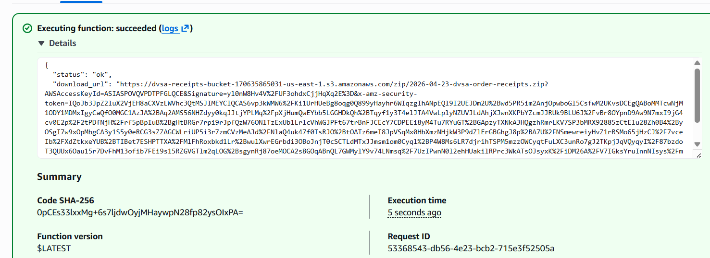

# Lesson #03 - Sensitive Data Exposure

#### ICS-344: Information Security

Course Project: DVSA Vulnerability Discovery and Remediation

#### Lesson #3: Sensitive Data Exposure

## Part 1) Goal and Vulnerability Summary

This lesson demonstrates a Sensitive Data Exposure vulnerability in the DVSA serverless application. The affected component is the DVSA-ADMIN-GET-RECEIPT Lambda function, which is intended to be an administrative operation for generating pre-signed Amazon S3 URLs to download customer receipt files.

The vulnerability is that the function performs no authorization check before generating the receipt archive and returning the download URL. A caller with Lambda invocation permissions can provide only a date, invoke the function directly, and receive a pre-signed URL for a ZIP archive containing receipt files for that date. This bypasses the normal application flow and exposes order IDs, customer names, shipping addresses, purchased items, and totals.

The impact is high because this is not a single-record leak. One successful invocation can expose every receipt stored for the selected day, turning an access control mistake into a bulk confidentiality breach.

## Part 2) Why This Works / Root Cause

The root cause is the absence of authorization enforcement inside admin_get_receipts.py. The handler immediately reads the supplied year/month/day values, downloads matching receipt files from S3, builds a ZIP archive, uploads that ZIP back to S3, and returns a pre-signed download link. There is no verification that the caller is an administrator, no ownership check for the requested receipts, and no trusted identity check before S3 operations begin.

```text
def lambda_handler(event, context):
# Vulnerable behavior: no authorization check before S3 access
y = event['year']
...
signed_link = client.generate_presigned_url(...)
return {'status': 'ok', 'download_url': signed_link}
```

A second design issue increases the risk: relying on the function name "ADMIN" does not create a security boundary. In a serverless system, each Lambda function must protect itself because it can be invoked independently by identities that have Lambda invocation permissions. The safe design is to enforce authorization both before routing to the function and inside the function itself.

## Part 3) Environment and Setup

| Field | Value |
| --- | --- |
| DVSA Website URL | http://dvsa-student-2026-170635865031-us-east-1.s3-website.us-east-1.amazonaws.com |
| API Gateway Endpoint | https://2ygrq8cev6.execute-api.us-east-1.amazonaws.com/Stage/order |
| Affected Lambda Function | DVSA-ADMIN-GET-RECEIPT |
| Vulnerable Source File | admin_get_receipts.py |
| S3 Receipts Bucket | dvsa-receipts-bucket-170635865031-us-east-1 |
| AWS Region | us-east-1 |
| Test Date Used | 2026-04-23 |
| Target Order ID | f64b00be-4334-4afd-8a2d-dd896a9f04c7 |
| Tools Used | AWS Lambda Console Test, browser, curl, unzip, terminal/CloudShell/WSL |

## Part 4) Reproduction Steps

- Open the AWS Management Console and navigate to Lambda.

- Search for and open DVSA-ADMIN-GET-RECEIPT.

- Open the Test tab and create a new test event. The request contains only a date and order context; it does not include any admin proof.

```text
{
"order-id": "f64b00be-4334-4afd-8a2d-dd896a9f04c7",
"year": "2026",
"month": "04",
"day": "23"
}
```

- Click Test. Observe that the function succeeds and returns status: ok with a download_url.

- Copy the full download_url and download the ZIP archive.

```text
export DURL='<paste full download_url here>'
curl -L "$DURL" -o /tmp/receipts.zip
```

- List the ZIP archive contents to identify receipt files.

```text
unzip -l /tmp/receipts.zip
```

- Extract and read a receipt file to confirm that private order data was exposed.

```text
unzip -p /tmp/receipts.zip tmp/2026/04/23/<receipt_filename>.txt
```

## Part 5) Evidence and Proof

The evidence below shows that the function returned a receipt archive URL without any admin authorization and that the resulting archive exposed customer receipt contents.

### Evidence 1 - Unauthorized Lambda invocation returns a pre-signed URL

The Lambda Test console shows the function succeeded and returned status: ok with a download_url. The test event did not include isAdmin or any authenticated admin identity.



### Evidence 2 - Receipt contents reveal private order data

After downloading and extracting the ZIP archive, a receipt file was opened. The receipt includes order information, recipient details, purchased item, and total. This confirms that the link exposed sensitive customer data rather than just returning an empty or harmless file.



## Part 6) Fix Strategy / Probable Mitigation

The fix should use defense in depth. A single control is not enough because the function can be reached directly outside the normal API flow.

- Layer 1 - Function-level authorization: Add an authorization guard at the start of admin_get_receipts.py. If the caller is not a verified admin, return Unauthorized before any S3 client is created or any object is listed/downloaded.

- Layer 2 - API-layer protection: If the function is routed through order-manager.js, add an admin-only action that passes isAdmin only after it is derived from a trusted source such as Cognito claims, not from user-controlled input.

- Least privilege: restrict Lambda invocation permissions so only the intended backend role or admin path can invoke DVSA-ADMIN-GET-RECEIPT.

- Reduce exposure window: reduce the pre-signed URL expiration from 3600 seconds to 300 seconds or the shortest practical period.

## Part 7) Code / Config Changes

### Layer 1 - admin_get_receipts.py

The primary fix is applied inside the Lambda function itself. This prevents direct invocation from bypassing authorization.

```text
# Before: no authorization check
def lambda_handler(event, context):
client = boto3.client('s3')
resource = boto3.resource('s3')
y = event['year']
...
signed_link = client.generate_presigned_url(..., ExpiresIn=3600)
return {'status': 'ok', 'download_url': signed_link}
```

```text
# After: authorization guard before any S3 access
def lambda_handler(event, context):
if not event.get('isAdmin') == 'true':
return {'status': 'err', 'message': 'Unauthorized'}
client = boto3.client('s3')
resource = boto3.resource('s3')
y = event['year']
...
signed_link = client.generate_presigned_url(..., ExpiresIn=300)
return {'status': 'ok', 'download_url': signed_link}
```



### Layer 2 - order-manager.js

If this administrative function is exposed through the API in the future, the order manager should route it only after the authenticated user is verified as an admin. The isAdmin value must be derived from trusted identity claims, not accepted directly from the request body.

```text
case 'admin-get-receipt':
if (isAdmin == 'true') {
payload = {
'year': req['year'],
'month': req['month'],
'day': req['day'],
'isAdmin': 'true'
};
functionName = 'DVSA-ADMIN-GET-RECEIPT';
break;
} else {
return callback(null, {
statusCode: 403,
headers: { 'Access-Control-Allow-Origin': '*' },
body: JSON.stringify({ status: 'err', msg: 'Unauthorized' })
});
}
```

## Part 8) Verification After Fix

After applying the function-level fix, the same test event was executed again without isAdmin. The function returned Unauthorized immediately and did not proceed to S3 operations. This verifies that the direct invocation path is blocked for non-admin callers.



A second test was executed with isAdmin set to true to confirm that the intended administrative workflow still works. The function returned a download_url only for the authorized admin simulation, showing that the fix blocks unauthorized callers without breaking legitimate admin access.



### Verification summary

| Test Case | Expected Result | Actual Evidence | Pass/Fail |
| --- | --- | --- | --- |
| Before fix: invoke with date only | Function should not return sensitive data, but vulnerable version does. | status ok + download_url returned | Vulnerable |
| After fix: invoke without isAdmin | Unauthorized | status err + Unauthorized message | Pass |
| After fix: invoke with isAdmin true | Valid admin request still works | status ok + download_url returned | Pass |

## Part 9) Structured Operation and Security Analysis

## 9.1 Intended logic and security rules

The intended workflow is that administrative receipt retrieval should only be available to verified admin users. A normal user may view their own order through the ordinary application workflow, but must not obtain a bulk archive of receipts for all customers on a selected date.

- Rule 1: DVSA-ADMIN-GET-RECEIPT must only execute for verified administrators.

- Rule 2: A non-admin caller must never receive a pre-signed S3 URL for bulk receipt data.

- Rule 3: The function must enforce authorization internally because it can be invoked independently of API Gateway.

- Rule 4: Pre-signed URLs must have short expiration periods to reduce impact if exposed.

## 9.2 Behavior trace

| Phase | Input / Action | Observed Behavior | Security Meaning |
| --- | --- | --- | --- |
| Normal intended behavior | Non-admin tries to retrieve receipts | Should return Unauthorized | Receipt archive remains protected |
| Exploit behavior | Lambda Test event with year/month/day only | Returns status ok + download_url | Authorization missing; sensitive data exposed |
| Post-fix behavior | Same event without isAdmin | Returns Unauthorized | Function-level guard blocks direct invocation abuse |

## 9.3 Table A - Structured analysis summary

| Vulnerability | Intended Rule(s) | Artifacts Used to Infer Rule | Normal Behavior Evidence | Exploit Behavior Evidence |
| --- | --- | --- | --- | --- |
| Sensitive Data Exposure (Lesson #3) | Only verified admin users may invoke DVSA-ADMIN-GET-RECEIPT and receive receipt archive URLs. Non-admin users must never obtain receipt data for other users or bulk daily receipts. | admin_get_receipts.py, Lambda Test console, S3 receipt ZIP, extracted receipt file, post-fix test results, CloudWatch/Lambda execution output. | Correct behavior is an Unauthorized response when isAdmin is absent; after the fix this is exactly what occurred. | Before the fix, invoking the function with only year/month/day returned status ok and a download_url. The downloaded ZIP contained receipt data including order details, recipient, item, and total. |

## 9.4 Table B - Deviation and fix summary

| Vulnerability | Why This Is a Deviation | Deviation Class | Fix Applied (Where) | Post-Fix Verification | Optional Latency |
| --- | --- | --- | --- | --- | --- |
| Sensitive Data Exposure (Lesson #3) | The backend generated a bulk receipt archive URL without verifying admin status. This violates the expected rule that sensitive receipt retrieval is an admin-only operation. | Intentional misuse / security-relevant abuse | Added isAdmin authorization guard at the start of admin_get_receipts.py; reduced pre-signed URL expiration; proposed admin-only API routing gate in order-manager.js. | Without isAdmin the function returns Unauthorized. With isAdmin true the admin workflow still returns a valid download_url. | Approx. 4429 ms exploit path / approx. 5 ms fixed early-return path |

## Part 10) Takeaway / Lessons Learned

The main lesson is that naming a function ADMIN does not protect it. In serverless architectures, each Lambda function is an independently invokable compute unit and must enforce its own authorization checks. Relying only on API Gateway or routing conventions is not enough because backend functions can be reached through other AWS invocation paths by identities with sufficient permissions.

This vulnerability has a high blast radius because the function returns a ZIP archive containing all receipts for a selected date. One unauthorized invocation can expose multiple customers' names, addresses, purchased items, totals, and order identifiers. The secure design is to apply defense in depth: validate the caller at the API layer, validate again inside the Lambda function, restrict Lambda invocation permissions, and minimize pre-signed URL lifetime.
