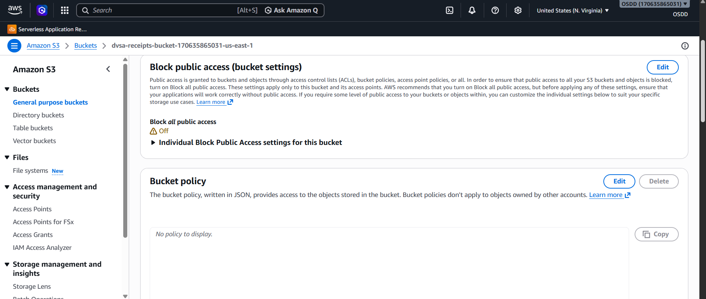
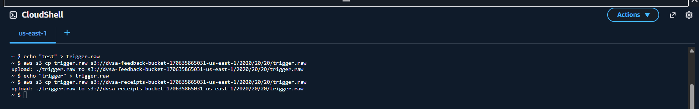
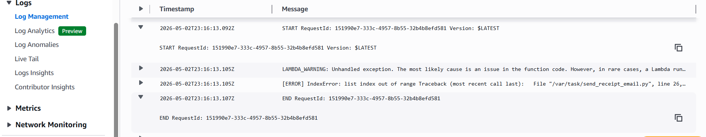
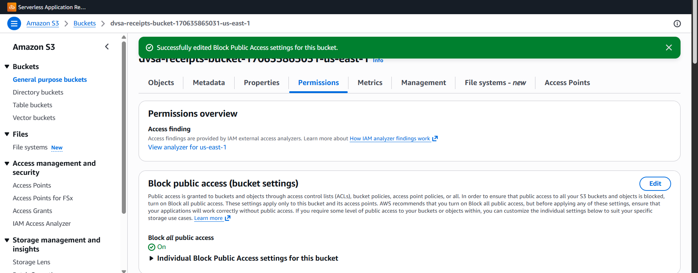
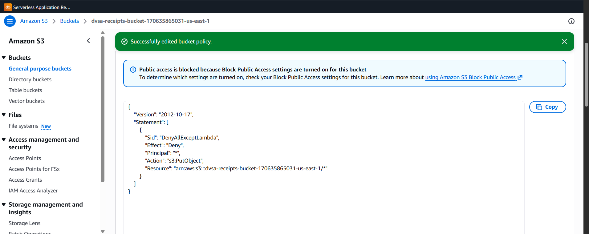
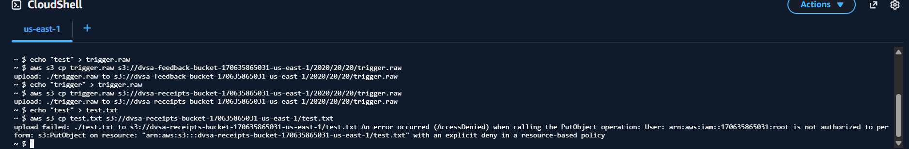

# Lesson #04 - Insecure Cloud Configuration

#### ICS-344: Information Security

Course Project: DVSA Vulnerability Discovery and Remediation

#### Lesson #4: Insecure Cloud Configuration

## Part 1) Goal and Vulnerability Summary

This lesson demonstrates an insecure cloud configuration vulnerability in the DVSA serverless application. The affected component is the Amazon S3 receipts bucket, dvsa-receipts-bucket-170635865031-us-east-1, which is connected to the DVSA-SEND-RECEIPT-EMAIL Lambda function through an S3 event trigger. The bucket is intended to store receipt objects generated by the trusted DVSA backend workflow. It should not accept arbitrary direct uploads from external AWS sessions, and it should not allow untrusted object creation to become an entry point into backend compute.

During the test, the bucket had Block Public Access disabled and no bucket policy applied. A trigger file was uploaded directly to the receipt trigger path in S3. The upload caused the backend Lambda function to execute, which was confirmed in CloudWatch by START and END RequestId log entries. This proves that the bucket configuration allowed an attacker-controlled S3 object to invoke backend code without passing through the normal DVSA website, API Gateway, Cognito authentication, or application authorization checks.

Security impact: an attacker with AWS credentials and sufficient S3 permissions in the lab account can bypass the application layer, upload attacker-controlled objects, and trigger backend Lambda execution. In an event-driven serverless design, this is serious because storage is not passive; object creation events can automatically invoke compute.

| Component | Intended State | Observed Vulnerable State |
| --- | --- | --- |
| S3 receipts bucket | Receives receipt objects only from trusted DVSA backend roles. | Allowed direct object upload from the test AWS session. |
| Block Public Access | Enabled for all four settings unless the bucket intentionally hosts public content. | Disabled / Off. |
| Bucket policy | Restrictive policy limiting writes to authorized backend roles only. | No policy to display. |
| Lambda trigger | Invoked only by trusted receipt-generation workflow. | Invoked after attacker-controlled S3 upload. |

## Part 2) Why This Works / Root Cause

The root cause is a missing storage-layer authorization boundary. The receipts bucket was configured without the two protective controls that should restrict who can write objects: Block Public Access was off, and no bucket policy was applied. Because the bucket did not explicitly deny unauthorized PutObject requests, the request was evaluated mainly against the caller's IAM permissions. In the lab environment, the CloudShell session had enough S3 permissions to upload an object.

This is dangerous in DVSA because the bucket is connected to a Lambda trigger. When a file is placed at the expected receipt path, AWS automatically invokes the backend function. The Lambda function treats the S3 event as a trusted internal event, but the event was actually caused by a direct upload outside the application flow. Therefore, the issue is not only open storage; it is open storage that becomes a direct route into backend execution.

| Security Layer | Expected Control | Finding |
| --- | --- | --- |
| Application layer | User requests should pass through the website/API path with authentication and validation. | The upload bypassed the website and API Gateway completely. |
| S3 bucket configuration | Block Public Access on and restrictive bucket policy. | Block Public Access off and no bucket policy. |
| Event trigger boundary | Only trusted backend writes should trigger receipt email processing. | A direct S3 upload triggered the Lambda function. |
| Lambda input handling | Validate S3 event source, object key pattern, and file format before processing. | The function attempted to process malformed attacker-controlled input and raised an IndexError. |

## Part 3) Environment and Setup

| Field | Value |
| --- | --- |
| DVSA Website URL | http://dvsa-student-2026-170635865031-us-east-1.s3-website.us-east-1.amazonaws.com |
| AWS Account ID | 170635865031 |
| AWS Region | us-east-1 (N. Virginia) |
| Affected S3 Bucket | dvsa-receipts-bucket-170635865031-us-east-1 |
| Triggered Lambda Function | DVSA-SEND-RECEIPT-EMAIL |
| CloudWatch Log Group | /aws/lambda/DVSA-SEND-RECEIPT-EMAIL |
| Trigger Object Key Used | 2020/20/20/trigger.raw |
| Tools Used | AWS Console, Amazon S3 console, AWS CloudShell, CloudWatch Logs |

Intended workflow under correct configuration:

- A DVSA user places an order through the frontend and authenticated API flow.

- A trusted backend Lambda writes a receipt object to the receipts bucket.

- The S3 event notification invokes DVSA-SEND-RECEIPT-EMAIL.

- The Lambda reads the receipt and sends the customer email.

- External users never write directly to the receipts bucket.

## Part 4) Reproduction Steps

- Open the AWS Console in us-east-1 and navigate to Amazon S3.

- Open the bucket dvsa-receipts-bucket-170635865031-us-east-1 and go to the Permissions tab.

- Confirm that Block Public Access is Off and the Bucket policy area shows No policy to display.

- Open AWS CloudShell from the AWS Console top bar.

- Create a local trigger file using the command below.

```text
echo "trigger" > trigger.raw
```

- Upload the trigger file to the receipt trigger path:

```text
aws s3 cp trigger.raw s3://dvsa-receipts-bucket-170635865031-us-east-1/2020/20/20/trigger.raw
```

- Open CloudWatch Logs and navigate to the log group:

```text
/aws/lambda/DVSA-SEND-RECEIPT-EMAIL
```

- Open the newest log stream and verify that the timestamp matches the upload time. In this test, the matching stream was created on 2026-05-02 and included the RequestId shown in Part 5.





## Part 5) Evidence and Proof

The strongest proof is not only that the file upload succeeded. The strongest proof is that the direct S3 upload caused backend execution. CloudWatch logs for the DVSA-SEND-RECEIPT-EMAIL function showed a new Lambda invocation immediately after the trigger file was uploaded.

```text
START RequestId: 151990e7-333c-4957-8b55-32b4b8efd581 Version: $LATEST
[ERROR] IndexError: list index out of range Traceback (most recent call last): File "/var/task/send_receipt_email.py", line 26, ...
END RequestId: 151990e7-333c-4957-8b55-32b4b8efd581
REPORT RequestId: 151990e7-333c-4957-8b55-32b4b8efd581 Duration: 14.30 ms Billed Duration: 301 ms Memory Size: 128 MB ...
```

The START and END RequestId entries confirm that the Lambda function was invoked. The IndexError does not disprove the vulnerability. The file was intentionally a dummy trigger file, not a valid receipt structure, so the function crashed while attempting to process unexpected input. That behavior is still useful evidence: it confirms attacker-controlled S3 input reached backend Lambda logic without going through API Gateway, Cognito, JWT verification, or application-level authorization.



| Evidence Item | What It Proves |
| --- | --- |
| Block Public Access = Off | The bucket lacked the first storage-level protection layer. |
| No bucket policy | No resource-based rule restricted who could upload objects. |
| Successful S3 upload to trigger path | The test AWS session could write directly to the bucket outside the application flow. |
| CloudWatch START and END RequestId | The direct upload caused backend Lambda execution. |
| IndexError in Lambda logs | The Lambda attempted to process attacker-controlled data and failed due to invalid format. |

## Part 6) Fix Strategy / Probable Mitigation

The fix should harden the storage boundary and the event-processing boundary. The minimum effective fix includes the following controls:

- Enable Block Public Access on the receipts bucket for all four settings.

- Apply a restrictive bucket policy that prevents PutObject from any principal except trusted DVSA backend roles that legitimately write receipt objects.

- Limit GetObject permissions to trusted backend roles that must read receipts.

- Validate object key prefix, suffix, and file format inside the Lambda function before processing.

- Keep S3 event notifications scoped to the narrowest possible prefix and suffix needed by the receipt workflow.

- Monitor S3 writes using CloudTrail and S3 server access logging if available.

This approach fixes the root cause because the bucket itself rejects unauthorized writes before any object is created. If no object is created, the S3 event trigger does not fire, and the backend Lambda cannot be invoked through this path.

## Part 7) Code / Config Changes

The primary fix is a configuration change on the S3 bucket. No application code change is required for the minimum remediation, although additional Lambda input validation is recommended for defense in depth.

### Change 1 - Enable Block Public Access

Navigation: S3 -> dvsa-receipts-bucket-170635865031-us-east-1 -> Permissions -> Block public access -> Edit.

- Block public access to buckets and objects granted through new ACLs.

- Block public access to buckets and objects granted through any ACLs.

- Block public access to buckets and objects granted through new public bucket or access point policies.

- Block public and cross-account access to buckets and objects through any public bucket or access point policies.



### Change 2 - Add Restrictive Bucket Policy

Use the actual execution role name from Lambda -> DVSA-SEND-RECEIPT-EMAIL -> Configuration -> Permissions -> Execution role. Replace the placeholder below with the real role name before applying. If other DVSA backend functions legitimately write/read receipts, include those role ARNs as trusted roles too.

```text
{
"Version": "2012-10-17",
"Statement": [
{
"Sid": "DenyObjectWritesExceptTrustedReceiptRoles",
"Effect": "Deny",
"Principal": "*",
"Action": ["s3:PutObject", "s3:PutObjectAcl"],
"Resource": "arn:aws:s3:::dvsa-receipts-bucket-170635865031-us-east-1/*",
"Condition": {
"ArnNotLike": {
"aws:PrincipalArn": [
"arn:aws:iam::170635865031:role/[SEND_RECEIPT_EMAIL_EXECUTION_ROLE_NAME]",
"arn:aws:sts::170635865031:assumed-role/[SEND_RECEIPT_EMAIL_EXECUTION_ROLE_NAME]/*"
]
}
}
},
{
"Sid": "DenyObjectReadsExceptTrustedReceiptRoles",
"Effect": "Deny",
"Principal": "*",
"Action": "s3:GetObject",
"Resource": "arn:aws:s3:::dvsa-receipts-bucket-170635865031-us-east-1/*",
"Condition": {
"ArnNotLike": {
"aws:PrincipalArn": [
"arn:aws:iam::170635865031:role/[SEND_RECEIPT_EMAIL_EXECUTION_ROLE_NAME]",
"arn:aws:sts::170635865031:assumed-role/[SEND_RECEIPT_EMAIL_EXECUTION_ROLE_NAME]/*"
]
}
}
}
]
}
```



### Recommended Code Hardening - Validate S3 Event Input

Optional defense-in-depth logic for send_receipt_email.py:

```text
def lambda_handler(event, context):
record = event.get("Records", [{}])[0]
key = record.get("s3", {}).get("object", {}).get("key", "")
if not key.startswith("2020/20/20/") or not key.endswith(".raw"):
print("Rejected unexpected S3 object key:", key)
return {"status": "err", "message": "Invalid S3 object key"}
# Continue with normal receipt processing only after validation.
```

## Part 8) Verification After Fix

After enabling Block Public Access and applying a restrictive bucket policy, repeat the same upload attempt from CloudShell:

```text
aws s3 cp trigger.raw s3://dvsa-receipts-bucket-170635865031-us-east-1/2020/20/20/trigger.raw
```

Expected result after the fix:

```text
upload failed: ./trigger.raw to s3://.../2020/20/20/trigger.raw
An error occurred (AccessDenied) when calling the PutObject operation: Access Denied
```

This AccessDenied response proves that the direct S3 upload path is blocked. Since the object is not created, the S3 event trigger does not fire and DVSA-SEND-RECEIPT-EMAIL is not invoked through the attacker-controlled path.

Legitimate behavior check: after the fix, the normal DVSA order workflow should still work because trusted backend roles remain allowed to write/read the receipt objects needed by the application.



## Part 9) Structured Operation and Security Analysis

## 9.1 Intended Logic and Security Rules

- Only trusted DVSA backend roles may upload receipt objects to the receipts bucket.

- External AWS sessions must not directly write arbitrary objects to the receipts bucket.

- S3 object creation must not become an unauthenticated application bypass path into Lambda execution.

- The Lambda function should validate event source, object key, and content format before processing.

## 9.2 Evidence Sources and Behavior Trace

| Phase | Observed Behavior | Evidence Source |
| --- | --- | --- |
| Normal intended behavior | Only the trusted DVSA backend writes receipt objects; external uploads should be denied. | DVSA architecture, S3 bucket role, Lambda trigger design. |
| Exploit behavior before fix | A direct S3 upload to the trigger path succeeded and invoked DVSA-SEND-RECEIPT-EMAIL. | CloudShell upload output and CloudWatch START/END RequestId logs. |
| Post-fix behavior | The same direct upload attempt returns AccessDenied; no attacker-triggered Lambda execution occurs. | CloudShell AccessDenied output and CloudWatch verification. |

## 9.3 Deviation Analysis and Classification

The exploit violates the intended rule that only trusted backend roles may write to the receipts bucket. The bucket configuration allowed a direct upload from an external AWS session, and the object creation event triggered backend execution. This bypassed the normal DVSA application path and therefore represents a security-relevant abuse of a cloud configuration mistake.

Deviation class: Intentional misuse / security-relevant abuse.

## 9.4 Table A - Structured Analysis Summary

| Vulnerability | Intended Rule(s) | Artifacts Used to Infer Rule | Normal Behavior Evidence | Exploit Behavior Evidence |
| --- | --- | --- | --- | --- |
| Lesson #4 - Insecure Cloud Configuration | Only authorized DVSA backend roles may upload to the receipts S3 bucket. Direct uploads from external AWS sessions must be denied and must not trigger Lambda execution. | S3 Permissions tab, CloudShell upload output, S3 object path, Lambda trigger behavior, CloudWatch logs. | Correct configuration would deny direct upload attempts and only allow trusted backend-generated receipt objects. | Bucket had Block Public Access Off and no policy. The trigger file upload to 2020/20/20/trigger.raw caused CloudWatch logs to show START/ERROR/END for RequestId 151990e7-333c-4957-8b55-32b4b8efd581. |

## 9.5 Table B - Deviation and Fix Summary

| Vulnerability | Why This Is a Deviation | Deviation Class | Fix Applied (Where) | Post-Fix Verification | Optional Latency |
| --- | --- | --- | --- | --- | --- |
| Lesson #4 - Insecure Cloud Configuration | The S3 bucket accepted a direct upload that bypassed API Gateway and triggered backend Lambda execution, violating the rule that only trusted backend roles may create receipt objects. | Intentional misuse / security-relevant abuse | S3 -> dvsa-receipts-bucket-170635865031-us-east-1 -> Permissions: enable Block Public Access and apply a restrictive bucket policy allowing only trusted receipt workflow roles. | The same aws s3 cp upload attempt returns AccessDenied. No new attacker-triggered Lambda invocation appears in CloudWatch. | Before: upload and invocation within seconds. After: AccessDenied immediately. |

## Part 10) Takeaway / Lessons Learned

This lesson shows that cloud configuration is part of the application security boundary. In a serverless architecture, an S3 bucket can be more than storage; it can also be an event source that triggers backend compute. If the bucket accepts untrusted direct uploads, attackers may bypass the entire API layer and invoke Lambda functions through storage events.

The key lesson is to enforce least privilege at the cloud-resource level. Sensitive buckets should have Block Public Access enabled, restrictive bucket policies, narrowly scoped IAM permissions, and validation inside downstream Lambda functions. Security must be enforced at every layer: API, IAM, S3, event triggers, and application code.
