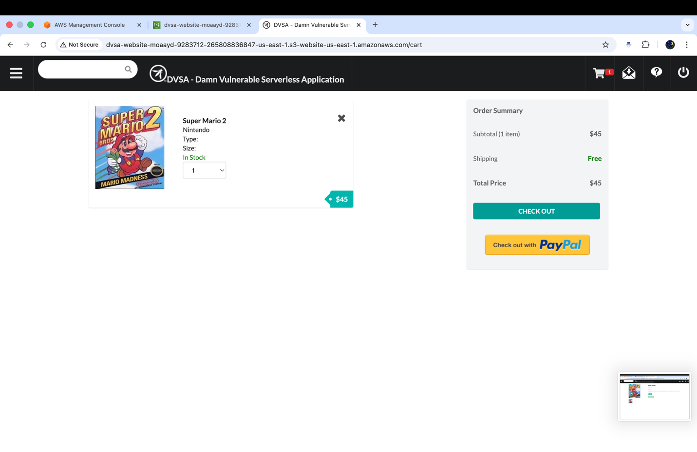
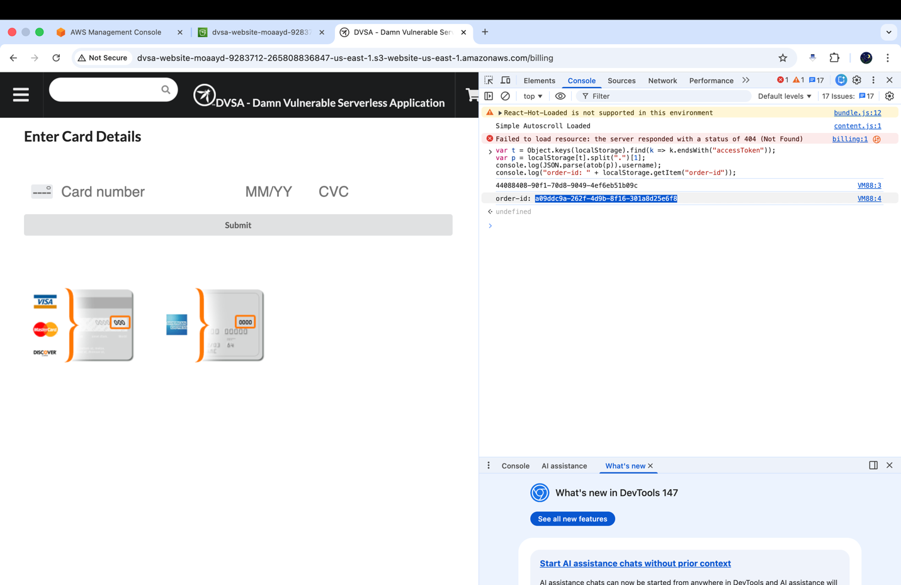
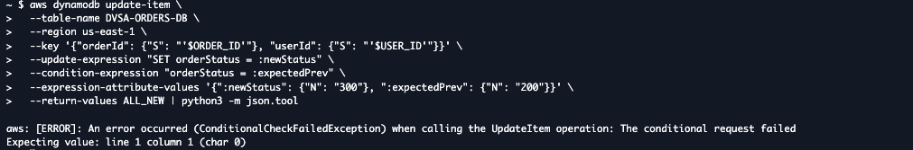

# Lesson #05

## 1-Goal and Vulnerability Summary

This lesson demonstrates a Broken Access Control vulnerability in the DVSA (Damn Vulnerable Serverless Application). The issue affects the backend logic responsible for processing order requests, as well as a hidden administrative Lambda function that should not be accessible by normal users.

The vulnerability allows a regular authenticated user to bypass the normal order workflow and directly trigger privileged backend functionality. As a result, the user can force an order into a completed (paid) state without going through the required steps such as shipping and billing.

### Expected Order Workflow

The DVSA application is designed to process orders through a strict sequence of stages:

Place Order -> Shipping -> Billing -> Paid

Each stage represents an important step in validating and completing an order:

- Place Order: The user selects items and creates a new order

- Shipping: The user provides delivery information

- Billing: Payment details are submitted and processed

- Paid: The system confirms the order after successful payment

Under normal conditions, an order should only reach the "paid" state after all previous steps have been completed successfully.

### What Actually Happens (The Vulnerability)

In the vulnerable implementation, the backend system does not properly enforce access control checks before executing privileged operations. Specifically, the main order-handling Lambda function does not verify whether the user is authorized to access internal administrative functionality.

Because of this, an attacker can manipulate the request payload and trigger a hidden administrative function directly. This function is normally intended only for internal use but can be invoked from a regular user session.

By doing this, the attacker can:

- Skip the shipping step

- Skip the billing step

- Directly set the order status to "paid"

### Attack Behavior

Instead of following the intended process:

User -> Place Order -> Shipping -> Billing -> Paid

The attacker forces the system to execute:

User -> Modified Request -> Admin Function -> Paid

This bypasses the entire payment workflow.

### Security Impact

The vulnerability has serious consequences:

| Impact Area | Description |
| --- | --- |
| Financial Integrity | Orders can be marked as paid without actual payment |
| Business Logic | Normal order validation rules are bypassed |
| Access Control | Unauthorized users can invoke privileged backend functions |
| Data Integrity | Order records can be modified into invalid states |

## 2-Why This Works / Root Cause

### Lack of Authorization Validation

The main reason this vulnerability exists is the absence of proper authorization checks in the backend logic. The Lambda function responsible for handling order requests processes user input without verifying whether the requester has the required privileges.

The application extracts the requested action from the incoming payload and directly routes it to the corresponding handler. This routing mechanism does not differentiate between normal users and administrative operations.

### Improper Request Routing

The system uses a conditional structure (such as a switch-case) to decide how to process each request based on the action field. However, this logic is applied uniformly to all users, regardless of their role.

This means that:

- Any authenticated user can trigger any action

- There is no restriction on accessing privileged functionality

- Administrative operations are exposed to regular users

As a result, sensitive backend functions can be executed without proper validation.

### Bypassing Internal Restrictions

The vulnerability becomes more severe when combined with the ability to manipulate request payloads. An attacker can craft a request that directly triggers an internal administrative function, bypassing the normal workflow.

Instead of following the expected process, the attacker injects a payload that causes the backend to execute privileged logic.

### Weak Validation of Payment Confirmation

The administrative function responsible for marking orders as paid accepts a confirmation token from the request. However, this token is not properly validated.

This leads to the following issues:

- The system does not verify whether the token corresponds to a real payment

- Any provided token value is accepted

- The order is marked as paid without actual billing

### Breakdown of Security Boundaries

A secure system should enforce clear separation between public operations and internal administrative logic. In this case, that boundary is missing.

The application fails in two key areas:

- At the routing level: The main order handler does not check whether the requested action requires elevated privileges

- At the function level: The administrative function does not independently verify the caller's permissions

Because of this, any request that reaches the administrative function is trusted and executed.

### Combined Effect of the Vulnerability

The issue is not caused by a single flaw, but by the combination of multiple weaknesses:

- Missing authorization checks

- Insecure routing logic

- Lack of validation for critical inputs

Together, these flaws allow a normal user to perform operations that should only be available to administrators.

### Key Insight

Trusting user-controlled input without verification leads to privilege escalation

## 3) Environment and Setup

### DVSA API Endpoint

The DVSA application exposes a REST API used for handling order-related operations. All interactions with the backend, including placing orders and updating their status, are performed through this endpoint:

https://bya1uph7a9.execute-api.us-east-1.amazonaws.com/dvsa/order

### AWS Region

All services used in this experiment are deployed in the following region:

us-east-1 (N. Virginia)

### Lambda Functions Involved

The following backend Lambda functions play a role in the vulnerability:

| Function | Description |
| --- | --- |
| DVSA-ORDER-MANAGER | Handles incoming /order API requests and routes them based on the requested action |
| DVSA-ORDER-UPDATE | Internal administrative function responsible for updating order status and storing payment confirmation |

### Tools Used

The following tools were used during testing:

| Tool | Purpose |
| --- | --- |
| Browser Developer Tools | Capture API requests, headers, and payload data |
| JWT Decoder (jwt.io) | Decode authentication token to extract user information |
| Mac Terminal | Execute attack scripts and API requests |
| curl | Send crafted HTTP requests to the API |
| python3 | Format JSON responses for readability |
| AWS Console | Inspect Lambda functions and logs |

## 4) Reproduction Steps

### Step 1: Access the DVSA Application

The DVSA web application was opened in the browser, and a normal user logged into the system.



### Step 2: Extract Order ID and User Information

Using the DevTools Console, the following script was executed:

```text
var t = Object.keys(localStorage).find(k => k.endsWith("accessToken"));
var p = localStorage[t].split(".")[1];
console.log(JSON.parse(atob(p)).username);
console.log("order-id: " + localStorage.getItem("order-id"));
```



### Step 3: Verify Order State Before Attack

Before performing the exploit, the order was queried directly from DynamoDB to confirm its initial state.


### Step 4: Execute the Exploit

The crafted payload was sent to the backend API using the following command:


### Step 5: Verify Order After Exploit

After sending the payload, the order was queried again:


## 5) Evidence and Proof

### Evidence 1: Initial Order State

Before the exploit, the order was in an incomplete state and had not been paid.

DynamoDB query showing orderStatus = 100


### Evidence 2: Exploit Execution

The payload was successfully delivered to the backend using a crafted request.


### Evidence 3: Order Status Change

After executing the exploit, the order status was updated to processed, and a confirmation token was generated. This occurred without completing the billing step, confirming that the application allowed unauthorized access to privileged functionality.


## 6) Fix Strategy / Probable Mitigation

### Fix Location

The vulnerability was addressed at the data validation level in the backend, specifically by enforcing stricter conditions when updating order records in DynamoDB. The fix ensures that an order cannot be modified once it reaches a protected state.

### Root Cause of the Issue

The original system allowed updates to order data without verifying whether the order had already progressed beyond the editable stage. This allowed attackers to manipulate order status directly by bypassing the normal workflow.

Because there was no validation on the order state, unauthorized modifications could be applied even after the order should have been finalized.

### Fix Implementation

To mitigate this issue, a conditional update mechanism was introduced in the DynamoDB update operation.

The update now includes a condition that checks the current order status before applying any changes:

Only allow update if orderStatus matches expected previous state

If the condition is not satisfied, the update is rejected.

### Verification of the Fix

To test the effectiveness of the fix, an update operation was attempted on an order that had already been processed.

The following command was executed:

```text
aws dynamodb update-item \
--table-name DVSA-ORDERS-DB \
--region us-east-1 \
--key '{"orderId": {"S": "'$ORDER_ID'"}, "userId": {"S": "'$USER_ID'"}}' \
--update-expression "SET orderStatus = :newStatus" \
--condition-expression "orderStatus = :expectedPrev" \
--expression-attribute-values '{":newStatus": {"N": "300"}, ":expectedPrev": {"N": "200"}}'
```

### Observed Result

The system returned the following error:

ConditionalCheckFailedException

This indicates that the update operation was rejected because the condition was not met.

### Why This Fix Works

This fix ensures that:

- Orders can only be updated when they are in a valid state

- Any attempt to modify an order after it has progressed beyond that state is blocked

- Unauthorized or malicious updates are prevented

By enforcing this condition, the system eliminates the possibility of modifying orders through crafted or injected requests

## Part 8 - Verification After Fix

### Verification Process

After applying the fix, the system was tested again to confirm that unauthorized updates are no longer possible.

An attempt was made to modify the order status using a direct DynamoDB update command with a condition that enforces validation of the previous state.

### Observed Behavior

The update operation returned the following error:

ConditionalCheckFailedException

This indicates that the request was rejected because the condition defined in the update expression was not satisfied.

### Explanation

This behavior confirms that the system now enforces strict validation before allowing any modification to the order. Since the order had already progressed beyond the editable state, the update was correctly blocked.

### Order State Verification

The DVSA "My Orders" page was also checked after applying the fix. The order remained unchanged and preserved its final state, confirming that no unauthorized modifications were applied.

### Supporting Evidence

### DynamoDB Conditional Update Failure

The update command failed with ConditionalCheckFailedException, demonstrating that the system rejects invalid updates when the order status does not match the expected condition.



### Final Order State

The DVSA "My Orders" page shows that the order status remains unchanged after the attempted update, confirming that the fix successfully prevents unauthorized modifications.


## Part 9 - Structured Operation and Security Analysis

### Table A

| Vulnerability | Intended Rule(s) | Artifacts Used to Infer Rule | Normal Behavior Evidence | Exploit Behavior Evidence |
| --- | --- | --- | --- | --- |
| Broken Access Control | Only authorized backend logic should be able to update order status. Users must follow the sequence: shipping -> billing -> paid. Direct access to privileged functions must be restricted. | DVSA /order API requests, DVSA-ORDER-MANAGER, DVSA-ORDER-UPDATE Lambda, DynamoDB records, DevTools Network tab, Terminal commands | Under normal operation, the user completes checkout and billing, after which the order status changes and a confirmation token is generated. The order remains unchanged until payment is completed. | A crafted payload was sent using curl, which directly triggered backend logic. The order status changed to processed/delivered and a token was generated without completing billing, proving unauthorized access to privileged functionality. |

### Table B

| Vulnerability | Why This Is a Deviation | Deviation Class | Fix Applied (Where) | Post-Fix Verification | Optional Latency Before / After Logging |
| --- | --- | --- | --- | --- | --- |
| Broken Access Control | The system allows user-controlled input to invoke backend functionality without verifying permissions. This breaks the intended trust boundary between normal users and internal logic. | Security design flaw / access control failure | Conditional validation applied at the database level (DynamoDB update with condition expression to enforce order status validation). | Attempted update after fix failed with ConditionalCheckFailedException, confirming that unauthorized modification is now blocked. Order state remained unchanged. | Not measured |

## Takeaway / Lessons Learned

### Key Lessons Learned

This lesson demonstrates that even when a system appears to function correctly, underlying security weaknesses can allow attackers to bypass critical business logic. The DVSA application failed to enforce proper access control, allowing a normal user to perform actions that should be restricted to privileged backend components.

### Importance of Access Control

One of the most important insights from this exercise is:

### Access control must be enforced at every layer of the application

The vulnerability occurred because the backend trusted user input without verifying whether the user had permission to execute the requested action. This allowed a normal user to trigger internal logic and modify the order state directly.

### Impact of the Vulnerability

The exploit showed that:

- Orders could be completed without going through the billing process

- Confirmation tokens were generated without payment

- The system allowed unauthorized state changes

This demonstrates a serious flaw in business logic enforcement and can lead to financial loss and data inconsistency in real-world systems.

### Effectiveness of the Fix

After applying the fix using conditional validation in DynamoDB:

- Unauthorized updates were rejected

- Order state remained protected

- Attempts to modify finalized orders resulted in errors

This confirms that enforcing validation at the data layer effectively prevents unauthorized actions.

### Security Principles Applied

The fix and analysis highlight the importance of the following security principles:

- Never trust user input without validation

- Enforce strict access control checks

- Validate system state before allowing modifications

### Final Conclusion

This lesson emphasizes that secure system design must go beyond functionality. Proper validation, strict access control, and protection of backend logic are essential to prevent exploitation.

By enforcing conditions on order updates and restricting access to privileged functionality, the system can ensure that all operations follow the intended workflow and maintain data integrity.
