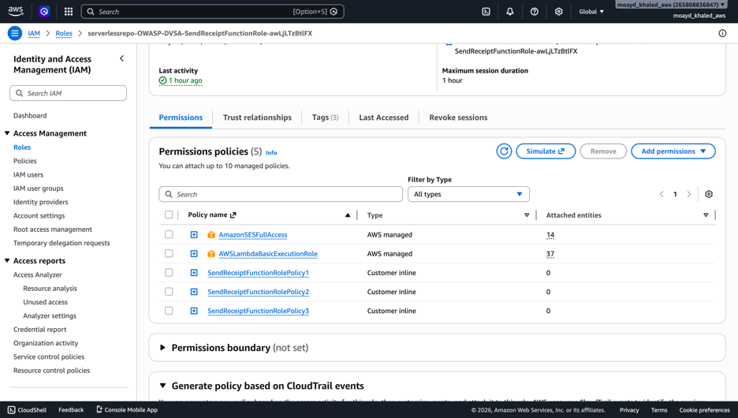
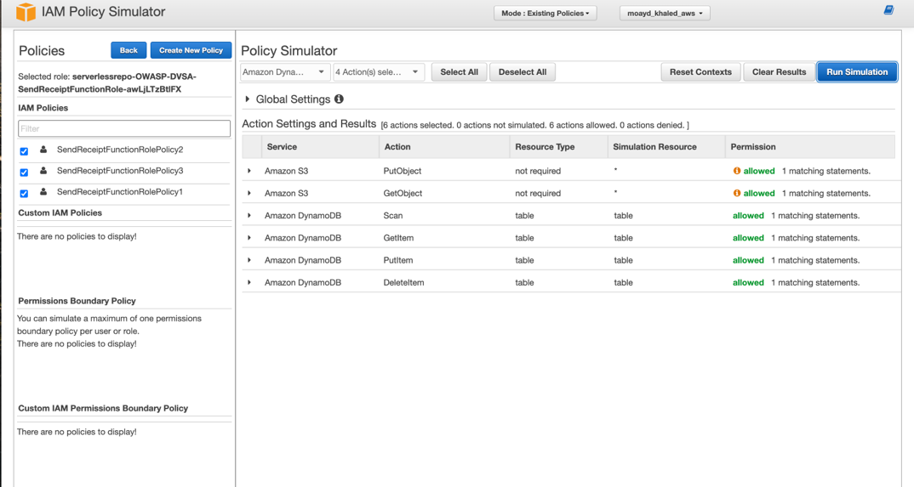
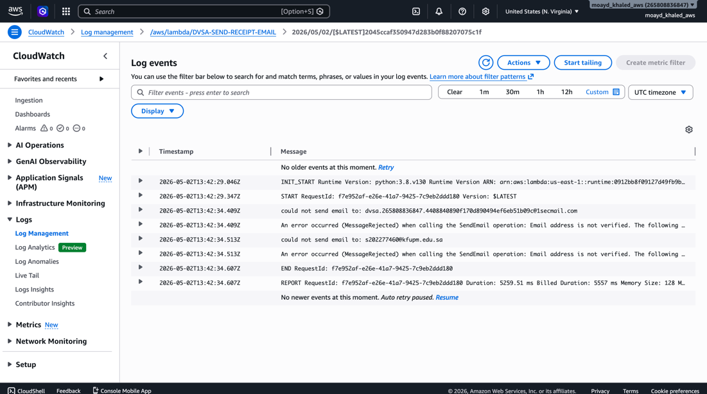
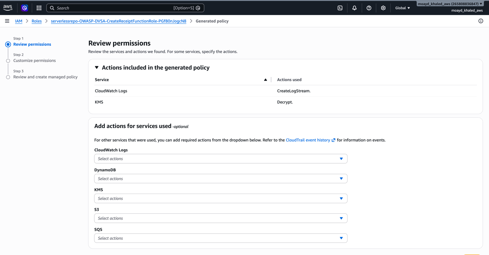
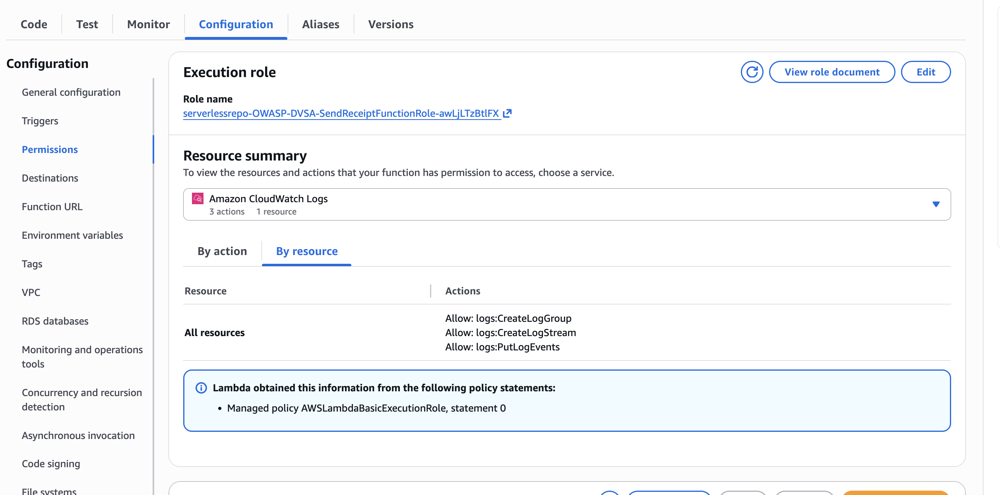
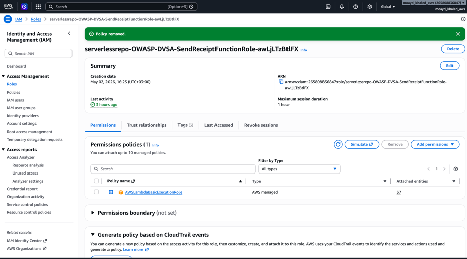
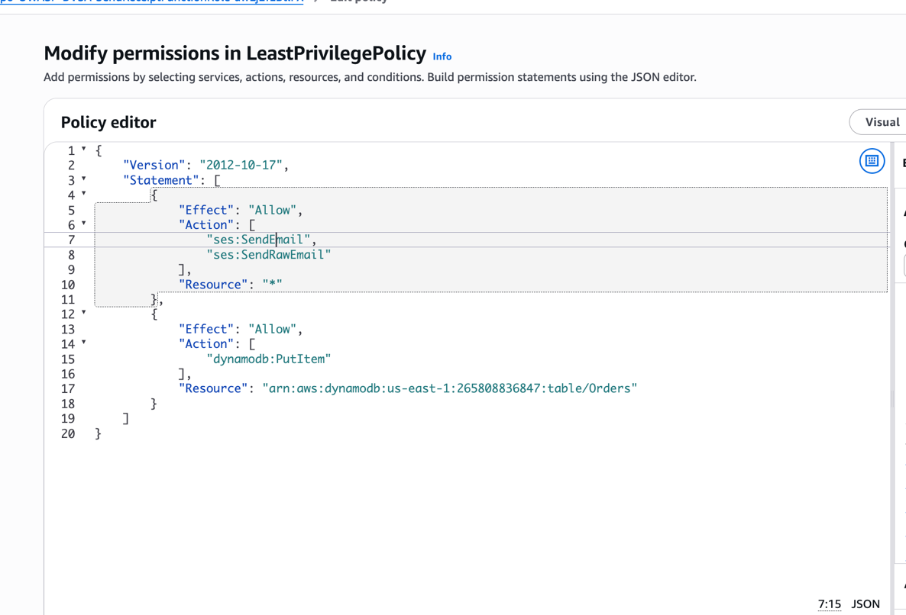
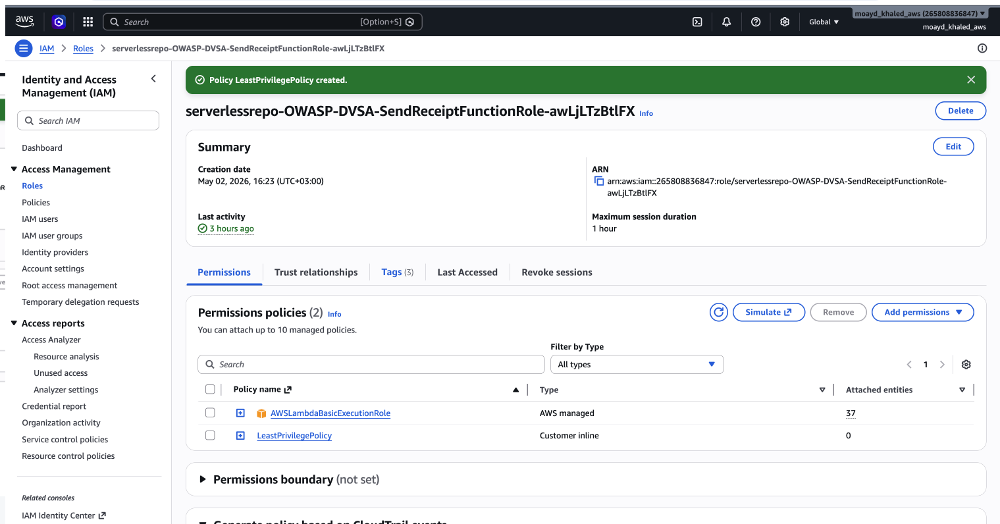
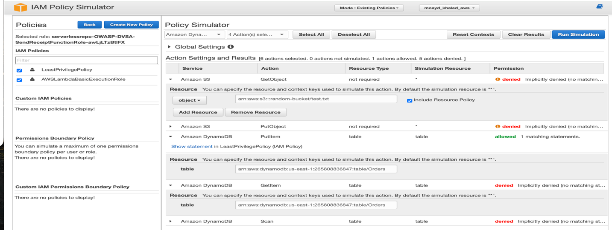

# ICS-344 Course Project

# Lesson #7: Over-Privileged Function

## 1) Goal and Vulnerability Summary

This lesson demonstrates an Over-Privileged IAM Role vulnerability in the DVSA application. The vulnerability affects the IAM execution role attached to the `DVSA-SEND-RECEIPT-EMAIL` Lambda function.

What the function is supposed to do:

- Read a receipt file from a specific S3 bucket
- Send that receipt via Amazon SES

What the function is supposed to do:

- Read a receipt file from a specific S3 bucket
- Send that receipt via Amazon SES

| Permission | Actual Scope | Should be |
| --- | --- | --- |
| S3 | Access ALL buckets (`*`) | Only receipts bucket |
| DynamoDB | Access ALL tables | Only orders table |
| SES | Full access | Only send email |
| STS | Identity exposure | Not needed at all |

## 2) Why This Works / Root Cause

The vulnerability exists because the system violates the:

**Principle of Least Privilege**

Instead of giving only required permissions, the role includes:

- `arn:aws:s3:::*` -> access to all buckets
- `dynamodb:table/*` -> access to all tables
- `AmazonSESFullAccess` -> full email control

Over-privileged roles allow attackers to escalate attacks beyond the function itself.

## 3) Environment and Setup

| Component | Details |
| --- | --- |
| Lambda function | `DVSA-SEND-RECEIPT-EMAIL` |
| IAM role (vulnerable) | `serverlessrepo-OWASP-DVSA-SendReceiptFunctionRole-[suffix]` |
| CloudTrail trail | `dvsa-policygen-trail` (created during this lesson) |
| CloudWatch log group | `/aws/lambda/DVSA-SEND-RECEIPT-EMAIL` |
| Tools used | AWS Console, IAM Policy Simulator, CloudTrail Policy Generator |
| AWS Region | `us-east-1` (N. Virginia) |

## 4) Reproduction Steps

- Log in to the AWS Management Console and navigate to Lambda.
- In the Functions list, search for `DVSA-SEND-RECEIPT-EMAIL` and open the function.
- Navigate to the Configuration tab, then select Permissions.
- Under the Execution role section, click the role name, for example `serverlessrepo-OWASP-DVSA-CreateReceiptFunctionRole-[suffix]`. This opens the IAM role associated with the Lambda function.
- On the Permissions tab, observe the attached policies, such as:

### Test Permissions Using IAM Policy Simulator

- Navigate to IAM -> Policy Simulator.
- Select Roles, then choose the execution role associated with the Lambda function.

### Test S3 Access

- Service: Amazon S3
- Actions: `GetObject`, `PutObject`
- Resource: `arn:aws:s3:::random-bucket/test.txt`

### Test DynamoDB Access

- Service: Amazon DynamoDB
- Actions: `Scan`, `GetItem`, `PutItem`, `DeleteItem`
- Resource: `arn:aws:dynamodb:us-east-1:[ACCOUNT_ID]:table/test-table`

### Verify Actual Usage with CloudWatch Logs

- Navigate to Lambda -> `DVSA-SEND-RECEIPT-EMAIL` -> Monitor -> View CloudWatch logs.
- Open the latest log stream.
- Observe log entries such as:
- `START RequestId`
- `END RequestId`
- `REPORT RequestId`

Errors such as `MessageRejected` may appear due to SES configuration, but they still confirm that the function executed.

### Generate Policy from CloudTrail

- Navigate to CloudTrail and create a trail.
- Use the following configuration:
- Trail name: `moayd-trail`
- Multi-region trail: Enabled
- Logging: Enabled
- Trigger the Lambda function by completing a checkout in the DVSA application.
- Navigate to IAM -> Roles -> `serverlessrepo-OWASP-DVSA-CreateReceiptFunctionRole`.
- Scroll down and click Generate policy based on CloudTrail events.
- Configure the following:
- Time period: Last 1 day
- Region: `us-east-1`
- Trail: `moayd-trail`
- Click Generate policy.

## 5) Evidence and Proof

### Screenshot 1: Lambda Function Permissions Page

The `DVSA-SEND-RECEIPT-EMAIL` Lambda function was identified, and its execution role was examined. The role is responsible for defining the permissions granted to the function.

### Screenshot 2: IAM Role Policies

The execution role contains multiple attached policies, including:

### Screenshot 3: IAM Policy Simulator Results

### Evidence 4: CloudWatch Logs (Actual Execution)

### Evidence 5: Generated Policy from CloudTrail

## 6) Fix Strategy / Probable Mitigation

The vulnerability can be mitigated by applying the Principle of Least Privilege to the Lambda execution role. Instead of granting broad, unrestricted permissions, the role should be limited to only the specific actions and resources required for the function to operate correctly.

### Required Changes

| Policy | Action |
| --- | --- |
| `AmazonSESFullAccess` | Replace with a custom policy that only allows `ses:SendEmail` and `ses:SendRawEmail` |
| `SendReceiptFunctionRolePolicy1` (S3 wildcard) | Remove completely, as S3 access is not required for the function |
| `SendReceiptFunctionRolePolicy2` (DynamoDB wildcard) | Replace with a restricted policy allowing only `dynamodb:PutItem` on the specific Orders table |
| `SendReceiptFunctionRolePolicy3` (STS) | Remove entirely, since it is unnecessary for the receipt workflow |
| `AWSLambdaBasicExecutionRole` | Keep, as it provides only logging permissions through CloudWatch |

### Why This Fix Works

By limiting the permissions assigned to the Lambda function, the potential impact of any compromise is significantly reduced. Instead of having access to all resources, the function is restricted to only what it strictly needs.

As a result:

- The function can no longer access all S3 buckets
- It cannot perform unrestricted DynamoDB operations
- It is limited to sending emails only
- Administrative actions are prevented

This reduces the attack surface and prevents misuse of excessive permissions.

## 7) Code / Config Changes

### Remove Over-Permissive Policies

The original IAM role associated with the Lambda function contained multiple policies that granted excessive and unnecessary permissions across different AWS services.

To mitigate this issue, the following policies were removed:

- `AmazonSESFullAccess`
- `CreateReceiptFunctionRolePolicy1`
- `CreateReceiptFunctionRolePolicy2`
- `CreateReceiptFunctionRolePolicy3`

After removing these policies, only the essential logging policy remained:

### Create Least-Privilege Inline Policy

A new inline policy was created to grant only the minimum required permissions.

The following JSON policy was used:

This policy restricts:

The updated policy significantly reduces the scope of access:

- **Email Permissions:** Only the ability to send emails (`SendEmail` and `SendRawEmail`) is allowed. This replaces the previous full administrative access to SES.
- **DynamoDB Permissions:** Access is restricted to a single operation (`PutItem`) on a specific table (`Orders`). This prevents the function from reading, deleting, or modifying other data.
- **Removed Access:** Permissions for S3, STS, and unnecessary DynamoDB actions were completely removed.

### Attach the New Policy

After applying the changes, the role contained only:

- `AWSLambdaBasicExecutionRole`
- `LeastPrivilegePolicy`

### Explanation of the New Policy

| Permission Area | Before Fix | After Fix |
| --- | --- | --- |
| S3 Access | Full access to all buckets | Removed completely |
| DynamoDB Access | Full access to all tables | Restricted to `PutItem` on Orders table |
| SES Access | Full administrative access | Limited to sending emails only |
| STS Access | Exposed identity information | Removed |

## 8) Verification After Fix

### Re-test Permissions Using IAM Policy Simulator

After applying the least-privilege policy changes, the IAM Policy Simulator was used again to verify that excessive permissions were successfully removed.

The following tests were performed:

### Test 1: S3 Access

- Service: Amazon S3
- Actions:
- `GetObject`
- `PutObject`
- Resource: `arn:aws:s3:::random-bucket/test.txt`

### Test 2: DynamoDB Access

- Service: Amazon DynamoDB
- Actions:
- `Scan`
- `GetItem`
- `DeleteItem`
- Resource: `arn:aws:dynamodb:us-east-1:ID:table/Orders`

This confirms the fix did not break legitimate application functionality, the function can still write order records as required.

| Action | Before Fix | After Fix |
| --- | --- | --- |
| S3 Access | Allowed | Denied |
| DynamoDB Access | Allowed | Denied |
| SES Access | Full Access | Restricted |
| Overall Security | Vulnerable | Secured |

### Post-Fix Role Summary

The role now shows only two policies:

- `AWSLambdaBasicExecutionRole` (for logging)
- `LeastPrivilegePolicy` (the new minimal custom policy)

## 9) Structured Analysis

### Table A: Vulnerability Behavior Analysis

| Vulnerability | Intended Rule | Normal Behavior | Observed Behavior |
| --- | --- | --- | --- |
| Over-Privileged IAM Role | Lambda should only access required resources | Function accesses only specific services needed for execution | Role allows access to additional AWS services (S3, DynamoDB, SES) beyond what is required |

### Detailed Explanation

The Lambda function is designed to perform a limited and well-defined task, which is sending receipt emails and storing order-related data. Under normal circumstances, the function should only require minimal permissions, such as writing logs to CloudWatch, sending emails through SES, and inserting records into a specific DynamoDB table.

However, during the analysis phase, it was observed that the IAM role attached to the Lambda function initially granted access to multiple AWS services that were not necessary for its operation. These included broad permissions for S3 and DynamoDB, as well as full administrative access to SES.

This creates a mismatch between what the system is supposed to do and what it is actually allowed to do. Although the function does not actively use these extra permissions, they still exist and could be exploited if the function is compromised. This is the core characteristic of an over-privileged role.

### Table B: Root Cause and Fix Analysis

| Vulnerability | Cause of Issue | Category | Fix Applied | Result After Fix |
| --- | --- | --- | --- | --- |
| Over-Privileged IAM Role | Use of broad permissions (`*`) and full-access policies | Misconfiguration | Applied least-privilege policy and removed unnecessary permissions | Access restricted to only required actions |

### Detailed Root Cause Analysis

The root cause of this vulnerability lies in improper IAM policy design. Instead of defining permissions based on actual functional requirements, the system used overly broad policies, such as wildcard (`*`) resources and full-access managed policies.

This approach is often taken for convenience during development but introduces significant security risks in production environments. By allowing unrestricted access to multiple services, the role effectively increases the attack surface of the system.

For example:

- Granting access to all S3 buckets allows potential data exposure or deletion
- Allowing full DynamoDB access enables unauthorized reading or modification of data
- Providing full SES access could lead to misuse of email services

Even though these actions were not observed during execution, their availability represents a serious security concern.

### Post-Fix Behavior Analysis

After applying the fix, the IAM role was reconfigured to follow the principle of least privilege. This resulted in a significant reduction in permissions, allowing only the actions strictly required for the Lambda function.

The verification process confirmed that:

- Only `dynamodb:PutItem` is allowed for the specific Orders table
- Email permissions are limited to sending operations only
- All unrelated actions, including S3 and additional DynamoDB operations, are denied

This demonstrates that the role is now properly aligned with the intended functionality of the system.

## 10) Takeaway / Lessons Learned

This lesson highlights the importance of properly managing IAM permissions in cloud environments. Granting excessive permissions can introduce serious security risks, even if the application itself is functioning correctly.

One of the key observations is that having access to resources does not necessarily mean they are used. The CloudTrail analysis showed that the Lambda function only relied on a small subset of its permissions, confirming that many of the assigned permissions were unnecessary.

By applying the principle of least privilege, the system was secured by ensuring that the Lambda function only has access to the actions it truly requires. This minimizes the potential impact in case of compromise and reduces the overall attack surface.

### Key Lessons

- IAM roles should always follow the least privilege principle
- Overly broad permissions increase security risk without providing additional functionality
- Tools like IAM Policy Simulator and CloudTrail are essential for identifying and validating permission usage
- Regular review of IAM policies helps prevent misconfigurations

### Final Conclusion

The vulnerability demonstrated in this lesson shows how improper permission management can lead to over-privileged roles. After applying the fix and verifying the results, the system now enforces strict access control, ensuring that only necessary actions are permitted. This significantly enhances the security of the DVSA application.
