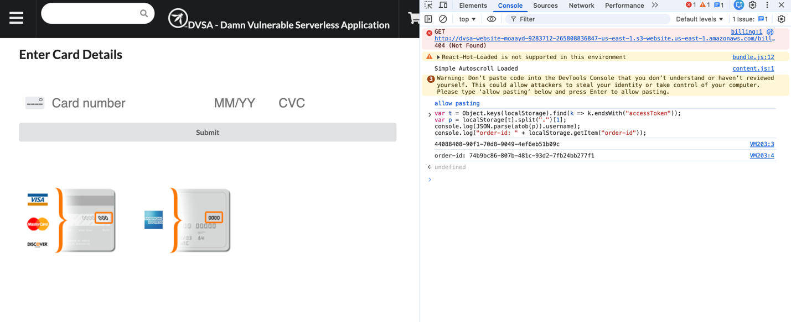
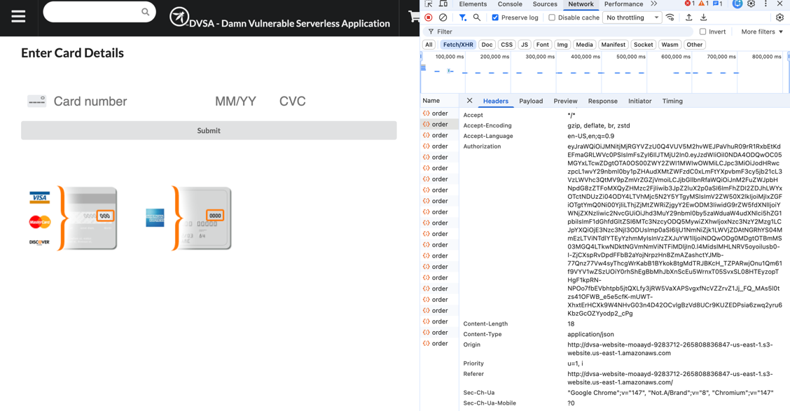
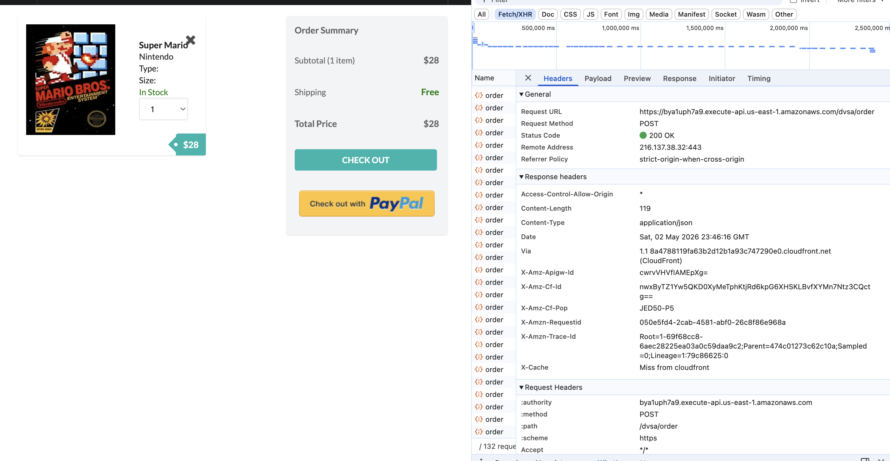
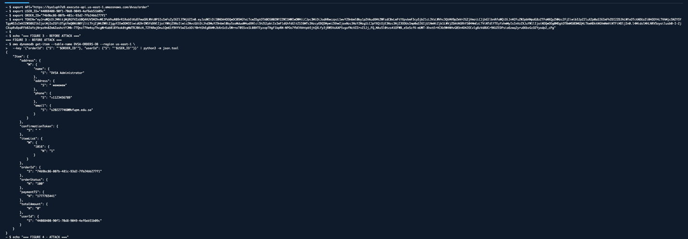
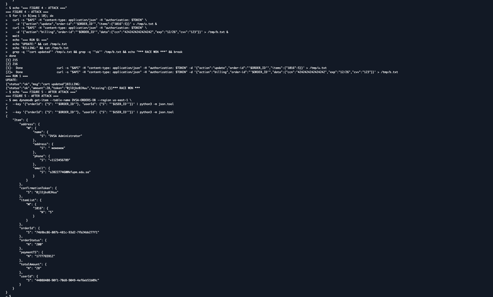
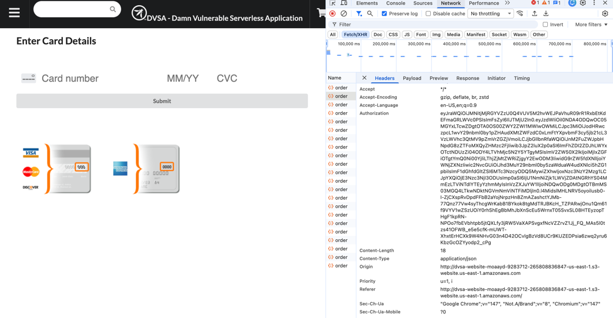
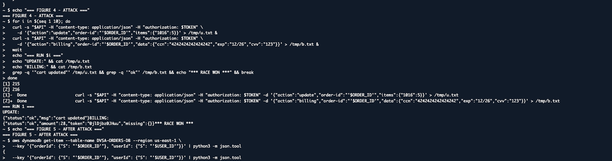
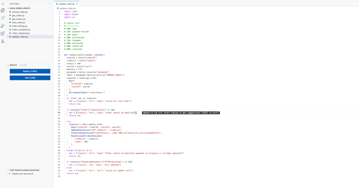
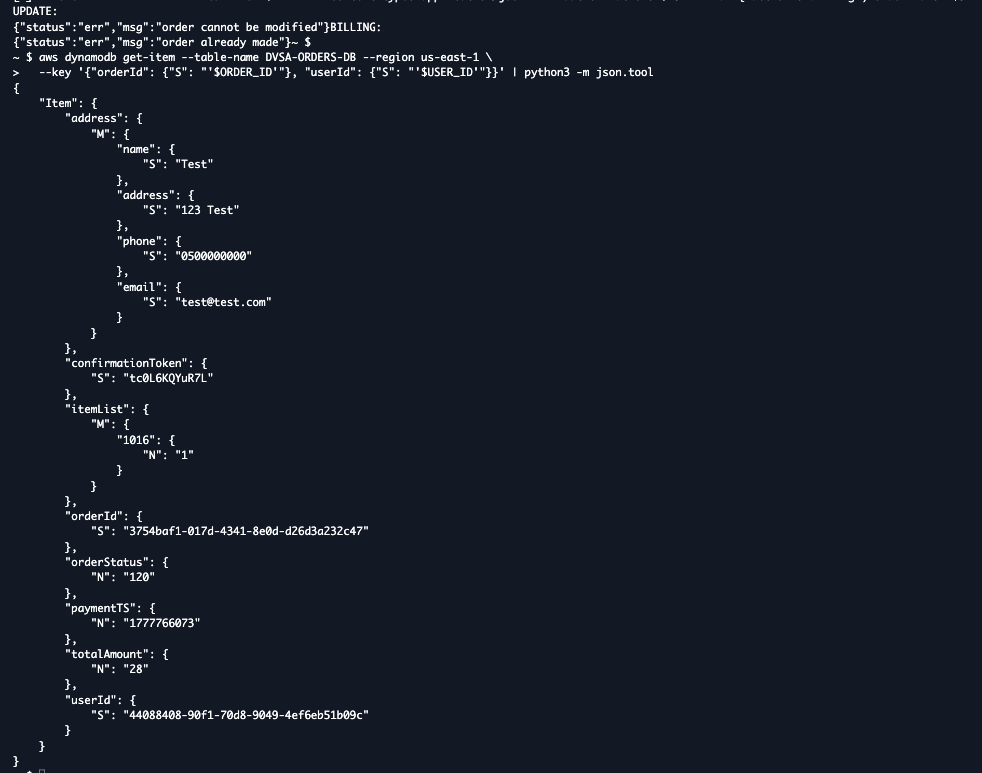

# Lesson #08

## 1. Goal and Vulnerability Summary

The purpose of this lesson is to demonstrate a business logic vulnerability in the DVSA (Damn Vulnerable Serverless Application). Specifically, the issue is caused by a race condition that occurs when multiple requests are processed at the same time during the checkout process.

This vulnerability is not related to input validation or authentication weaknesses. Instead, it arises from the way the application handles concurrent operations in a serverless environment, where multiple Lambda executions can run simultaneously without coordination.

### Expected Behavior of the System

Under normal conditions, the order workflow should behave in a controlled and sequential manner:

- A user selects items and adds them to the cart

- The user proceeds to checkout

- Payment is submitted and processed

- The order is finalized based on the cart contents at the time of payment

- After payment, the order should be locked and no further changes should be allowed

This ensures that the user is charged correctly and the order remains consistent.

### Actual Behavior in the Vulnerable System

In the current implementation, the system does not properly enforce this sequence. Both the billing operation and the cart update operation are handled independently and can execute at the same time.

Because there is no locking mechanism or validation step between these operations, the backend accepts both requests without checking for conflicts.

As a result, an attacker can:

- Initiate a payment request for a low-value cart

- Simultaneously send an update request to increase the quantity of items

- Cause both operations to be processed successfully

### Outcome of the Attack

This leads to a mismatch between what the user pays and what the system records:

User is charged for a smaller order -> but receives a larger one

The system fails to guarantee consistency during the payment process, which breaks the integrity of the application

### Impact on the System

| Area | Impact |
| --- | --- |
| Payment accuracy | Users may pay less than the actual order value |
| Application logic | Order validation rules can be bypassed |
| Data consistency | Stored order data may not reflect actual transactions |
| System design | Concurrency increases the likelihood of exploitation |

### Core Issue

At its core, the vulnerability exists because:

Concurrent processing without control leads to inconsistent system state

## 2) Why This Works / Root Cause

### Lack of Order State Control

The main issue behind this vulnerability is the absence of proper control over the order state during processing. The Lambda function responsible for handling orders processes both the billing request and the update request without verifying whether a payment operation is already in progress.

In a secure design, once the billing process starts, the system should prevent any further modifications to the order. However, in this implementation, no such validation exists. As a result, multiple operations can be executed simultaneously on the same order.

### Missing Conditional Validation

A secure backend should enforce a condition before processing updates. For example, it should check whether the order is currently being processed (e.g., a flag such as payment_in_progress). If such a condition is not met, update requests should be rejected.

In this case, the system does not implement conditional checks or locking mechanisms. This allows multiple requests to modify the same data without coordination, leading to inconsistent results.

### Race Condition Scenario

The vulnerability occurs because of the following sequence:

- A billing request is sent to process the payment

- At the same time, an update request is sent to modify the cart

- Both requests are processed independently and concurrently

- The system does not detect any conflict between these operations

This creates a timing window where the final order state becomes unpredictable and inconsistent.

### Impact of Serverless Architecture

The problem is amplified by the nature of serverless computing:

- Each Lambda execution runs in an isolated environment

- There is no shared memory between concurrent executions

- Multiple instances of the same function can run in parallel

- The database does not enforce strict locking by default

Because of this, concurrent requests are processed independently, making it easier for race conditions to occur.

### Why the Issue Still Appears During Testing

During testing, some update requests may return errors such as:

KeyError: 'items'

This happens due to differences in request structure or payload format. However, this error does not indicate that the vulnerability has been fixed. It only shows that the update request was not processed correctly in that instance.

The key point is that the system still allows concurrent execution of billing and update operations without enforcing synchronization.

### Root Cause Summary

The vulnerability exists due to the combination of:

No locking mechanism + No validation + Concurrent execution = Race condition

## 3-Environment and Setup

### System Components

The experiment was conducted using the DVSA (Damn Vulnerable Serverless Application) deployed on AWS. The following components were used during testing:

| Component | Description |
| --- | --- |
| Lambda Function | DVSA-ORDER-UPDATE (update_order.py) |
| API Endpoint | REST API used to send billing and update requests |
| CloudWatch Logs | Used to monitor Lambda execution and confirm activity |
| Tools Used | Browser Developer Tools, Mac Terminal, curl, AWS Console |
| AWS Region | us-east-1 (N. Virginia) |
| User Context | Authenticated DVSA user with JWT token |
| Script Used | Custom script using parallel requests to trigger race condition |

### Testing Setup

The attack was performed by capturing API requests from the browser and replaying them using command-line tools. Specifically:

- The billing request was captured during checkout

- The update request was captured when modifying cart items

- Both requests were sent simultaneously using terminal commands

This setup allowed testing how the backend behaves when handling concurrent operations.

### Expected Order Processing Workflow

Under normal conditions, the system is expected to follow a strict sequence:

- The user adds items to the cart

- The user submits shipping details

- The user submits payment information

- The backend processes payment and finalizes the order

- The order becomes locked and cannot be modified

At this point, the total price and item quantity should remain unchanged.

### Observed Workflow in Testing

During testing, the system allowed overlapping operations:

- A billing request was processed while an update request was still being handled

- Both requests were accepted without validation or synchronization

- The order state became inconsistent depending on which request completed last

### Key Observation

The system does not enforce a strict execution order between operations. Instead, it allows concurrent processing, which leads to unpredictable results.

This behavior is essential for triggering the race condition vulnerability.

### Reproduction Steps

#### Phase 1: Create a Fresh Order

- Open the DVSA application in the browser and log in using a valid user account.

- Clear any existing cart items to ensure the test starts from a clean state.

- Add one item to the cart. This creates the baseline order before the race condition is attempted.

- Proceed to checkout and submit the shipping information.

- Stop at the payment page before submitting card details. At this point, the order exists in the backend but has not yet been finalized.



#### Phase 2: Capture Required Values

- Open browser Developer Tools and navigate to the Network tab.

- Filter requests by Fetch/XHR.

- Select the latest /order request and open the Headers tab.

- Copy the API endpoint from the Request URL.

- Copy the Authorization token from the request headers.





#### Phase 3: Extract Order ID from Browser Storage

Instead of relying only on the request payload, the order ID was extracted directly from browser local storage using the DevTools Console.


#### Phase 4: Run the Race Condition Script

The collected API endpoint, token, and order ID were inserted into a bash script. The script sends one billing request and multiple update requests at the same time.

The purpose is to cause the backend to process the billing operation and cart update operation concurrently.

The script was executed using:

Before the attack



#### Phase 5: Observe the Result

During the first round, the billing request succeeded while the update requests were also accepted by the backend.

This confirms that the backend allowed cart modification during the billing process



## 5) Evidence and Proof

#### Evidence 1: API Endpoint and Authorization Header

The DevTools Network tab was used to identify the /order API endpoint and capture the Authorization token required to replay authenticated requests.




#### Evidence 2: Order ID Extracted from Local Storage

The order ID was retrieved from browser local storage using the DevTools Console. This confirmed the active order being targeted by the race condition test.


#### Evidence 3: before the attack


#### Evidence 4: Race Condition Script Output

The terminal output shows that the billing request and update requests were sent concurrently.

In Round 1, the billing request returned:

This proves that the application accepted both billing and update operations during the same processing window.



#### Evidence 5: Final Order State

The final order list shows the target order with status paid, confirming that the billing process completed after the concurrent update attempts.

This demonstrates that the backend did not properly lock the order during payment processing.


## 6. Fix Strategy / Probable Mitigation

### Fix Location

In this implementation, the fix was applied inside the DVSA-ORDER-UPDATE Lambda function, specifically in the file: update_order.py

This function is responsible for modifying the cart items of an existing order. Since the vulnerability allows the order to be updated during or after billing, the update function is the correct place to enforce validation before any cart change is accepted.

### Why the Fix Was Applied Here

The race condition occurs when an update request and a billing request are processed at the same time. If the update function does not check the current order state, it may still modify the cart even after the billing process has started or completed.

By adding validation directly inside update_order.py, the system ensures that every update request must check the current order status before making changes.

### Fix Implemented

Before updating the cart, the function now retrieves the current order record from DynamoDB and checks the orderStatus value.

The logic works as follows:

1. Read the current order from DynamoDB

2. Check the orderStatus value

3. If orderStatus is not 100, reject the update

4. If orderStatus is 100, allow the cart update

The added protection rejects updates with the message:

### order cannot be modified

### Why This Prevents the Race Condition

Before the fix, the update request could modify the cart without checking whether billing had already started or completed.

After the fix, even if update and billing requests are sent at the same time, the update function validates the order state first. If the order is no longer editable, the update request is blocked

### Before and After Behavior

| Area | Before Fix | After Fix |
| --- | --- | --- |
| Update request | Accepted without checking order state | Checks orderStatus before updating |
| Paid order | Could still be modified during race window | Update is rejected |
| Race condition | Possible | Prevented |
| System state | Could become inconsistent | Remains consistent |

### Security Principle Applied

This fix applies the principle of state validation before modification. The system now verifies that the order is still in an editable state before allowing any cart update.

## 7. Code / Config Changes

Fix location: DVSA-ORDER-UPDATE Lambda function order_update.py

### BEFORE

```text
# VULNERABLE: allows update when orderStatus = 100 OR 110
if response["Item"]["orderStatus"] > 110:
res = {"status": "err", "msg": "order already paid"}
return res
update_expr = "SET {} = :itemList".format("itemList")
response = table.update_item(
Key={"orderId": orderId, "userId": userId},
UpdateExpression=update_expr,
ExpressionAttributeValues={":itemList": itemList}
)
```

### AFTER

```text
# FIXED: only allow update when status is exactly 100
if response["Item"]["orderStatus"] != 100:
res = {"status": "err", "msg": "order cannot be modified"}
return res
try:
response = table.update_item(
Key={"orderId": orderId, "userId": userId},
UpdateExpression="SET itemList = :itemList",
# Atomic: fails if billing has set paymentTS
ConditionExpression="orderStatus = :open AND
attribute_not_exists(paymentTS)",
ExpressionAttributeValues={":itemList": itemList, ":open": 100}
)
except Exception as e:
res = {"status": "err",
"msg": "Order cannot be modified (payment in progress or
already updated)"}
return res
```

### Figure 7 - Lambda fixed code deployed



## 8. Verification After Fix

After applying the fix, running the same race condition attack with a fresh order

shows the attack no longer succeeds:

```text
# UPDATE response after fix:
{"status": "err", "msg": "Order cannot be modified (payment in progress
or already updated)"}
# BILLING still works normally:
{"status": "ok", "amount": 28, "token": "5w3KpYcdcZ6r"}
# DynamoDB after fix:
# itemList: 1016 = 1 (quantity NOT changed)
# totalAmount = 28 (correct price for 1 item)
# orderStatus = 120 (paid normally)
```

### order cannot be modified



## 9. Structured Operation and Security Analysis

### Table A: Vulnerability Behavior Analysis

| Vulnerability | Intended Rule | Normal Behavior | Observed Behavior |
| --- | --- | --- | --- |
| Race Condition in Order Processing | The order should not be modified once billing begins | Billing completes first, then the order becomes locked | Billing and update requests were accepted at the same time |
| Missing Order State Validation | The system must verify order status before applying updates | Update requests should be rejected if payment is in progress | Update requests were processed without checking order status |
| Concurrent Lambda Execution | Requests should follow a strict execution sequence | Operations should execute one after another | Multiple Lambda executions processed requests in parallel |

#### Detailed Explanation

The vulnerability occurs because the order update operation and billing operation were not properly synchronized. In a secure workflow, the order should become locked once payment begins. However, before the fix, the backend allowed update requests to reach the update function while billing was being processed.

This created a race condition where two actions could happen during the same time window:

- The billing request charged the user for the current order total.

- The update request modified the cart items before the order was fully finalized.

Because both requests were handled concurrently, the system could enter an inconsistent state. This violates the expected order workflow because cart contents should not change during payment.

### Table B: Fix and Security Improvement Analysis

| Vulnerability | Cause of Issue | Category | Fix Applied | Result After Fix |
| --- | --- | --- | --- | --- |
| Race Condition in Order Processing | No validation of order status before update | Logic flaw | Added order status check in update_order.py | Updates blocked after payment begins |

### Detailed Root Cause Analysis

The root cause of this vulnerability is a flaw in the application logic. The system allowed update operations to proceed without verifying whether the order was still in a valid state for modification.

Because the application runs in a serverless environment, multiple Lambda functions can execute simultaneously. Without proper validation, this allows conflicting operations to be processed at the same time.

For example:

- A billing request charges the user

- An update request modifies the cart concurrently

- Both requests are accepted without restriction

This results in a race condition where the final order state depends on execution timing rather than correct logic.

### Post-Fix Behavior Analysis

After applying the fix, the update function now checks the orderStatus before modifying the cart. If the order is not in the open state, the request is rejected.

This ensures that:

- Update requests cannot modify a paid order

- Concurrent execution no longer leads to inconsistent results

- The system enforces the correct order workflow

### Security Impact Assessment

Before the fix:

- The system allowed concurrent modification during payment

- Business logic rules could be bypassed

- Order data could become inconsistent

After the fix:

- Only valid updates are accepted

- Order state is protected

- System behavior is predictable and secure

## 10. Takeaway / Lessons Learned

This lesson demonstrates how weaknesses in application logic can introduce serious security vulnerabilities, even when the system appears to function correctly. The race condition observed in the DVSA application shows that improper handling of concurrent requests can lead to inconsistent and unsafe system behavior.

### Key Observations

One of the most important findings is that:

### Correct functionality does not guarantee secure behavior

Although the system successfully processes orders and payments, it initially failed to enforce the correct sequence of operations. This allowed update requests to interfere with billing, creating a race condition.

### Lessons Learned

- Application logic must enforce strict sequencing of critical operations such as payment and order updates

- Backend systems should always validate the current state before processing any request

- Serverless architectures increase the likelihood of concurrency issues due to parallel execution

- Race conditions are not caused by input errors, but by missing coordination between operations

### Security Principles Applied

The fix implemented in this lesson follows an important security principle:

### Validate state before performing any modification

By checking the order status before updating the cart, the system ensures that only valid operations are executed.

### Impact of the Fix

After applying the fix:

- Update requests are rejected once billing begins

- The race condition window is effectively closed

- The order workflow now follows the intended sequence

- Data consistency is preserved

### Final Conclusion

The vulnerability in this lesson highlights the importance of controlling concurrent operations in distributed systems. By adding proper validation inside the update logic, the system now prevents unauthorized modifications and maintains a consistent state.

This demonstrates that secure design requires not only correct functionality, but also careful handling of execution order and system state.
