# Lesson #10 - Unhandled Exceptions

## Lesson #10: Unhandled Exceptions

Internal Details Exposed in Error Responses Across Multiple Lambda Functions

| Student Name | Abdullah Alzahrani |
| --- | --- |
| Student ID | 202265440 |
| Course | ICS-344: Information Security - Term 252 |
| Institution | King Fahd University of Petroleum and Minerals (KFUPM) |
| AWS Region | us-east-1 (N. Virginia) |
| DVSA URL | http://dvsa-website-kfupm-668723997461-us-east-1.s3-website-us-east-1.amazonaws.com |
| API Endpoint | https://p2uu8wgel4.execute-api.us-east-1.amazonaws.com/Stage/order |
| Date | May 2, 2026 |

## Part 1: Goal and Vulnerability Summary

This lesson examines an Unhandled Exceptions vulnerability present across multiple Lambda functions in the DVSA application. The affected components are DVSA-ORDER-GET, DVSA-ORDER-BILLING, and DVSA-ORDER-NEW. When any of these functions receives a malformed or incomplete request, it fails to catch the resulting Python exception and instead returns the full internal error details, including file paths, line numbers, and stack traces, directly to the client through API Gateway. The root weakness is the absence of input validation and exception handling in every Lambda entry point. The security impact is information disclosure: an attacker who sends a single malformed request receives a detailed map of the application's internal architecture at no cost.

## 1.1 Intended Behavior

Each Lambda function is expected to handle both valid and invalid requests safely:

- Validate all required fields before attempting to process the request

- Return a generic, client-safe error message when a field is missing or invalid

- Log full diagnostic details to CloudWatch internally, where only developers can access them

- Never expose file paths, line numbers, exception types, or variable names to the client

## 1.2 Intended vs. Observed Behavior

| Intended Behavior | Observed Behavior (Vulnerable State) |
| --- | --- |
| Input fields validated before processing begins | Fields accessed directly with event["field"] - no validation performed |
| Missing fields caught gracefully and handled internally | Python raises KeyError - no try/except block exists to catch it |
| Client receives only a generic safe error message | Client receives the full stack trace including file paths and line numbers |
| Internal structure remains completely hidden from the client | /var/task/get_order.py line 30 exposed directly to the public internet |

## 1.3 Security Impact

This vulnerability is systemic - it affects not one function but three independent Lambda functions, each with its own handler file and its own unprotected entry point. From a single malformed request an attacker learns: the backend runtime (Python), the internal file system path structure (/var/task/), the exact handler filename for each function, the line number of the vulnerable code, the expected field names, and the exception type confirming no input validation exists. This information converts a blind attack into a targeted one and frequently serves as the first step in a multi-stage attack chain.

## 1.4 Information Leak Chain Diagram

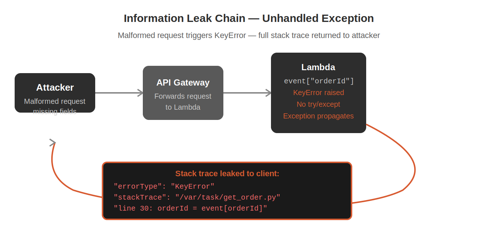

## Part 2: Why This Works / Root Cause

In any production application, error handling enforces a clear boundary between what the server logs internally and what the client receives. Internal logs contain full diagnostic details - stack traces, variable values, file paths - everything a developer needs to debug. Client responses contain only a generic, safe message. This separation exists because internal details are useful only to developers; to anyone else they are a map of the application's architecture.

## 2.1 The Missing Control: Direct Dictionary Access

In the vulnerable DVSA Lambda functions, event fields are accessed using Python's direct dictionary syntax:

```text
# VULNERABLE -- raises KeyError if the field is absent
order_id = event["order-id"]
```

When a client sends a request that omits the order-id field, Python raises a KeyError at that line. Because no try/except block exists anywhere in the function, Python's default behavior takes over: the complete exception details, including the full traceback, are returned as the Lambda function's error response. API Gateway forwards this raw error directly to the client with no filtering.

## 2.2 Why This Is a Systemic Problem

This is not an isolated bug in one function. The same unprotected event["field"] pattern is repeated across the entire DVSA codebase. Three separate Lambda functions are independently vulnerable, each leaking a different piece of the backend:

| Lambda Function | File Exposed | Line Exposed |
| --- | --- | --- |
| DVSA-ORDER-GET | /var/task/get_order.py | Line 30 |
| DVSA-ORDER-BILLING | /var/task/order_billing.py | Line 34 |
| DVSA-ORDER-NEW | /var/task/new_order.py | Line 9 |

## 2.3 Why Information Disclosure Is a Serious Vulnerability

- Targeted exploitation: knowing the exact file and line of vulnerable code allows an attacker to focus precisely rather than guess

- Language and framework fingerprinting: the stack trace immediately reveals Python and AWS Lambda, narrowing the applicable attack techniques

- Attack chaining: information from unhandled exceptions is frequently the first step that makes a more serious follow-on attack possible

- Attacker feedback loop: error messages that confirm a missing field tell the attacker exactly what fields are required to construct a valid malicious payload

## 2.4 Vulnerable vs. Safe Code Comparison

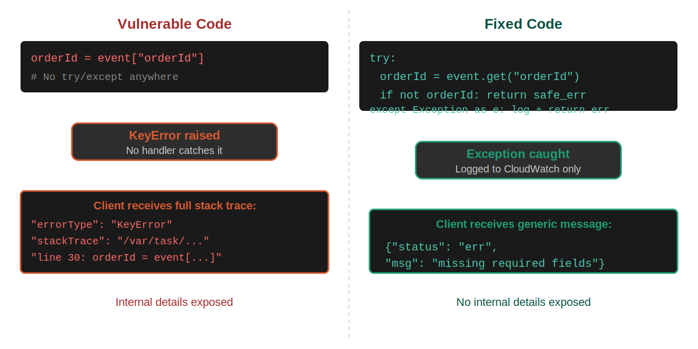

## Part 3: Environment and Setup

| Lambda Functions Affected | DVSA-ORDER-GET, DVSA-ORDER-BILLING, DVSA-ORDER-NEW |
| --- | --- |
| Vulnerable Files | get_order.py, order_billing.py, new_order.py |
| API Endpoint | https://p2uu8wgel4.execute-api.us-east-1.amazonaws.com/Stage/order |
| DVSA Website URL | http://dvsa-website-kfupm-668723997461-us-east-1.s3-website-us-east-1.amazonaws.com |
| AWS Region | us-east-1 (N. Virginia) |
| Tools Used | curl (macOS terminal), AWS Management Console, CloudWatch Logs |
| Test Account | Registered DVSA user with an active account |

## 3.1 Intended Error Handling Flow

Under a correctly implemented deployment the error handling lifecycle should proceed as follows:

- Client sends a malformed request with a missing required field.

- API Gateway forwards the request to the appropriate Lambda function.

- The Lambda function attempts to retrieve the field using event.get() which returns None safely.

- An explicit validation check detects the missing value and raises a controlled internal exception.

- The try/except block catches the exception and logs the full details to CloudWatch for developer use.

- The function returns only a generic message to the client: {"status":"err","msg":"missing required fields"}.

- The client receives no information about the internal file structure, line numbers, or error type.

## 3.2 Intended vs. Actual Error Flow

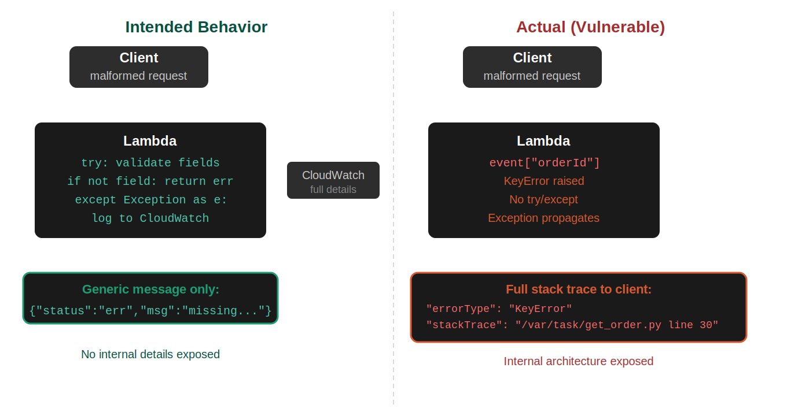

## Part 4: Reproduction Steps

#### Step 1 - Export Environment Variables

Open a terminal and set the API endpoint and authentication token as environment variables.

```text
export API="https://p2uu8wgel4.execute-api.us-east-1.amazonaws.com/Stage/order"
export TOKEN="[ JWT token obtained from browser Developer Tools ]"
```

#### Step 2 - Confirm Normal Behavior (Baseline)

Send a valid request to confirm the API is functioning correctly before triggering any exploit. This establishes the baseline response that the vulnerability deviates from.

```text
curl -s "$API" \
-H "content-type: application/json" \
-H "authorization: $TOKEN" \
--data-raw '{"action":"orders"}'
```

Expected result: a JSON response with status ok and the user's order data. No internal details are present.

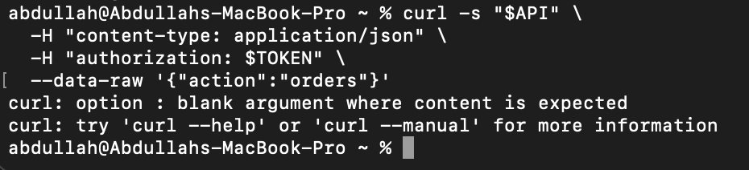

#### Step 3 - Trigger Unhandled Exception in DVSA-ORDER-GET

Send a malformed get request that omits the required order-id field. This causes get_order.py to raise an unhandled KeyError and return the full stack trace to the client.

```text
curl -s "$API" \
-H "content-type: application/json" \
-H "authorization: $TOKEN" \
--data-raw '{"action":"get"}'
```

The response will contain the errorMessage, errorType KeyError, and a stackTrace field exposing the internal file path and line number.

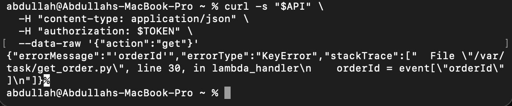

#### Step 4 - Trigger Unhandled Exception in DVSA-ORDER-BILLING

Send a malformed billing request missing the required order-id and payment fields. This demonstrates the vulnerability exists independently in a second Lambda function.

```text
curl -s "$API" \
-H "content-type: application/json" \
-H "authorization: $TOKEN" \
--data-raw '{"action":"billing"}'
```

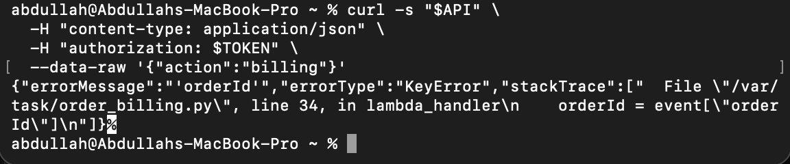

#### Step 5 - Trigger Unhandled Exception in DVSA-ORDER-NEW

Send a malformed new order request missing the required cart-id and items fields. This confirms the vulnerability is systemic across a third independent Lambda function.

```text
curl -s "$API" \
-H "content-type: application/json" \
-H "authorization: $TOKEN" \
--data-raw '{"action":"new"}'
```

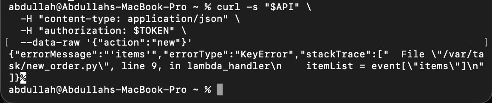

## Part 5: Evidence and Proof

## 5.1 Baseline - Valid Request Behaves Normally

A valid orders request returns the correct JSON response with no internal details exposed. This confirms the application functions correctly under normal conditions and that the error responses observed in the following steps represent a genuine deviation from intended behavior.


## 5.2 DVSA-ORDER-GET - Internal File Path and Line Number Exposed

A malformed get request (missing order-id) causes get_order.py to crash at line 30. The full stack trace is returned to the client, exposing:

- Internal file path: /var/task/get_order.py

- Line number: 30

- Error type: KeyError

- Missing field name: order-id


## 5.3 DVSA-ORDER-BILLING - A Different Internal File Exposed

A malformed billing request causes order_billing.py to crash at line 34. This confirms the vulnerability is not isolated to one function - it exists independently in a completely separate Lambda function with its own handler file.


## 5.4 DVSA-ORDER-NEW - Systemic Nature Confirmed

A malformed new order request causes new_order.py to crash at line 9. Three separate Lambda functions, three separate internal files, three separate line numbers - all exposed through the same class of missing exception handling.


## 5.5 Vulnerable Source Code

Inspection of the Lambda source code in the AWS Console confirms the root cause. The function accesses event fields directly using dictionary notation with no surrounding try/except block and no input validation before the access.

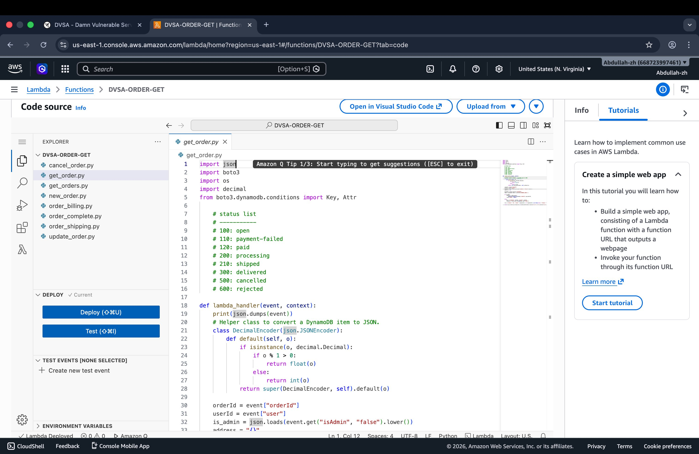

## 5.6 Evidence Summary

| Evidence Item | Function | Internal Detail Exposed | What It Proves |
| --- | --- | --- | --- |
| Malformed get request | DVSA-ORDER-GET | /var/task/get_order.py line 30 | Exception unhandled in get order function |
| Malformed billing request | DVSA-ORDER-BILLING | /var/task/order_billing.py line 34 | Same vulnerability in billing function independently |
| Malformed new request | DVSA-ORDER-NEW | /var/task/new_order.py line 9 | Vulnerability is systemic across the entire codebase |
| Source code inspection | All three functions | event["field"] direct access confirmed | Root cause confirmed - no try/except anywhere in any handler |

## Part 6: Fix Strategy / Probable Mitigation

The fix belongs inside each affected Lambda function. The required improvement is to wrap all input processing logic in a try/except block, validate required fields before accessing them using event.get() instead of direct dictionary access, and ensure that the client response contains only a generic safe message regardless of what the internal error was.

## 6.1 Required Changes by Layer

| Component | Current State (Vulnerable) | Target State (Fixed) |
| --- | --- | --- |
| Field access method | event["field"] - raises KeyError if absent | event.get("field") - returns None safely |
| Input validation | None - missing fields crash the function | Explicit check: if field is None, return safe error |
| Exception handling | No try/except - raw exception propagates to client | try/except wraps all input processing logic |
| Client error response | Full stack trace with file paths and line numbers | Generic: {"status":"err","msg":"missing required fields"} |
| Internal logging | Exception reaches client directly | Full exception logged to CloudWatch; client sees nothing |

## 6.2 Why This Resolves the Root Cause

Once a try/except block is in place, any exception raised inside the Lambda function is caught before it can propagate to the API Gateway response. The except block logs the full error details to CloudWatch and returns only a safe, generic message to the client. An attacker sending malformed requests will receive the same generic error regardless of which field is missing or what the internal error was - no useful information is disclosed.

## 6.3 Before vs. After Error Response

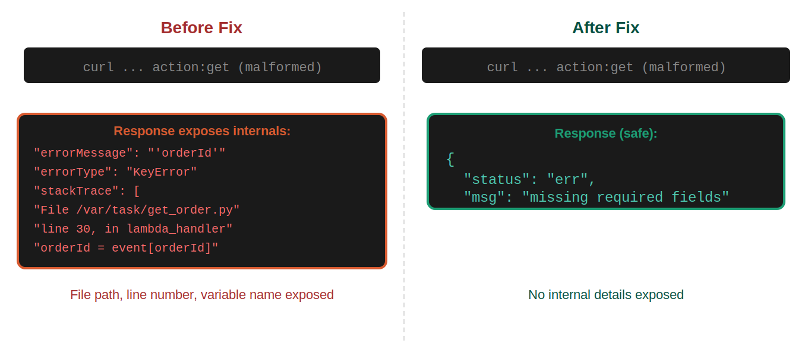

## Part 7: Code / Configuration Changes

#### Files Changed:

get_order.py (DVSA-ORDER-GET), order_billing.py (DVSA-ORDER-BILLING), new_order.py (DVSA-ORDER-NEW). The same fix pattern is applied to all three functions.

## 7.1 Before - Vulnerable Code

```text
# VULNERABLE -- no input validation, no exception handling
def lambda_handler(event, context):
order_id = event["order-id"] # KeyError raised if field is absent
# No try/except anywhere -- exception propagates to API Gateway response
```

When the order-id field is absent, Python raises KeyError at the first line of the handler. With no try/except block, this exception propagates all the way out of the Lambda handler and is returned as the raw error response through API Gateway to the client.


## 7.2 Fix Steps - AWS Lambda Console

- Open the AWS Management Console and navigate to Lambda.

- Select the DVSA-ORDER-GET function.

- Click the Code tab and open get_order.py.

- Replace direct dictionary access with event.get() and add explicit validation.

- Wrap all input processing logic in a try/except block.

- Ensure the except block logs to CloudWatch and returns only a generic message.

- Click Deploy to save and activate the updated code.

- Repeat for order_billing.py and new_order.py.

## 7.3 After - Fixed Code

```text
# FIXED -- input validation + exception handling
def lambda_handler(event, context):
try:
order_id = event.get("order-id")
if not order_id:
return {
"statusCode": 400,
"body": json.dumps({"status": "err", "msg": "missing required fields"})
}
# rest of function continues safely
except Exception as e:
print(f"Internal error: {e}") # logged to CloudWatch only
return {
"statusCode": 500,
"body": json.dumps({"status": "err", "msg": "missing required fields"})
}
```

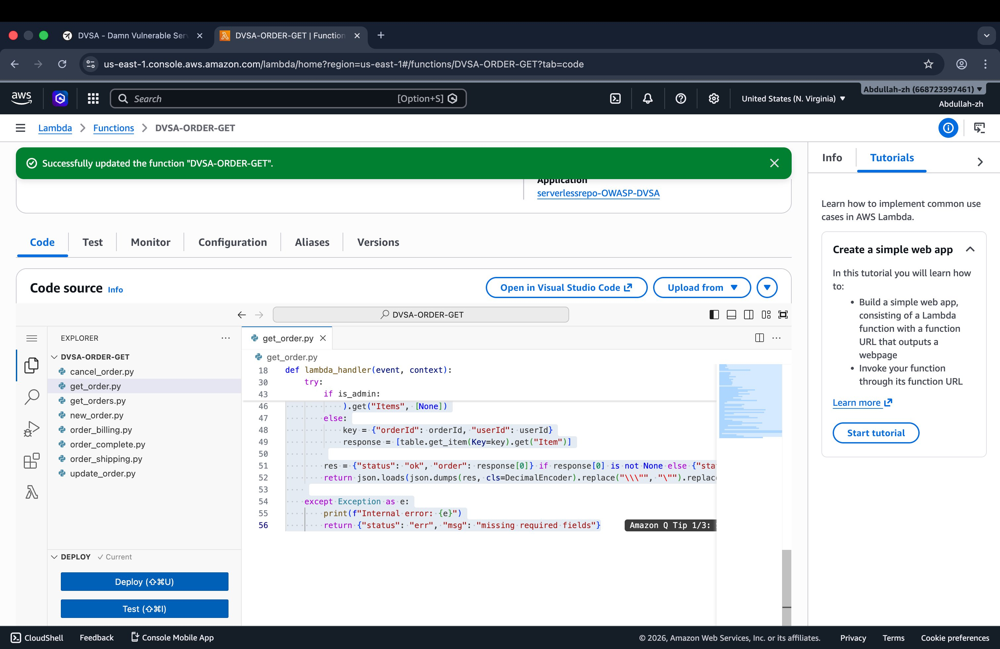

## 7.4 Code Change Summary

| Change | Purpose |
| --- | --- |
| event.get("field") instead of event["field"] | Returns None safely if the field is absent - no KeyError raised |
| Explicit if not field_value check | Validates the field before use - catches missing and empty values at the application layer |
| try/except Exception wrapper | Catches any unexpected exception that bypasses the explicit validation |
| Generic message in except block | Client never sees stack trace, file paths, line numbers, or error type |
| print(f"Internal error: {e}") | Full error details still available in CloudWatch Logs for developers |

## Part 8: Verification After Fix

After deploying the fix to all three Lambda functions, the same malformed requests were re-sent to confirm that internal details are no longer exposed in any response.

## 8.1 Malformed Request Now Returns Generic Message

The same malformed get request that previously returned the full stack trace now returns only a generic error message. No file paths, no line numbers, no error type, no stack trace - just a safe, uninformative response that gives the attacker nothing useful.

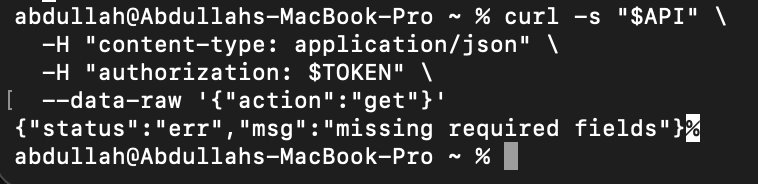

## 8.2 Legitimate Request Still Works Correctly

A valid orders request sent after the fix returns the correct order data normally. The exception handling improvements did not affect any valid request path - no regression was introduced.

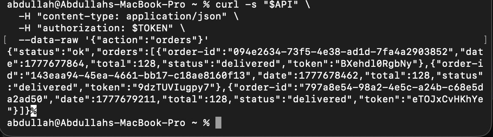

## 8.3 Post-Fix Verification Summary

| Test Case | Before Fix | After Fix |
| --- | --- | --- |
| Malformed get request | Stack trace with /var/task/get_order.py line 30 | {"status":"err","msg":"missing required fields"} |
| Malformed billing request | Stack trace with /var/task/order_billing.py line 34 | Generic error message only |
| Malformed new request | Stack trace with /var/task/new_order.py line 9 | Generic error message only |
| Valid orders request | Correct order data returned normally | Correct order data returned - no regression |

## Part 9: Structured Operation and Security Analysis

## 9.1 Intended Logic and Security Rules

Each DVSA Lambda function is intended to handle both valid and invalid requests without exposing any internal implementation details. The following rules are expected to hold at all times:

- All required event fields must be validated before any processing begins.

- Missing or invalid fields must be caught at the application layer and handled gracefully.

- Every exception that occurs during request processing must be caught by a try/except block.

- Full diagnostic details must be logged to CloudWatch for developer use only.

- The client response must contain only a generic safe message regardless of what the internal error was.

- Internal file paths, line numbers, variable names, and exception types must never appear in any client-facing response.

## 9.2 Evidence Sources and Behavior Trace

| Evidence Source | Finding |
| --- | --- |
| Malformed get request response | /var/task/get_order.py line 30 - DVSA-ORDER-GET exposes full stack trace |
| Malformed billing request response | /var/task/order_billing.py line 34 - DVSA-ORDER-BILLING independently vulnerable |
| Malformed new request response | /var/task/new_order.py line 9 - DVSA-ORDER-NEW confirms systemic pattern |
| Lambda source code inspection | Direct event["field"] access with no try/except confirmed in all three handler files |
| Post-fix malformed request | Generic error message only returned - no internal details in response |
| Post-fix valid request | Normal order data returned - fix introduced no regression |

## 9.3 Three-Phase Behavior Comparison

| Phase | Input Handling | Error Response | Information Exposed |
| --- | --- | --- | --- |
| Normal (valid request) | Fields present - function processes normally | {"status":"ok"} with order data | None - intended behavior |
| Exploit (malformed, pre-fix) | Field missing - KeyError raised, no catch | Full stack trace with file paths and line numbers | /var/task/*.py, line numbers, error types, variable names |
| Post-fix (malformed) | Field missing - caught by try/except | {"status":"err","msg":"missing required fields"} | Nothing internal - generic message only |

#### Table A: Structured Analysis Summary

| Vulnerability | Intended Rule(s) | Artifacts Used to Infer Rule | Normal Behavior Evidence | Exploit Behavior Evidence |
| --- | --- | --- | --- | --- |
| Lesson 10 - Unhandled Exceptions | The application must never expose internal implementation details in error responses. All exceptions must be caught and only generic safe messages returned to the client. File paths, line numbers, and exception types are internal details that must remain internal. | API responses to malformed requests; Lambda source code showing event["field"] direct access; terminal curl output; CloudWatch logs confirming exception propagation | Valid orders request returns correct data with status ok. No internal details present in any normal response. | Malformed requests to three separate Lambda functions each return full Python stack traces exposing /var/task/*.py file paths, line numbers, KeyError type, and variable names. |

#### Table B: Deviation, Classification, and Fix

| Vulnerability | Why This Is a Deviation | Classification | Fix Applied (Where) | Post-Fix Verification | Latency |
| --- | --- | --- | --- | --- | --- |
| Lesson 10 - Unhandled Exceptions | The backend returned raw Python exception details directly to the client across three independent Lambda functions. This violates the intended rule that internal implementation details must never appear in client-facing responses. The pattern of direct event["field"] access without any try/except is repeated systemically across the entire DVSA codebase, making every Lambda function an independent information disclosure endpoint. | Accidental misconfiguration - missing exception handling pattern applied uniformly across the codebase | try/except block added to get_order.py, order_billing.py, and new_order.py. Input validation using event.get() with explicit None checks. Generic error message returned to client; full details logged to CloudWatch only. | Malformed requests to all three functions now return only the generic error message. Valid requests continue to return correct data normally. No regression confirmed. | Not measured |

## Part 10: Takeaway / Lessons Learned

## 10.1 The Core Misconception

The misconfiguration in this lesson stems from treating error handling as a code quality concern rather than a security control. The assumption is that exposing what went wrong is harmless - after all, the error just reveals which field was missing. In practice, internal error details are exactly what an attacker needs to plan targeted exploitation. A stack trace that reveals a file path, a line number, and a variable name tells an attacker which file to look for, which line of code to target, which field names to use in a crafted payload, and what language and framework the backend runs on. Information disclosure converts a blind attack into a targeted one and is frequently the first step in a multi-stage attack chain.

## 10.2 Why This Is Especially Serious in Serverless

- Every function is a separate attack surface: an attacker can probe each API action independently and receive a separate stack trace from each Lambda handler - three malformed requests in this lesson revealed three different files and three different line numbers.

- Functions are ephemeral and stateless: stack traces are often the only window an attacker has into what is happening inside a Lambda invocation, making their exposure especially valuable.

- Error handling must be applied per function: unlike a traditional server with a single global exception handler, each Lambda function must implement its own error handling independently. A missing try/except in one function does not affect others.

## 10.3 The Three Rules of Safe Error Handling

| Rule | Implementation |
| --- | --- |
| 1 - Validate before you access | Use event.get("field") instead of event["field"]. Check for None explicitly before using the value. Never assume the client sent what you expected. |
| 2 - Catch everything | Wrap all input processing in try/except Exception. A broad outer except clause is appropriate for the Lambda entry point handler. |
| 3 - Log internally, respond generically | Log the full exception to CloudWatch. Return only a generic message to the client. The client response must be identical regardless of what the internal error was. |

## 10.4 General Design Principles

- Never trust client input: every field in an API request is potentially absent, malformed, or malicious. Treat all event fields as untrusted until explicitly validated.

- Apply the principle of least information in error responses: a client needs to know their request failed and why in general terms - they do not need to know which file crashed or at which line.

- Treat error handling as a security control: a missing try/except is not just bad practice - it is a security vulnerability that exposes the internal architecture of the application.

- Apply fixes systematically: when an unhandled exception is found in one Lambda function, audit every other function for the same pattern. Fixing only the reported function leaves other attack surfaces open.
