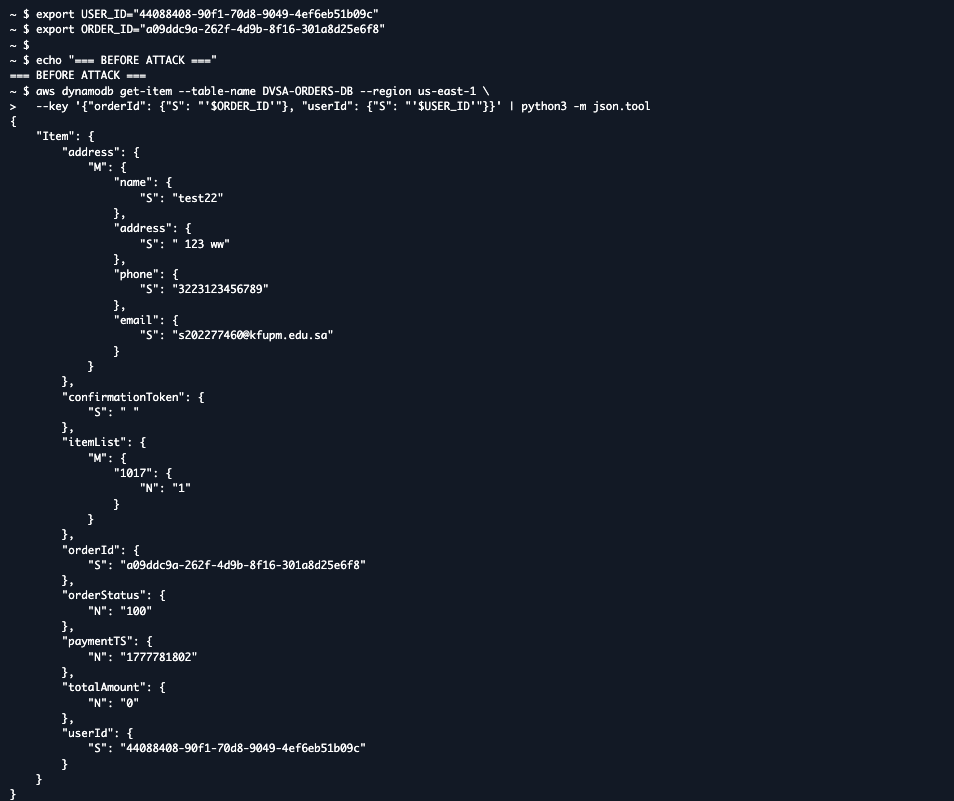
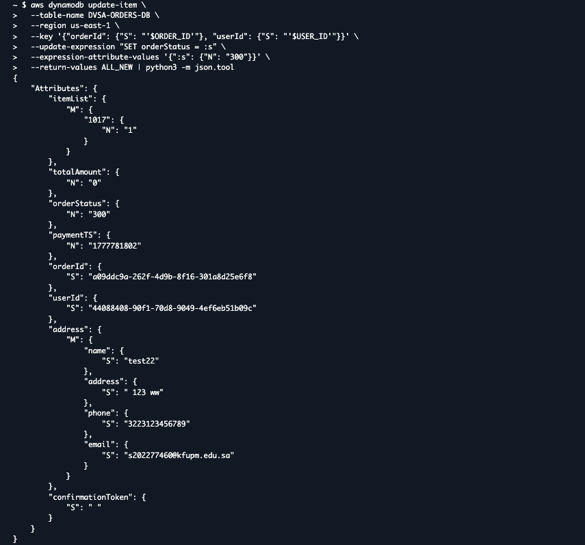
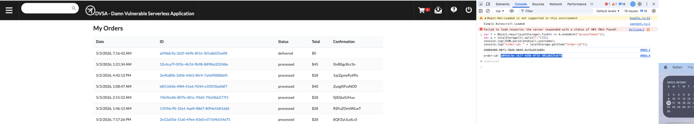
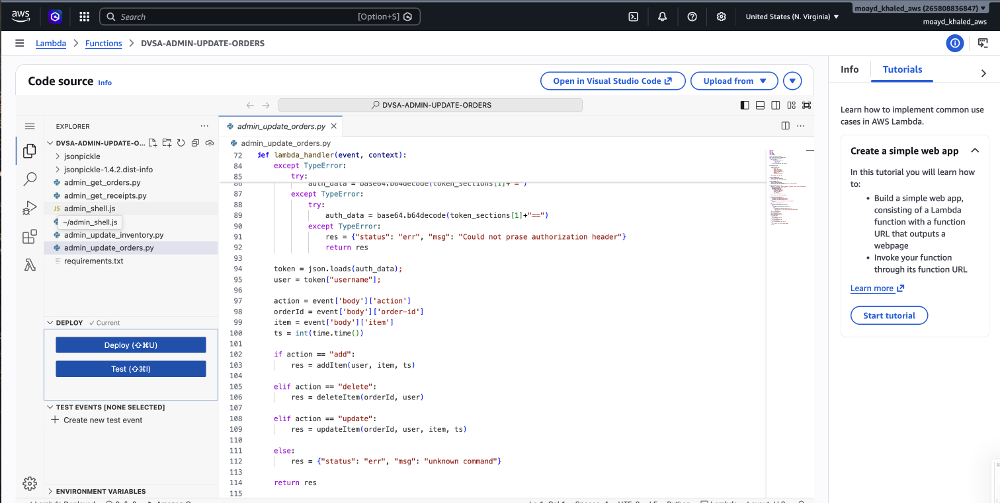
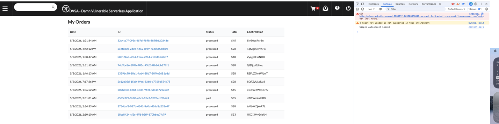

# Lesson #11 - Broken Access Control (Direct Database Bypass)

## 1-Goal and Vulnerability Summary

This bonus finding highlights a Broken Access Control vulnerability in the DVSA application, where an authenticated user can directly modify the order status in the backend DynamoDB database without completing the required payment process. Unlike Lesson 5, this issue does not depend on API manipulation or over-privileged Lambda roles, but rather on missing authorization checks and lack of state validation in the database update process.

Under normal conditions, the application enforces a structured workflow before an order is finalized:

- The user adds items to the cart

- Shipping information is provided

- Payment (billing) is completed

- The order is then marked as paid

However, this expected flow is not properly enforced. The following weaknesses were identified:

- The DVSA-ORDER-MANAGER Lambda function does not validate whether a user is authorized to update order status

- The DVSA-ORDERS-DB DynamoDB table allows direct updates without enforcing state transitions

- No server-side checks ensure that billing is completed before marking an order as paid

Because of these gaps, an attacker with AWS-level access (such as via CloudShell) can bypass the entire workflow and directly modify order records.

The security impact of this vulnerability includes:

- Financial abuse: items can be obtained without payment

- Workflow bypass: the order lifecycle can be skipped entirely

- Data integrity issues: order states no longer reflect real transactions

In this demonstration, the vulnerability was exploited to obtain a Mrs. Pac-Man game priced at $28 (item ID 1019) without completing the billing step. This was achieved by directly updating the order status using a single AWS CLI command, clearly showing how the lack of authorization enforcement leads to a complete breakdown of system integrity.

## 2-Why This Works / Root Cause

The vulnerability arises because the backend does not enforce any server-side authorization or validation when updating the order state. In the DynamoDB table, the orderStatus attribute is represented as a simple numeric value:

- 100 -> pending / unpaid

- 200 -> processing

- 300 -> paid / delivered

There are no safeguards in place to ensure that these status values follow the correct sequence. Specifically, the system does not verify whether a transition between states is legitimate or whether the required workflow steps have been completed.

This leads to the following weaknesses:

- No validation is performed before updating the order status

- The system does not enforce the required payment workflow

- Any request reaching the DynamoDB update operation can modify orderStatus directly

- State transitions are not restricted to authorized backend components

As a result, an attacker can use tools such as the AWS CLI or direct API calls to change the order status to any value, including marking an order as paid, without completing the billing process.

In a properly secured design, state changes should be tightly controlled. For example:

- Only the billing Lambda function should be allowed to update the order status

- The transition from pending (100) to paid (300) should occur only after successful payment verification

- Additional validation should ensure that intermediate steps cannot be skipped

Without these controls, the system fails to enforce its own business logic, allowing unauthorized manipulation of order data.

## 3) Environment and Setup

#### Key Environment Details

- AWS Region: us-east-1 (N. Virginia)

- DVSA Website: S3-hosted frontend endpoint

- Backend Database: DVSA-ORDERS-DB (Amazon DynamoDB)

- Lambda Function: DVSA-ORDER-MANAGER

- Tools Used: AWS CloudShell, AWS CLI, DVSA interface, Browser DevTools

- User Account: authenticated DVSA user

- Target Product: SUPERMARO- $45

## 4) Reproduction Steps

### Step 1: Access the DVSA Application

The DVSA web application was opened in the browser, and a normal user logged into the system.


### Step 2: Extract Order ID and User Information

Using the DevTools Console, the following script was executed:

```text
var t = Object.keys(localStorage).find(k => k.endsWith("accessToken"));
var p = localStorage[t].split(".")[1];
console.log(JSON.parse(atob(p)).username);
console.log("order-id: " + localStorage.getItem("order-id"));
```


### Step 3: Verify Order State Before Attack

Before performing the exploit, the order was queried directly from DynamoDB to confirm its initial state.



### Step 4: Execute the Exploit

The crafted payload was sent to the backend API using the following command:



### Step 5: Verify Order After Exploit

After sending the payload, the order was queried again:



## 5) Evidence and Proof

### Evidence 1: Initial Order State

Before the exploit, the order was in an incomplete state and had not been paid.

DynamoDB query showing orderStatus = 100


### Evidence 2: Exploit Execution

The payload was successfully delivered to the backend using a crafted request.


### Evidence 3: Order Status Change

After executing the exploit, the order status was updated to processed, and a confirmation token was generated. This occurred without completing the billing step, confirming that the application allowed unauthorized access to privileged functionality.


## 6) Fix Strategy / Probable Mitigation

The mitigation must focus on resolving the core issue, which is the lack of server-side validation and proper control over order state transitions within the DynamoDB update process. The system currently allows unrestricted modification of order status, which breaks the intended workflow.

To address this, the following improvements should be implemented:

- Enforce state transition rules: The backend must ensure that order status changes follow the correct sequence, such as pending (100) -> processing (200) -> paid (300). Any attempt to jump directly between states should be rejected.

- Introduce strict authorization checks: Only authorized backend components, such as the billing Lambda function, should be allowed to update the order status to "paid," and only after confirming successful payment.

- Apply DynamoDB conditional updates: Use condition expressions in update operations to verify that the current order status matches the expected previous state before applying any changes.

- Verify order ownership: Ensure that users can only modify orders that belong to them and that any update request complies with the permitted workflow.

## Part 7) Code / Config Changes



BEFORE

```text
aws dynamodb update-item \
--table-name DVSA-ORDERS-DB \
--key '{"orderId": ..., "userId": ...}' \
--update-expression "SET orderStatus = :newStatus" \
--expression-attribute-values '{":newStatus": {"N": "300"}}'
# No condition - anyone can set any status at any time
```

AFTER (FIXED)

```text
aws dynamodb update-item \
--table-name DVSA-ORDERS-DB \
--key '{"orderId": ..., "userId": ...}' \
--update-expression "SET orderStatus = :newStatus" \
--condition-expression "orderStatus = :expectedPrev" \
--expression-attribute-values '{
":newStatus": {"N": "300"},
":expectedPrev": {"N": "200"}
}'
# ConditionalCheckFailedException is thrown if status is not 200.
```

## Part 8 - Verification After Fix

After applying the fix, attempting to directly update the order status to 300 without going through the proper billing workflow returns a ConditionalCheckFailedException from DynamoDB, preventing the unauthorized status change:


#### Final Order State

The DVSA "My Orders" page shows that the order status remains unchanged after the attempted update, confirming that the fix successfully prevents unauthorized modifications.



## Part 9 - Structured Operation and Security Analysis

### Table A

| Vulnerability | Intended Rule(s) | Artifacts Used | Normal Behavior | Exploit Behavior |
| --- | --- | --- | --- | --- |
| Broken Access Control (Direct DB Bypass) | Order status should only change through the valid checkout process (cart -> shipping -> billing). Only the billing logic is allowed to mark an order as paid after successful payment verification. | DVSA checkout workflow, DynamoDB (DVSA-ORDERS-DB), orderStatus values (100/200/300), DVSA-ORDER-MANAGER Lambda, DevTools Console, billing page interactions | During normal operation, users must enter payment details to complete checkout. After successful payment, the order status transitions to 300 and appears as delivered. Without payment, the order remains in its initial state (100). | By using AWS CLI in CloudShell, the orderStatus was directly updated from 100 to 300 in DynamoDB without completing any payment step. The My Orders page then displayed the order as delivered, allowing the item to be obtained for free using a single command. |

### Table B

| Vulnerability | Why This Is a Deviation | Deviation Class | Fix Applied | Post-Fix Verification | Logging |
| --- | --- | --- | --- | --- | --- |
| Broken Access Control (Direct DB Bypass) | The backend allowed direct updates to orderStatus without validating whether the request followed the authorized billing workflow. This violates the rule that only completed payments should transition an order to a paid state, enabling unauthorized status changes and financial abuse. | Security design flaw / misuse of backend authorization | Introduced a DynamoDB ConditionExpression to enforce valid state transitions. Added authorization checks to ensure that only trusted backend components (such as billing logic) can update the order status. | After applying the fix, unauthorized update attempts failed with ConditionalCheckFailedException. Legitimate billing operations still succeeded, and orders were only marked as delivered after proper payment. | Before the fix, order status could be changed directly from 100 to 300 without errors. After the fix, unauthorized updates were rejected and logged, confirming enforcement of proper validation. |

## 10) Takeaway / Lessons Learned

This lesson demonstrates the critical importance of enforcing proper authorization and state validation in backend systems. The vulnerability showed that allowing direct database updates without validating the request context can completely bypass the intended business logic, enabling attackers to manipulate order states without completing the payment process. By directly modifying the orderStatus value in DynamoDB, the normal checkout workflow was skipped, resulting in unauthorized access to goods without payment. This highlights that security controls must not rely solely on application flow but must also be enforced at the data layer. The implemented fix, which introduced conditional expressions and strict validation of state transitions, successfully prevented unauthorized updates and ensured that only legitimate billing operations could modify the order status. Overall, the lesson emphasizes that strong access control, proper state enforcement, and validation at every layer are essential to maintain system integrity and prevent financial abuse.
